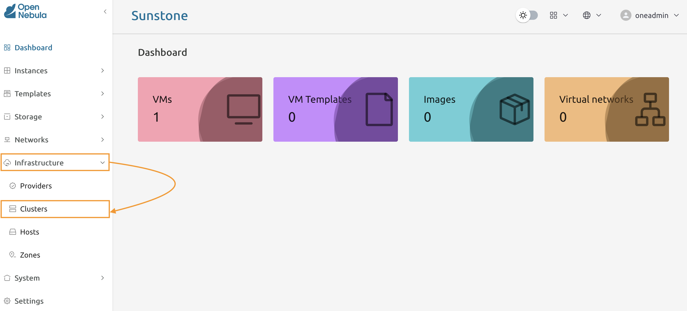
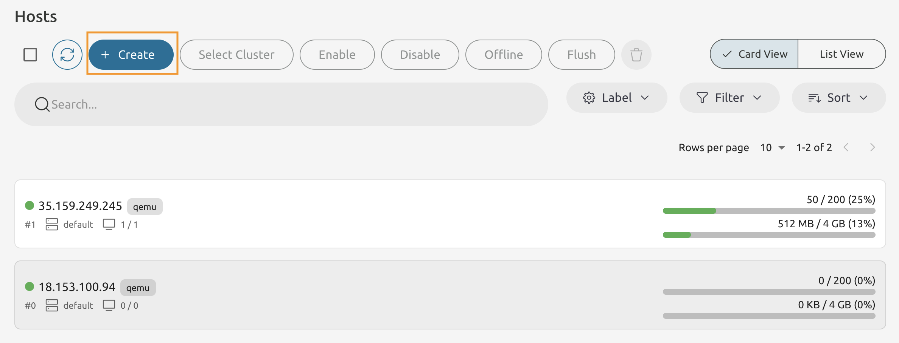
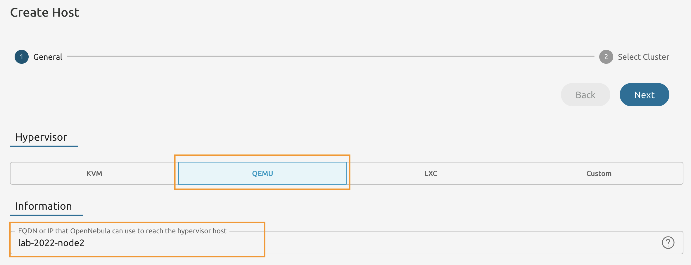
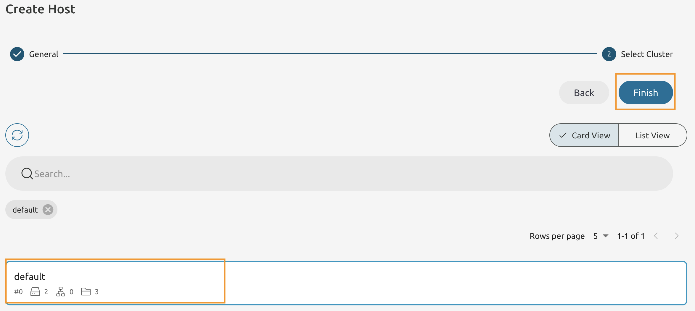
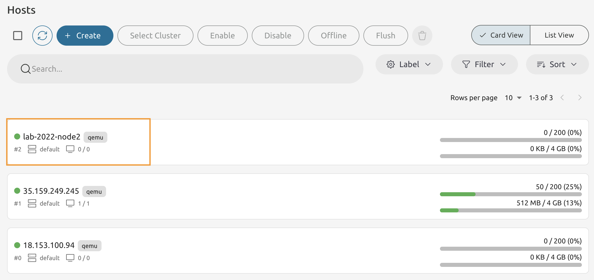

# Module 1 - Lab 2 : Add Hosts
{: .no_toc}

## Table of Contents
{: .no_toc}

<details markdown="block">
  <summary>
    Expand to access the In-page navigation
  </summary>
  {: .text-delta }
1. TOC
{:toc}
</details>

## Objective(-s):

- Add a Host using Sunstone.
- Add a Host using Command Line.


# Add a Host using Sunstone.

## 1.2.1

From the menu panel select **Infrastructure -> Hosts** to access the **Hosts** screen. 



## 1.2.2 

Press **Create** button to launch the **Create Host** wizard.




## 1.2.3

Set the **Hypervisor** to **QEMU**.

**Make sure to substitute 2022 with your unique Lab ID.**



## 1.2.4

Select the **default** cluster and press **Finish**.




## 1.2.5

If you actioned the previous steps correctly - you will see a new host has been added.



# Add a Host using Sunstone.

## 1.2.6

Switch to the Command Line on the Host 1 and make sure you are logged in as **oneadmin** user.

Add a host using the **onehost** command.

Make sure to use your Lab ID!

```console
onehost create -i qemu -v qemu lab-2022-node3
ID: 3
```
## 1.2.7

List all your hosts using the **onehost** command.

```console
onehost list

ID NAME            CLUSTER    TVM      ALLOCATED_CPU      ALLOCATED_MEM STAT
3 lab-2022-node3   default      0       0 / 200 (0%)     0K / 3.8G (0%) on
2 lab-2022-node2   default      0       0 / 200 (0%)     0K / 3.8G (0%) on
1 35.159.249.245   default      1     50 / 200 (25%)  512M / 3.8G (13%) on
0 18.153.100.94    default      0       0 / 200 (0%)     0K / 3.8G (0%) on
```

If your host is in the **int** state - run **top** subcommand to observe the transition from int ot on. 

```console
onehost top
```

Press CTRL + C to exit

## 1.2.8

Use **onehost show** command to print the information about the host

```console
onehost show lab-X-node3
HOST 7 INFORMATION                                                              
ID                    : 3                   
NAME                  : lab-2022-node3       
CLUSTER               : default             
STATE                 : MONITORED           
IM_MAD                : qemu                
VM_MAD                : qemu                
...
```

Now try the same command but with **-x** flag. 

```console
onehost show -x lab-X-node3
```

How does the output differs?

# Congratulations, you've completed the assignment!
{: .no_toc}