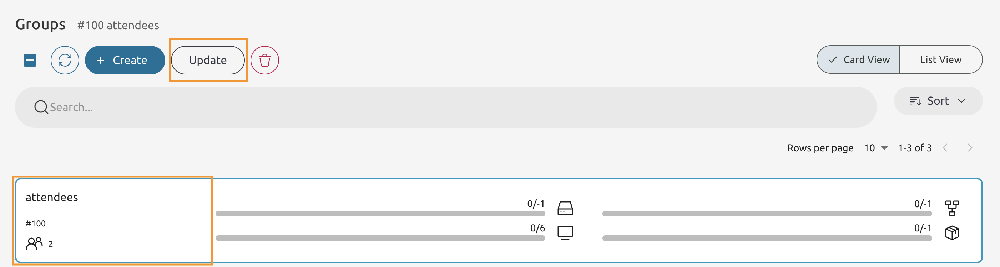
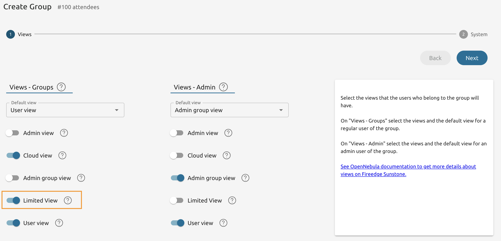
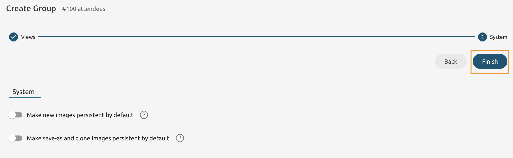
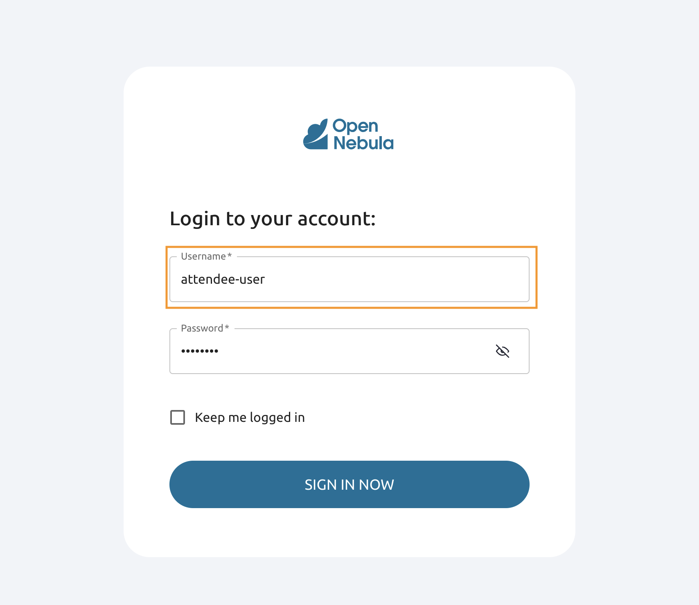
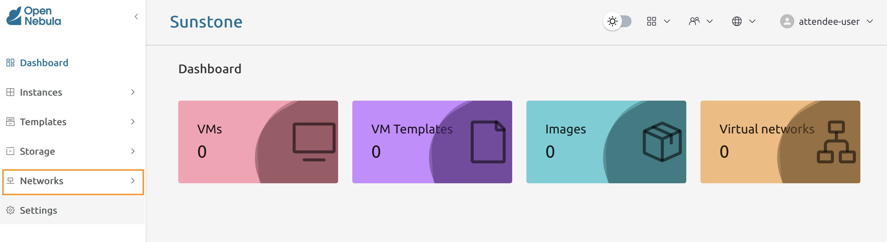
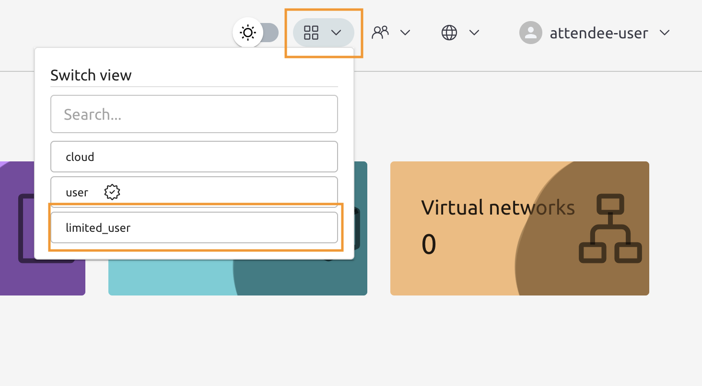
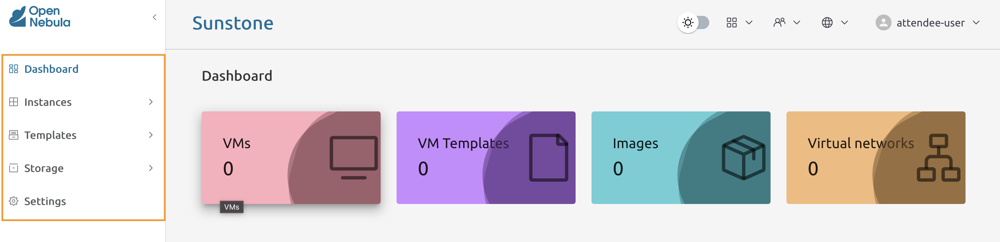

# Module 3 - Lab 1 : Create a Custom View
{: .no_toc}

## Table of Contents
{: .no_toc}

<details markdown="block">
  <summary>
    Expand to access the In-page navigation
  </summary>
  {: .text-delta }
1. TOC
{:toc}
</details>
    
    
## Objective(-s):
- Create a Custom View.
- Update the "attendees" to use the custom view.
- Verify the custom view.
    

# Create a Custom View.
    
## 3.1.1

From the Node 1's Command Line login as root and go to the views directory.

```console
sudo su
cd /etc/one/fireedge/sunstone/views/
```

Copy the "user" view.

```console
cp -R user/ limited_user
```
    
## 3.1.2

Enter the newly created view directory and remove views.

```console
cd limited_user/
rm -f sec-group-tab.yaml vnet-tab.yaml
ls -lh

total 28K
-rw-r--r-- 1 root root  885 Apr 15 10:13 backup-tab.yaml
-rw-r--r-- 1 root root  884 Apr 15 10:13 file-tab.yaml
-rw-r--r-- 1 root root 1.2K Apr 15 10:13 image-tab.yaml
-rw-r--r-- 1 root root 1.1K Apr 15 10:13 marketplace-app-tab.yaml
-rw-r--r-- 1 root root 1.2K Apr 15 10:13 service-tab.yaml
-rw-r--r-- 1 root root 2.7K Apr 15 10:13 vm-tab.yaml
-rw-r--r-- 1 root root 1.9K Apr 15 10:13 vm-template-tab.yaml
```
    
## 3.1.3

Go one level up and edit the **sunstone-views.conf** file.

```console
cd ../
vi sunstone-views.yaml
```

Under the **views** add the following code.

```console
views:
    ...
    limited_user:
        name: "Limited View"
        description: "A trimmed-down User view"
```

# Update the "attendees" to use the custom view.

    
## 3.1.4

Return to Sunstone's Groups tab and press the **Update** button.



    
## 3.1.5

Toggle the **Limited View** and press **Next**.



    
## 3.1.6

Press **Finish**.



    
## 3.1.7

Login as **attendee-user**.



    
## 3.1.8

Note that the **Network** menu item is present!



    
## 3.1.9

From the view switcher select the **limited_user** view.



    
## 3.1.10

Now pay attendtion to the menu bar. The **Network** item should disappear.



    
# Congratulations, you've completed the assignment!
{: .no_toc}