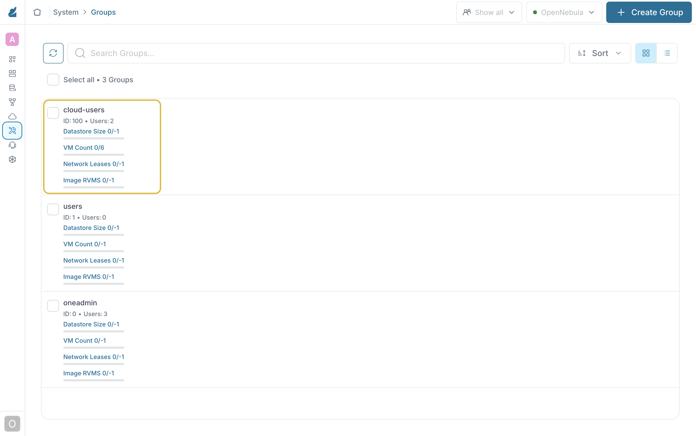
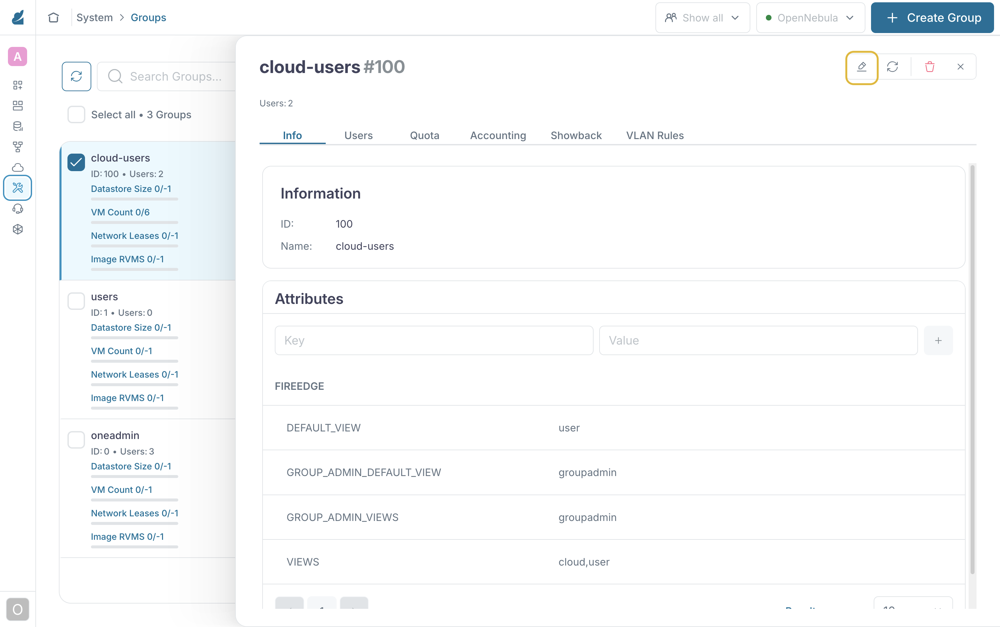
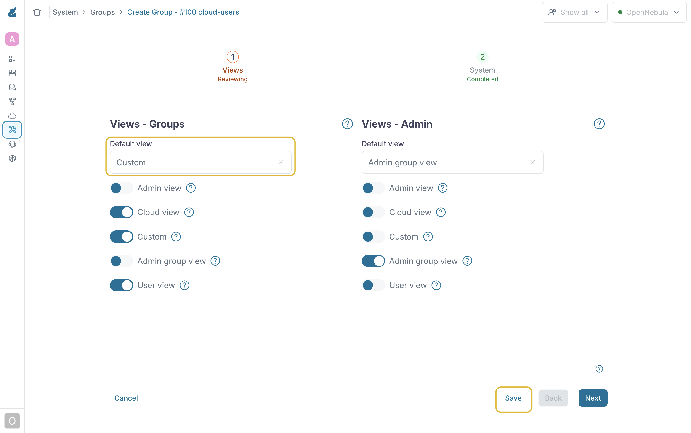
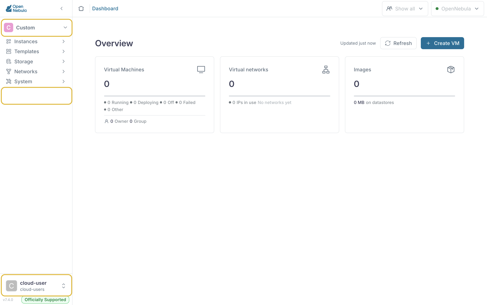

# Module 3 - Lab 1 : Create a Custom View
{: .no_toc}

## Table of Contents
{: .no_toc}

<details markdown="block">
  <summary>
    Expand to access the In-page navigation
  </summary>
  {: .text-delta }
1. TOC
{:toc}
</details>
    
    
## Objective(-s):
- Create a Custom View.
- Update the "cloud-users" to use the custom view.
- Verify the custom view.
    

# Create a Custom View.
    
## 3.1.1

From the Node 1's Command Line login as root and go to the views directory.

**Please note that you can't switch to root directly from oneadmin user. You must exit to the ubuntu user first!**

```console
sudo su
cd /etc/one/fireedge/sunstone/views/
```

Copy the "user" view.

```console
cp -R user/ custom
```
    
## 3.1.2

Enter the newly created view directory and remove the oneks view.

```console
cd custom/
rm -f oneks-tab.yaml
ls -lh
```

```console
total 48K
-rw-r--r-- 1 root root  885 Aug  7 13:07 backup-tab.yaml
-rw-r--r-- 1 root root  490 Aug  7 13:07 dashboard-tab.yaml
-rw-r--r-- 1 root root  884 Aug  7 13:07 file-tab.yaml
-rw-r--r-- 1 root root 1.1K Aug  7 13:07 group-tab.yaml
-rw-r--r-- 1 root root 1.2K Aug  7 13:07 image-tab.yaml
-rw-r--r-- 1 root root 1.1K Aug  7 13:07 marketplace-app-tab.yaml
-rw-r--r-- 1 root root  951 Aug  7 13:07 sec-group-tab.yaml
-rw-r--r-- 1 root root 1.7K Aug  7 13:07 service-tab.yaml
-rw-r--r-- 1 root root 2.8K Aug  7 13:07 vm-tab.yaml
-rw-r--r-- 1 root root 1.9K Aug  7 13:07 vm-template-tab.yaml
-rw-r--r-- 1 root root 1.5K Aug  7 13:07 vnet-tab.yaml
-rw-r--r-- 1 root root 1.3K Aug  7 13:07 vnet-template-tab.yaml
```
    
## 3.1.3

Go one level up and edit the **sunstone-views.conf** file.

```console
cd ../
vi sunstone-views.yaml
```

Under the **views** add the following code.

```console
views:
    ...
    custom:
        name: "Custom"
        description: "A User view without OneKS"
```

# Update the "cloud-users" to use the custom view.

    
## 3.1.4

Return to Sunstone and relogin as **oneadmin**.
Navigate to Groups tab and select the **cloud-users** group.



    
## 3.1.5

Press the **Update** button.


    
## 3.1.6

Set the **Custom** view as the default view and and press **Save**.



    
## 3.1.7

Login as **cloud-user** and note that the **Custom** view is now set as the default view.

Also note that the **Kubernetes** tab is no longer availiable under this view. 


    
# Congratulations, you've completed the assignment!
{: .no_toc}