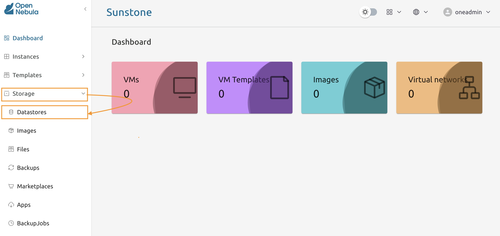
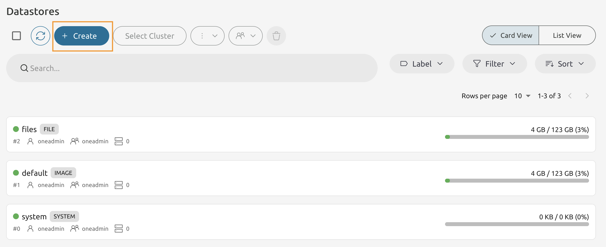
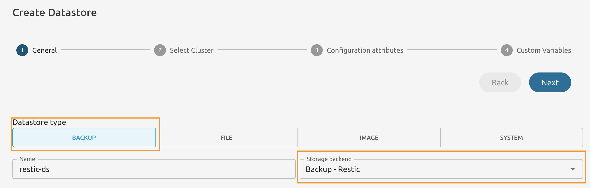
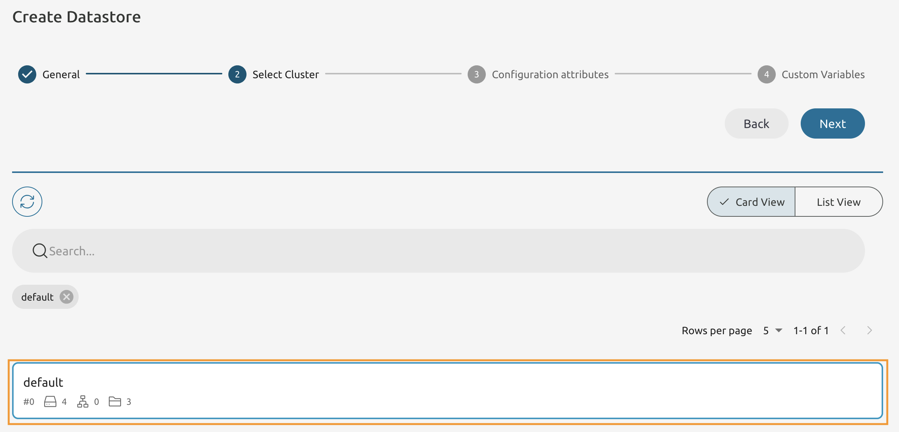
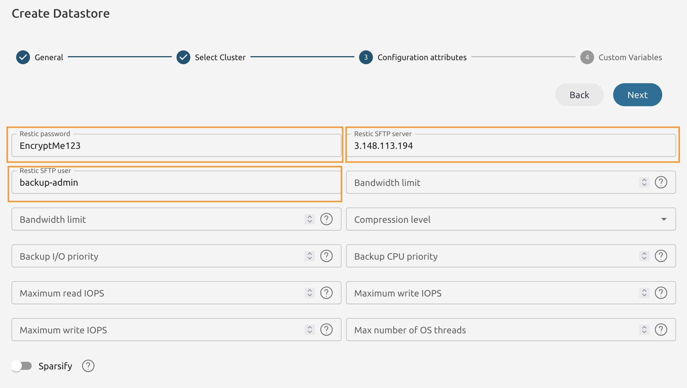
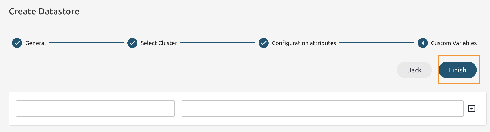
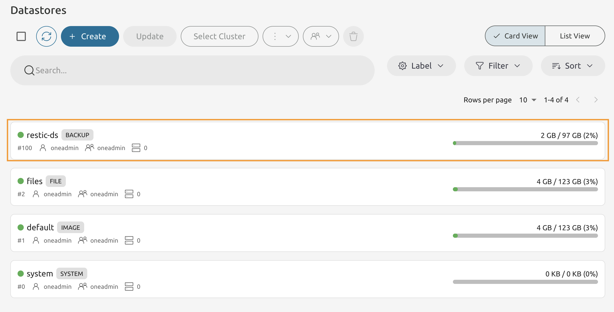

# Module 5 - Lab 2 : Backup Datastore
{: .no_toc}

## Table of Contents
{: .no_toc}

<details markdown="block">
  <summary>
    Expand to access the In-page navigation
  </summary>
  {: .text-delta }
1. TOC
{:toc}
</details>

## Objective(-s):

- Enroll SSH Public Key to the Backup Server.
- Create a Backup (Restic) datastore.


# Enroll the SSH Public Key to the Backup Server.

## 5.2.1

Connect to the Node 1's Command 

Copy the Public Key from the Host 1 to the Backup Server. Please **note the username on the Backup Server!**

You are going to be prompted to enter the password!

```console
ssh-copy-id backup-admin@<your backup server IP>
/usr/bin/ssh-copy-id: INFO: Source of key(s) to be installed: "/var/lib/one/.ssh/id_rsa.pub"
/usr/bin/ssh-copy-id: INFO: attempting to log in with the new key(s), to filter out any that are already installed
/usr/bin/ssh-copy-id: INFO: 1 key(s) remain to be installed -- if you are prompted now it is to install the new keys
backup-admin@<your backup server IP>'s password:

Number of key(s) added: 1

Now try logging into the machine, with:   "ssh 'backup-admin@<your backup server IP>'"
and check to make sure that only the key(s) you wanted were added.
```

## 5.2.2

Open the **Sunstone** interface and navigate to **Storage -> Datastores**.



## 5.2.3

Press **Create** to start the wizard.



## 5.2.4

Set the **Datastore Type** to **Backup**.

From the **Storage backend** drop-down list select **Backup - Restic**.

Name it the way you wish, however in this guide we're going to refer as **restic-ds**.



## 5.2.5

On the **Select Cluster** page choose the **default** cluster.



## 5.2.6

Set the **Restic SFTP user** to **backup-admin**.

Fill the **Restic SFTP server** field with **the IP address of your backup server host!**

And set the **Restic password** to a value, that will be used to encrypt backups at rest.




## 5.2.7

Leave the **Custom Variables** as is and press **Finish**. 




## 5.2.8

If you completed the actions correctly, you will see the new datastore tagged with the **BACKUP** tag.




# Congratulations, you've completed the assignment!
{: .no_toc}