# Module 5 - Lab 2 : Manage Datastores
{: .no_toc}

## Table of Contents
{: .no_toc}

  

    Expand to access the In-page navigation
  

  {: .text-delta }
1. TOC
{:toc}

## Objective(-s):

- Add the shared System datastore.
- Add the shared Image datastore.
- Add a datastore with the VirtioFS.

{: .note}
> Please note that in this lab **NFS** is already configured and mounted across the environment, therefore you don't need to edit the /etc/fstab file, install nfs tools and mount it yourself. In the real-life scenario you will need to perform all the mentioned yourself in the automated or manual way!

# Add the shared System datastore.

## 5.2.1

Navigate to **Storage -> Datastores**.

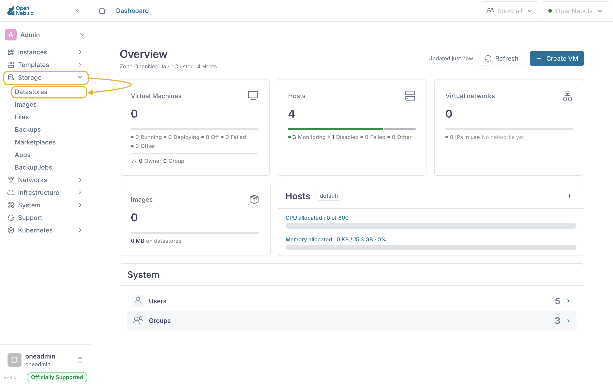

## 5.2.2

Press the **Create Datastore** button.

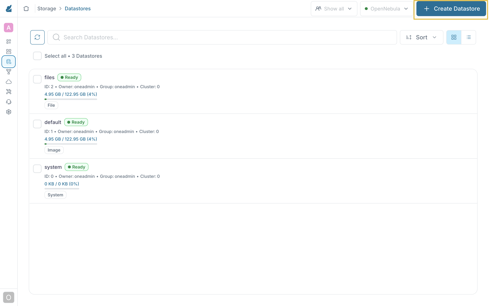

## 5.2.3

Let's create the System datastore first. 

Make sure to set the **Datastore type** to **SYSTEM** and the **Storage backend** value to **Filesystem - shared mode**. 

In this guide we will name it as **nfs-sys** while you can name it the way you wish.

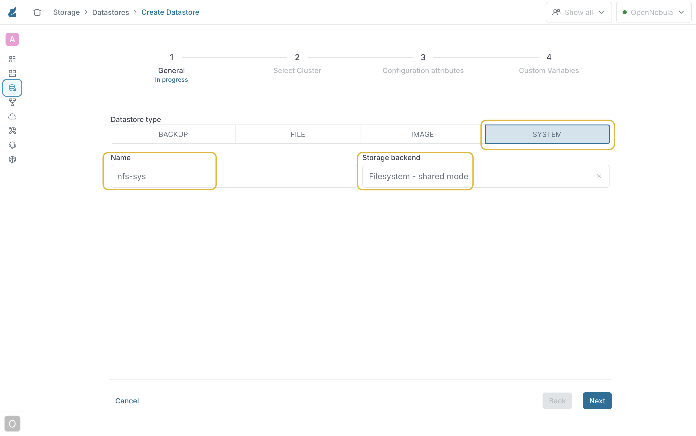

## 5.2.4

Select the **default** cluster and proceed to the next page.

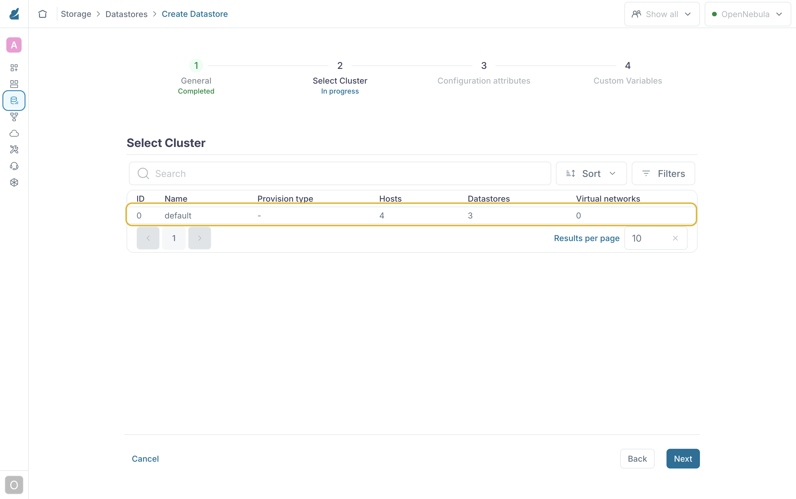

## 5.2.5

There's no need to adjust any of these settings at the moment so let's keep them on defaults and proceed to the next page.

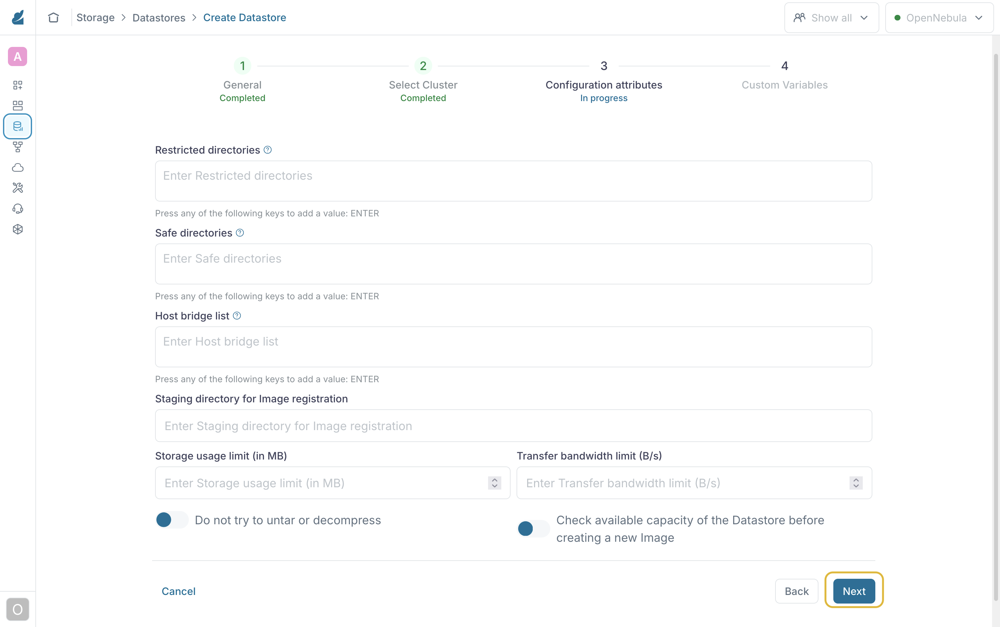

## 5.2.6

Leave the Custom Attributes page as is and finish the creation of a datastore.

## 5.2.7

Note that unlike the default system datastore - the shared one is showing the disk space metrics.

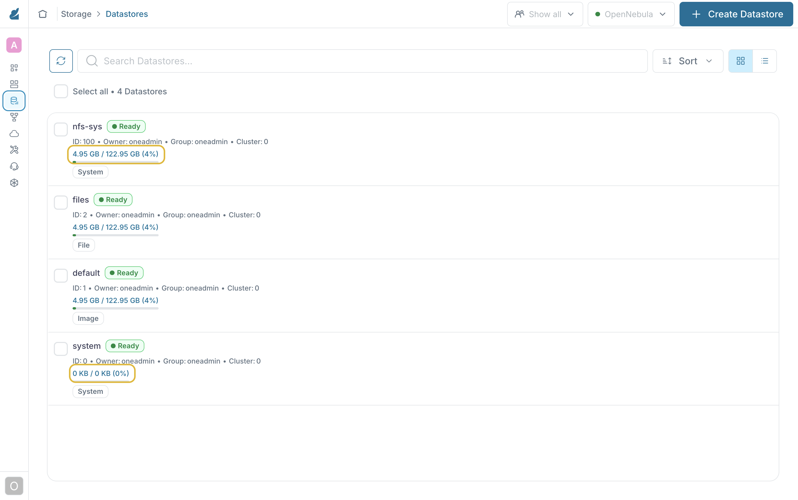

# Add the shared Image datastore.

## 5.2.8

Press the **Create Datastore** one again. 

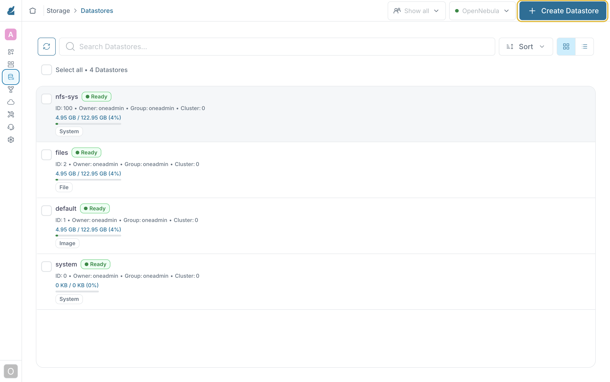

## 5.2.9

This time the **Datastore type** must be set to **IMAGE** while the backend still set to **Filesystem - shared mode**. 

Name can be set to the value you like. 

## 5.2.10 

Select the **default** cluster.

## 5.2.11

In the **Compatible system datastores** select the shared system datastore you've created before. 

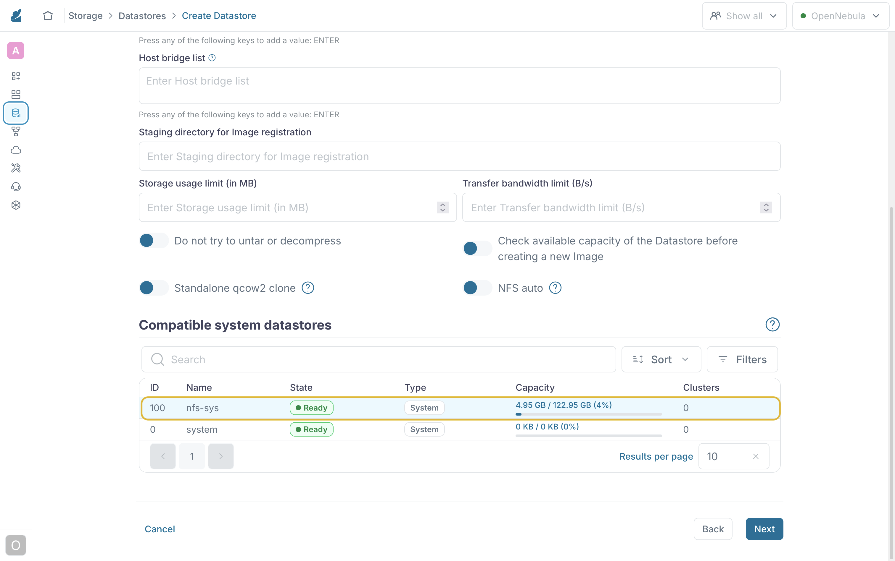

## 5.2.12

Finish the process.

## 5.2.13

You must end up having two shared datastores. 

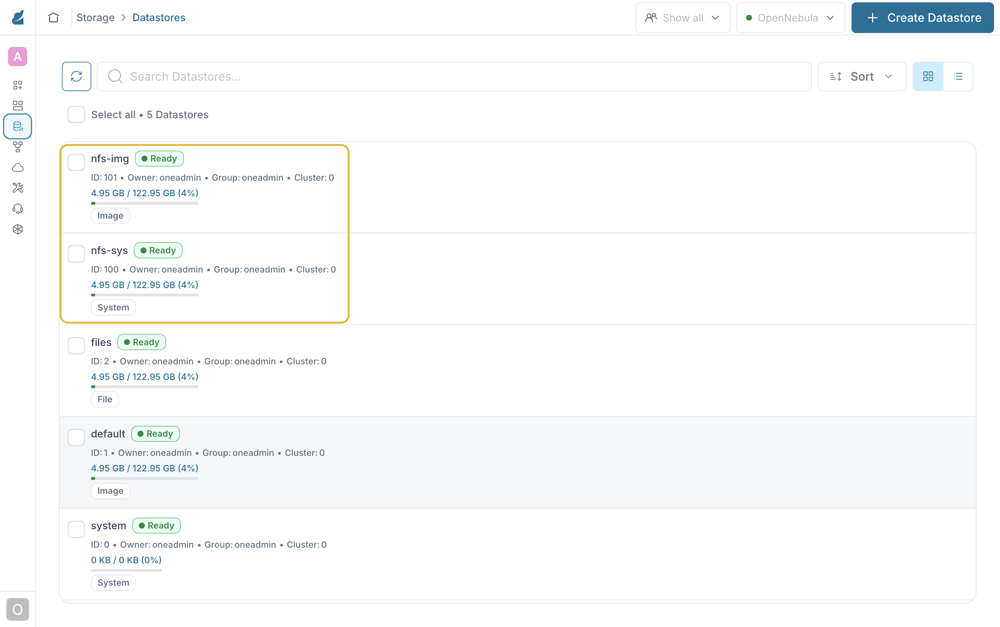

# Add a datastore with the VirtioFS. 

## 5.2.14

Press the **Create Datastore** button once again. 

## 5.2.15

It is going to be anothe **IMAGE** datastore yet with **Storage backend** set to **VirtioFS** this time. 

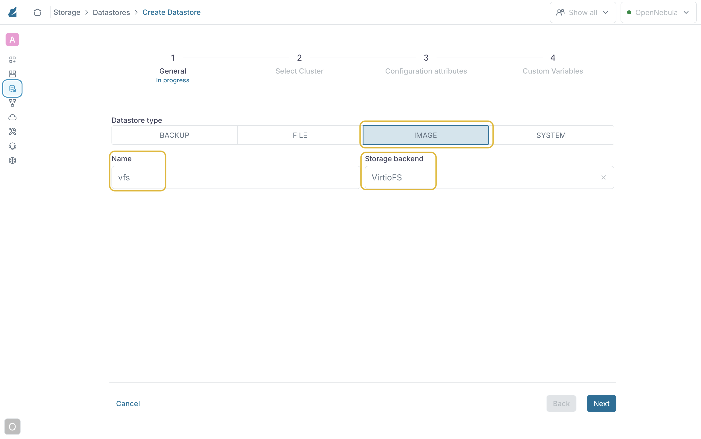

## 5.2.16

Set the cluster to **default** and proceed to the next step. 

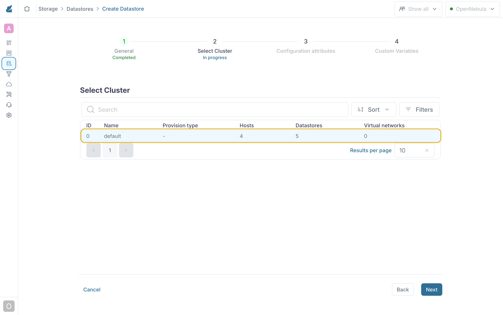

## 5.2.17

Keep this section as is.

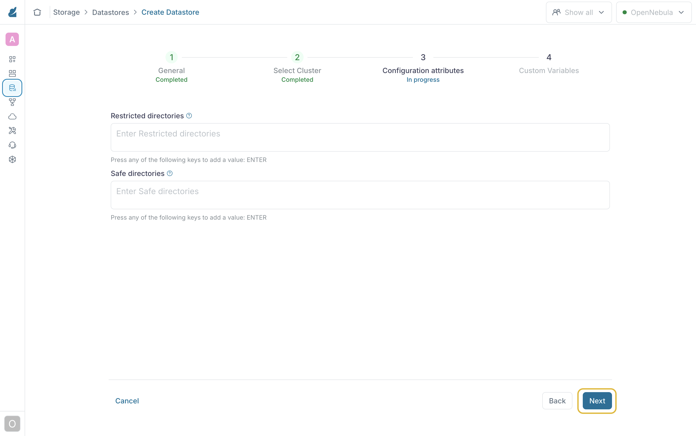

## 5.2.18

Keep this section as is and finish the process.

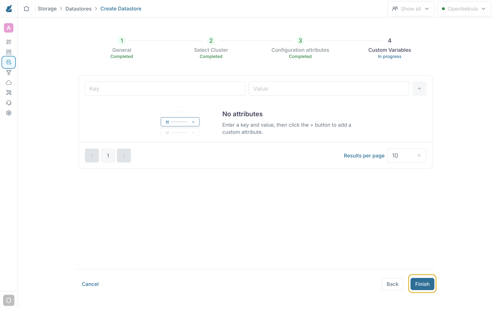

## 5.2.19

The last datastore supposed to be added and ready to use. 

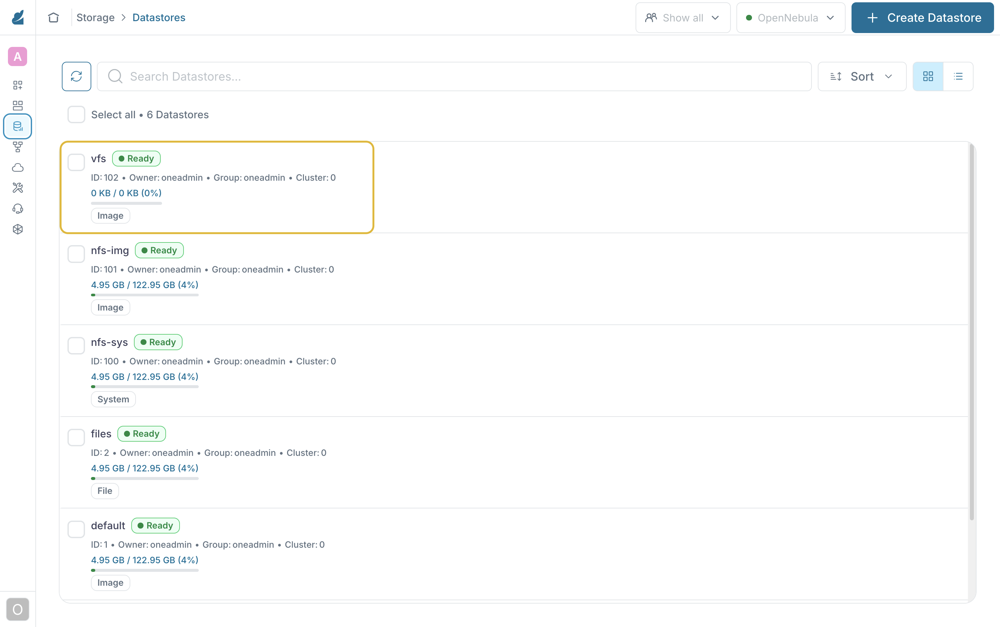

# Congratulations, you've completed the assignment!
{: .no_toc}