## Module 5 - Lab 3 : Image Management
{: .no_toc}

## Table of Contents
{: .no_toc}

<details markdown="block">
  <summary>
    Expand to access the In-page navigation
  </summary>
  {: .text-delta }
1. TOC
{:toc}
</details>
    
## Objective(-s):
- Download an Image from the Marketplace.
- Locate the actual Image on the datastore.
- Import an Image from the URL.
- Create an empty Image.
- Change the Persitency of an Image.


### Download Images from the Marketplace.

    
## 5.3.1

Navigate to **Storage -> Apps** to access the list of available Images in the Marketplaces. 

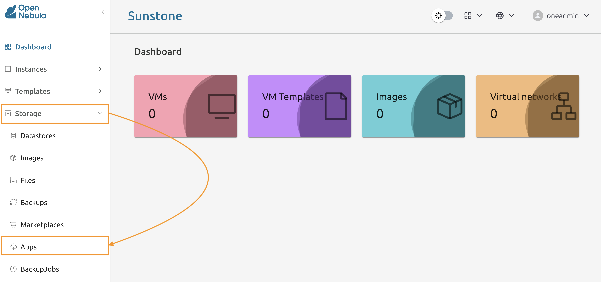

    
## 5.3.2

In the search bar enter **Alpine Linux 3.21** and locate the **Alpine Linux 3.21** image. 

Please select the **correct architecture**!

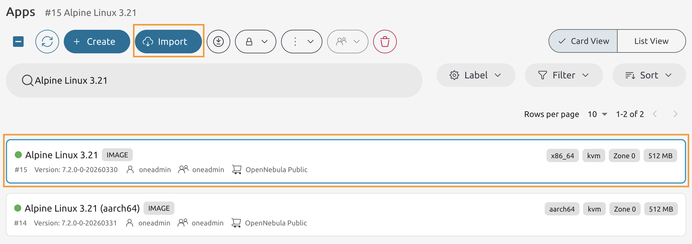

    
## 5.3.3

Select the **Alpine Linux 3.21** with the correct architecture and press **Import** button.

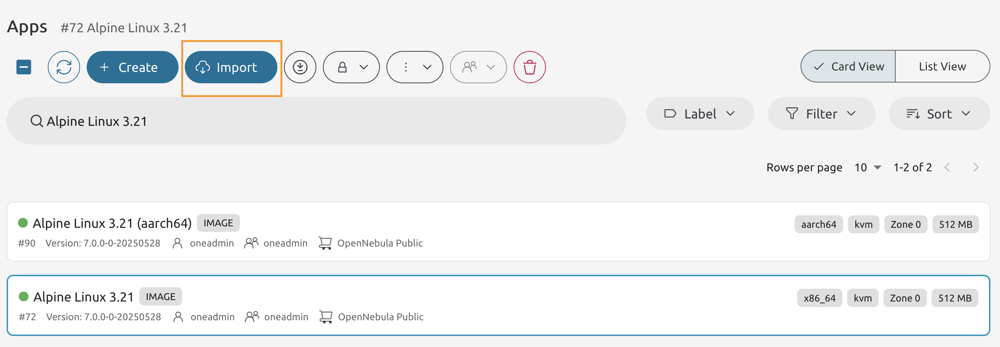

    
## 5.3.4

Keep the names as is, then proceed to the next page of the wizard.

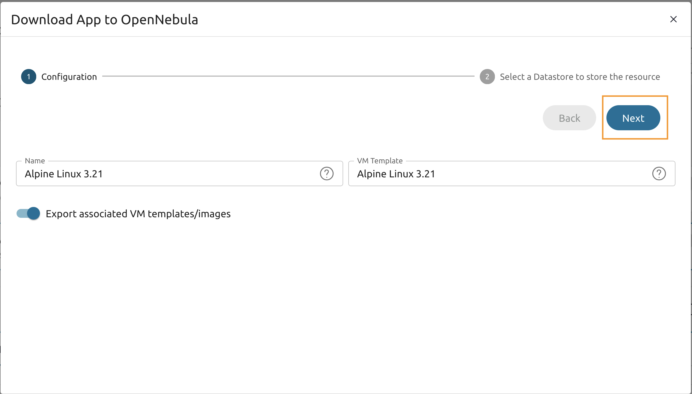

    
## 5.3.5

From the datastores select the **default** one and press **Finish**.

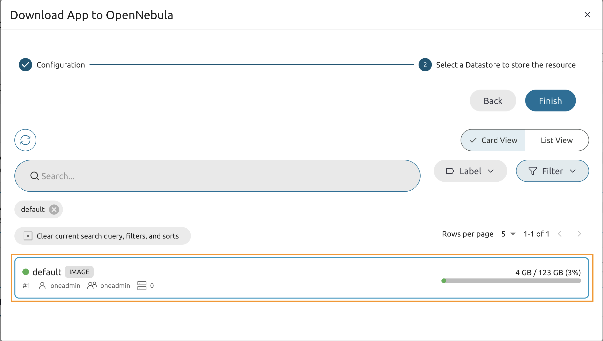

    
## 5.3.6

Go to the Node 1's Command Line and and list the currently available images.

```console
oneimage list

ID USER     GROUP    NAME                 DATASTORE     SIZE TYPE PER STAT RVMS
0 oneadmin oneadmin Alpine Linux 3.21     default       512M OS    No rdy     0
```


## 5.3.7

While in the Node 1's Command Line use the **onemarketapp** command to import the Ubuntu 24.04 Image.

```console
onemarketapp export 'Ubuntu 24.04' 'Ubuntu 24.04' -d 1

IMAGE
    ID: 1
VMTEMPLATE
    ID: 1
```

Execute the **oneimage** command one more time

```console
oneimage list

ID USER     GROUP    NAME                    DATASTORE     SIZE TYPE PER STAT RVMS
1 oneadmin oneadmin Ubuntu 24.04             default       3.5G OS    No rdy     0
0 oneadmin oneadmin Alpine Linux 3.21        default       512M OS    No rdy     0
```
    
# Locate the actual Image on the datastore.

    
## 5.3.8

Use the oneimage Command Line to show the extended information on the Alpine Linux 3.21 image.

Copy the **SOURCE** value.

```console
oneimage show 0

IMAGE 0 INFORMATION
ID             : 0
NAME           : Alpine Linux 3.21
USER           : oneadmin
GROUP          : oneadmin
LOCK           : None
DATASTORE      : default
TYPE           : OS
REGISTER TIME  : 04/16 10:11:43
LAST MODIFIED  : 04/16 10:11:43
PERSISTENT     : No
SOURCE         : /var/lib/one//datastores/1/e4b9bd2b837e18df15013f380f1e631f
PATH           : https://marketplace.opennebula.io/appliance/9ea07f80-beb8-013d-a75b-7875a4a4f528/download/0
FORMAT         : qcow2
...
```

    
## 5.3.9

Use the **file** command to check the file data.

Please use the **SOURCE** from your previous output!

```console
file <SOURCE> |  cut -d ':' -f 2
    QEMU QCOW Image (v3), 536870912 bytes, AES-encrypted (v3), 536870912 bytes
```

# Import an Image from the URL.

    
## 5.3.10

Navigate to the **Storage -> Images**.

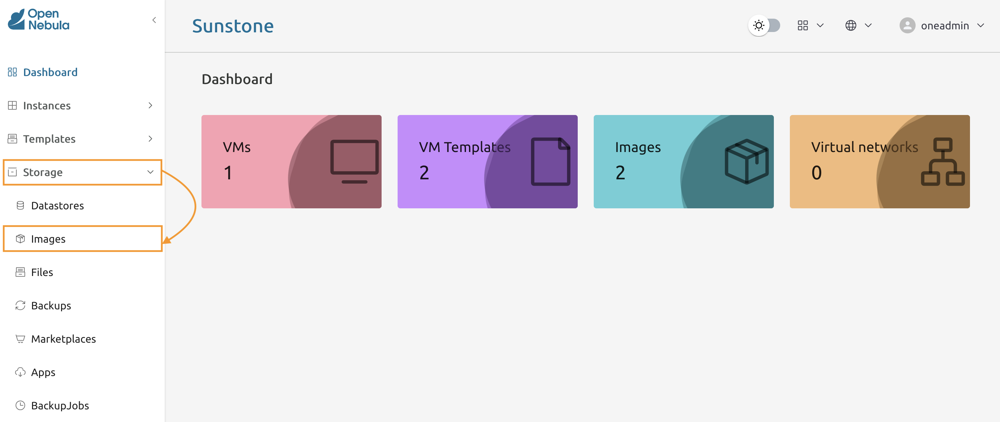

    
## 5.3.11

Press **Create** to start the wizard.

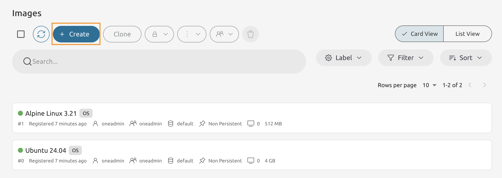

    
## 5.3.12

Name image as **Alpine Linux DB Server**.

Set the URL to https://one-training-files.s3.eu-central-1.amazonaws.com/alpine_db_server.qcow2

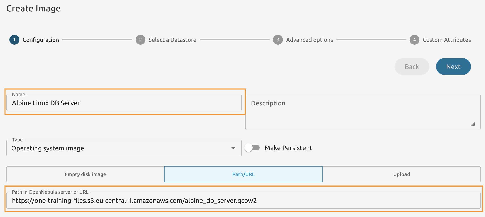

    
## 5.3.13

Select the **default** cluster.

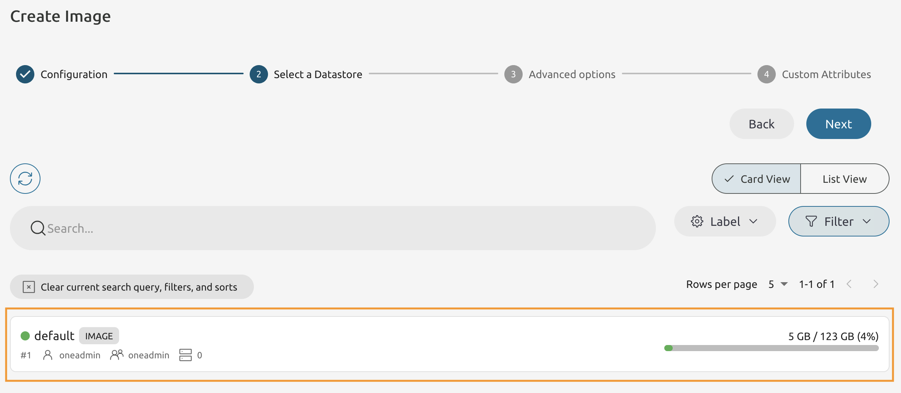

    
## 5.3.14

Set the **BUS** to **Virtio**.

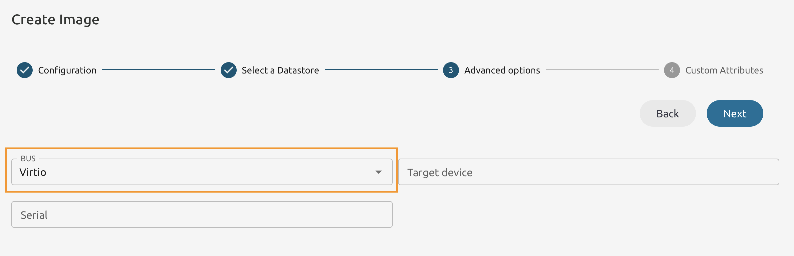


## 5.3.15

Keep the **Custom Atributes**  empty and press **Finish**

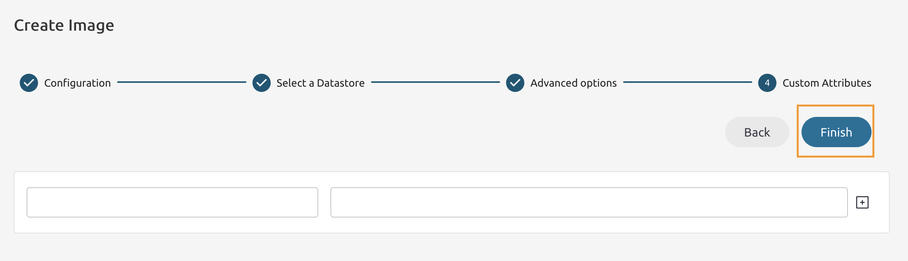

    
## 5.3.16

Return to Node 1's Command Line and extract the ID of a newly added Image. 

```console
oneimage list --filter NAME~DB

ID USER     GROUP    NAME                        DATASTORE     SIZE TYPE PER STAT RVMS
2 oneadmin oneadmin Alpine Linux DB Server       default         5G OS    No rdy     0
```

Change the permissions for the **Alpine Linux DB Server** image.

```console
oneimage chmod <Image ID> 644
```

# Create an Empty Image.

    
## 5.3.16

In the Node 1's Command Line create a file with the following content.

```console
SIZE=1024
NAME="Generic Datadisc"
FORMAT=qcow2
TYPE=DATABLOCK
```
    
## 5.3.17

Use the **oneimage create** to create the new disk on the **default Image datastore**.

```console
oneimage create <FILE NAME> --datastore 1
ID: 3
```

Use **oneimage show** to extract extract the path to the actual Image.

```console
oneimage show 3

IMAGE 2 INFORMATION
ID             : 3
NAME           : Generic Datadisc
...
SOURCE         : /var/lib/one//datastores/1/f3ed0184c89fdbd3adba8f984e2f1422
...
```

Copy the value from the **SOURCE** field.

    
## 5.3.17

Inspect the file using the **file** command.

**Use the **SOURCE** from the oneimage show output!**

```console
file <SOURCE> |  cut -d ':' -f 2

QEMU QCOW Image (v3), 21474836480 bytes (v3), 21474836480 bytes
```

Check the actual size of an Image using the **du** command.

```console
du -h <SOURCE>

196K	/var/lib/one//datastores/1/f3ed0184c89fdbd3adba8f984e2f1422
```

    
## 5.3.19

Allow **Group** members and **Other** OpenNebula users to use all images. 

```console
oneimage chmod 0,2 644
```

# Change the Persitency of an Image.
    
## 5.3.20

In Sunstone on the Images page select **Alpine Linux 3.21** and **Ubuntu 24.04** images.

Then from the drop-down list select **Persistent**.

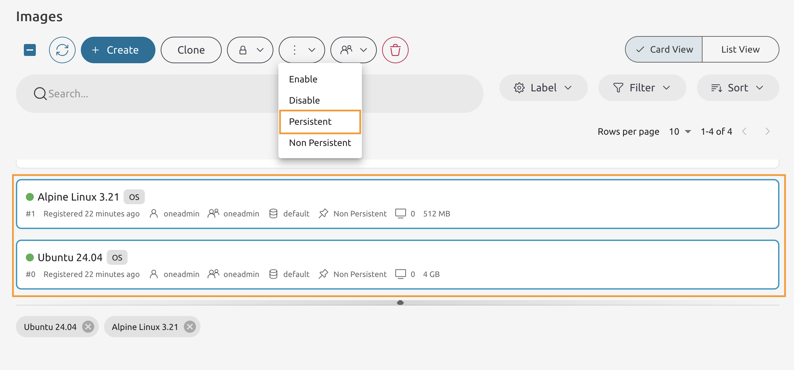

    
## 5.3.21

You should end up with four images, two of them must be **Persistent**. 

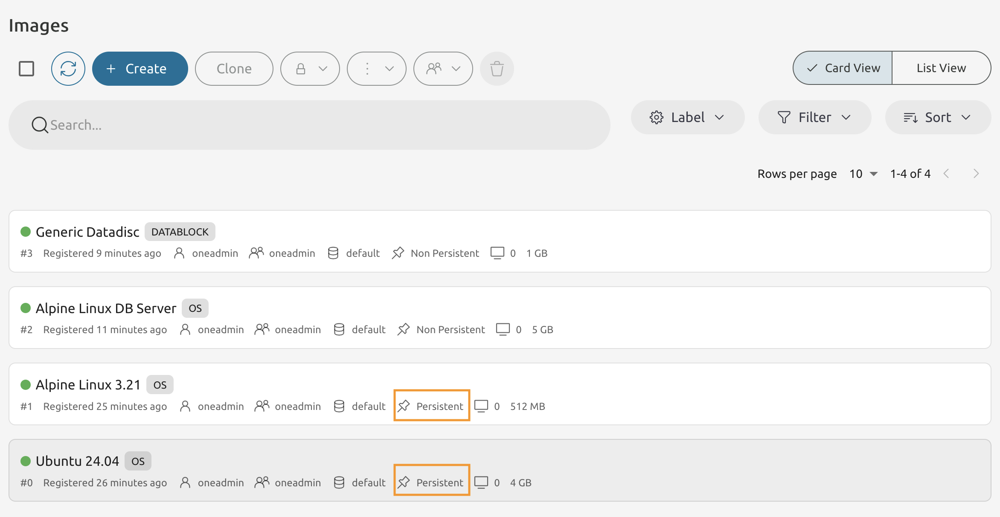
    
# Congratulations, you've completed the assignment!
{: .no_toc}