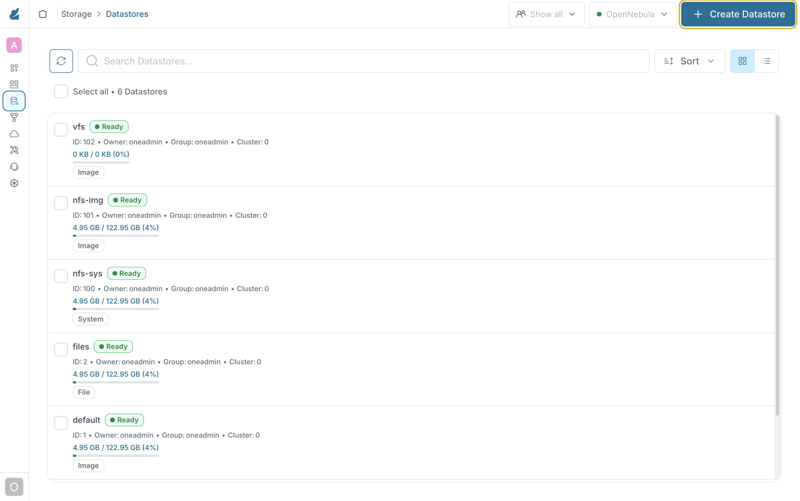
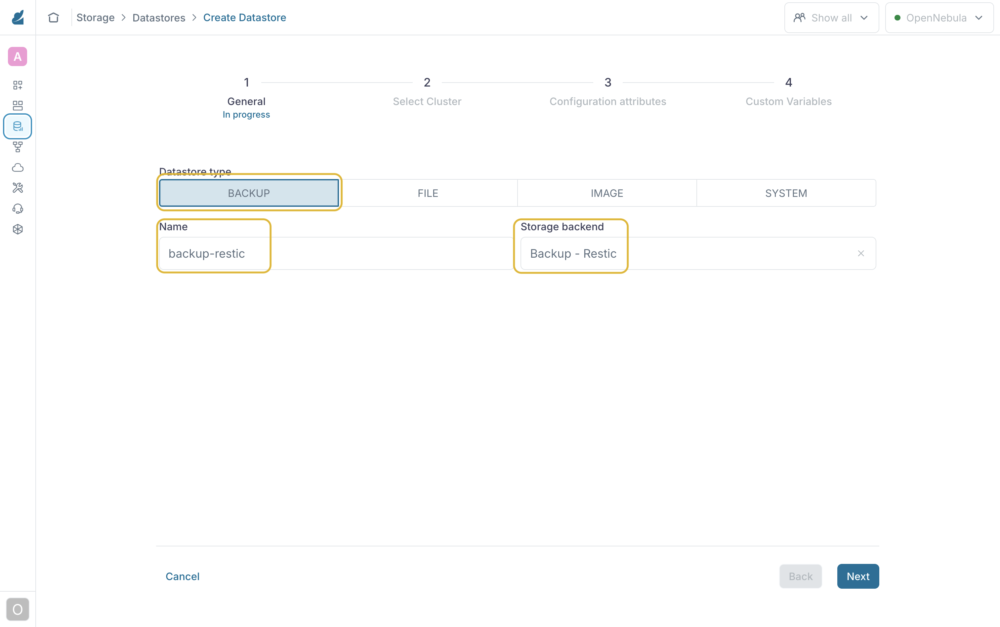
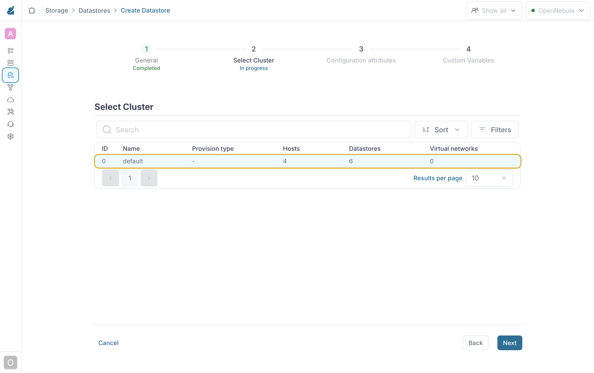
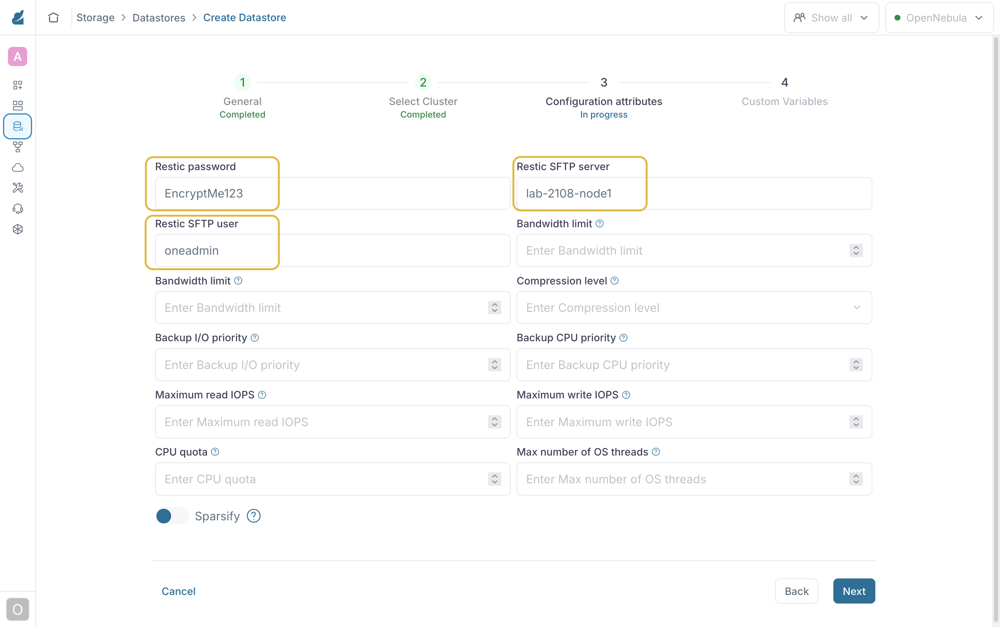
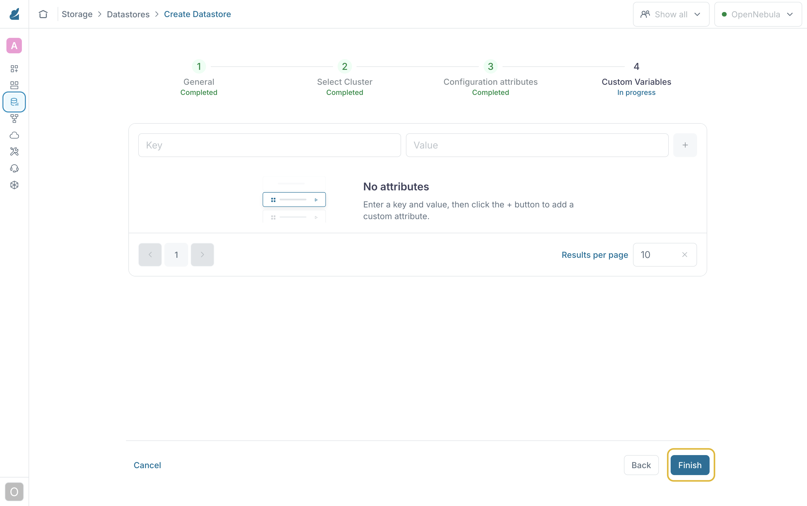

# Module 5 - Lab 3 : Backup Datastore
{: .no_toc}

## Table of Contents
{: .no_toc}

  

    Expand to access the In-page navigation
  

  {: .text-delta }
1. TOC
{:toc}

## Objective(-s):

- Create a Backup (Restic) datastore.

# Create a Backup (Restic) datastore.

{: .warning}
> Please note that in this lab environment the **Frontend** node is acting as the backup server. In a real-life scenario the backup server must be on a separate node! **Therefore you don't need to make sure that the backup server is reachable!**

## 5.3.1

Press the **Create Datastore** to start the process.

## 5.3.2

Set the **Datastore type** to **BACKUP** and the **Storage backend** to **Backup-Restic**.

You can name the datastore the way you wish.

## 5.3.3

Set the cluster to **default**. 

## 5.3.4

There are three important fields to configure:

- Set the **Restic password** to any value. This value will be used to encrypt the data at rest. 
- Set the **Restic SFTP server** to **lab-X-node1** where X is your unique Lab ID.
- Set the **Restic SFTP user** to **oneadmin**.

## 5.3.5

Leave **Custom Variables** as is and finish the process.

## 5.3.6

You shold end up with another datastore added. Refresh the page and make sure it is monitored and the disk space metrics are gathered! 

# Congratulations, you've completed the assignment!
{: .no_toc}