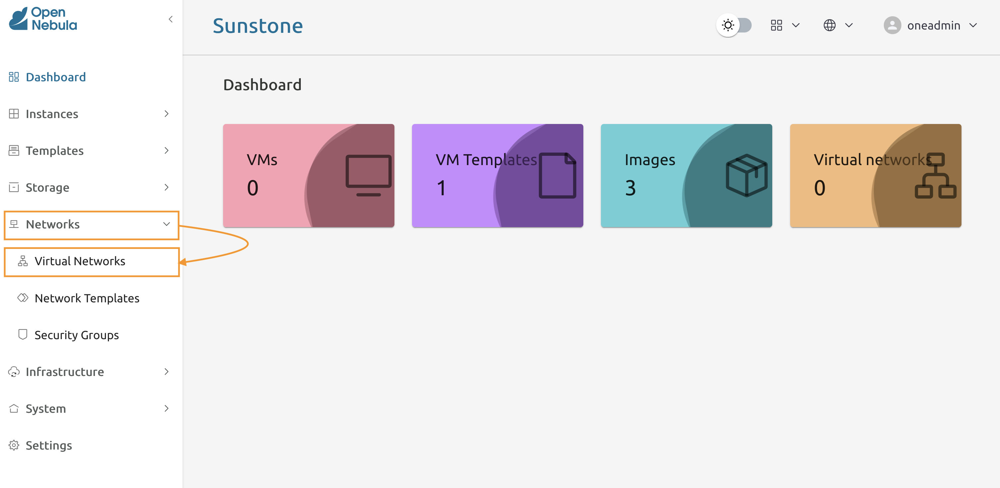
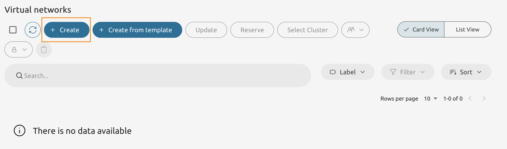
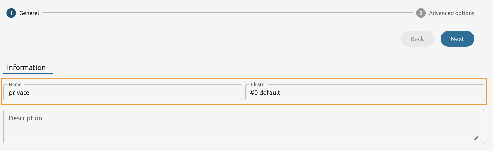
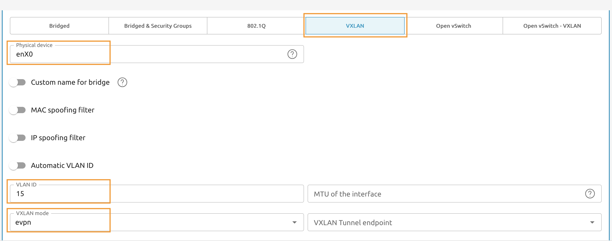
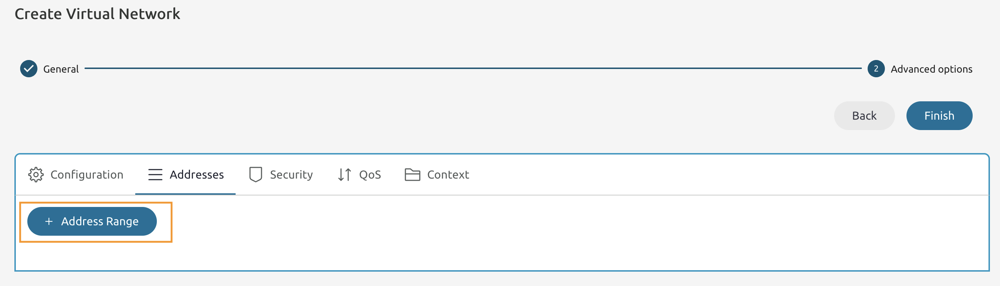
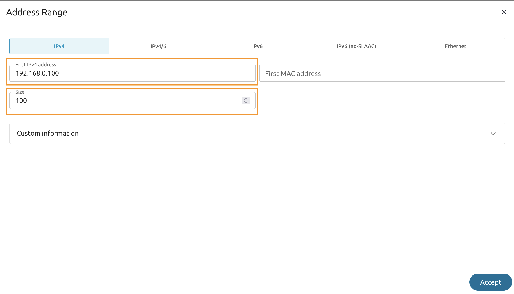
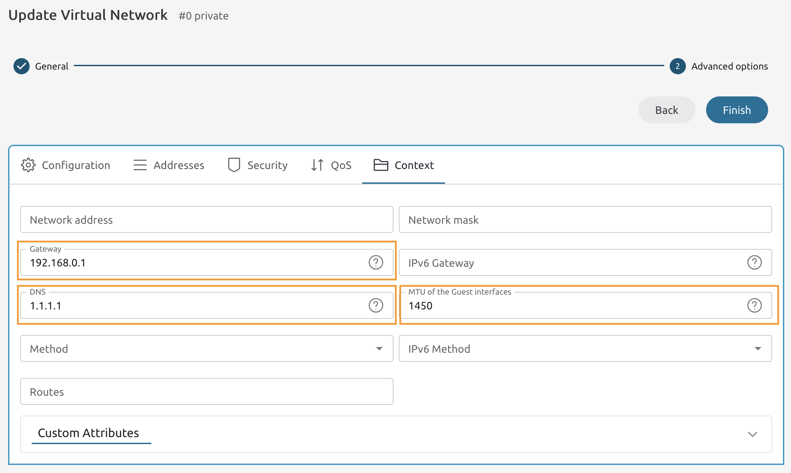

# Module 6 - Lab 1 : Virtual Networks
{: .no_toc}

## Table of Contents
{: .no_toc}

<details markdown="block">
  <summary>
    Expand to access the In-page navigation
  </summary>
  {: .text-delta }
1. TOC
{:toc}
</details>  
    
## Objective(-s):
- Create a routable Virtual Network with VXLAN type.
- Create an isolated Virtual Network with VXLAN type.

    
# Create a routable Virtual Network with VXLAN type.

## 6.1.1

Connect to either of the Hypervisor Nodes using the SSH and execute the **ip** command.

```console
ip -br a

lo     UNKNOWN    127.0.0.1/8 ::1/128
enX0   UP         10.0.126.101/28 metric 100 fe80::852:39ff:fe52:2f25/64
```

{: .note}
> Note the name of your interface - you are going to use it in the future steps. Please be aware that your output might differ from the one in the guide!
    
## 6.1.2

In Sunstone navigate to **Networks -> Virtual Networks**



    
## 6.1.3

Press **Create** to add a new Virtual Network.



    
## 6.1.4

Name it whatever you wish and select the **default** cluster.



    
## 6.1.5

Select **VXLAN** as the driver.

Attach it to the **enX0** physical device.

Use **15** as VLAN ID.

Set **VXLAN mode** to **evpn**.



    
## 6.1.6

Under the **Addresses** tab press **Address Range**.



    
## 6.1.7

Set the **First IPv4 address** to **192.168.0.100**.

And Size to be **100**.



    
## 6.1.8

Navigate to **Context** tab.

Set Gateway to **192.168.0.1**.

And DNS to **1.1.1.1**.

And press **Finish**.




### Create an isolated Virtual Network with VXLAN type.

    
## 6.1.8

Switch to the Node 1's Command Line and create a file named **isolated.conf** and with the following contents. Make sure to set **your interface name**.

Set the size and the first IP address to the values you wish making sure you have at least 10 spare IPs.

```console
NAME="isolated"
GUEST_MTU="1450"
IP_LINK_CONF="nolearning="
PHYDEV="<INTERFACE_NAME>"
VN_MAD="vxlan"
VXLAN_MODE="evpn"
AUTOMATIC_VLAN_ID="YES"
AR=[TYPE = "IP4", IP = "<FIRST_IP>", SIZE = "<SIZE>" ]
```

    
## 6.1.9

Use the **onevnet** command to create the isolated network.

```console
onevnet create isolated.conf

ID: 1
```

You should end up with two virtual networks.

```console
onevnet list

ID USER     GROUP    NAME     CLUSTERS   BRIDGE       STATE        LEASES OUTD ERRO
1 oneadmin oneadmin isolated  0          onebr1       rdy               0    0    0
0 oneadmin oneadmin routable   0          onebr.15     rdy               0    0    0
```
    
# Congratulations, you've completed the assignment!
{: .no_toc}