# Module 5 - Lab 2 : Security Groups
{: .no_toc}

## Table of Contents
{: .no_toc}

  

    Expand to access the In-page navigation
  

  {: .text-delta }
1. TOC
{:toc}

    
## Objective(-s):
- Create a Security Group.
- Attach the Security Group to the Isolated Virtual Network.

    
## 6.2.1

Navigate to **Networks -> Security Groups**. 

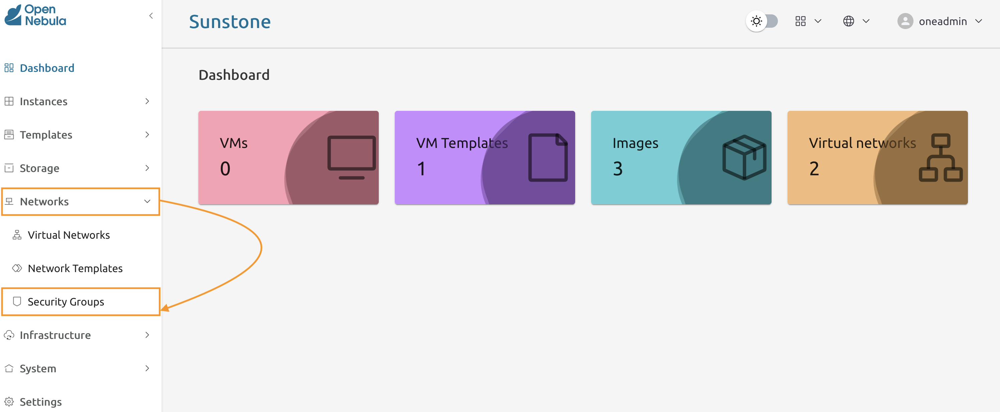

    
## 6.2.2

Press the **Create** button to add a new **Security group**.

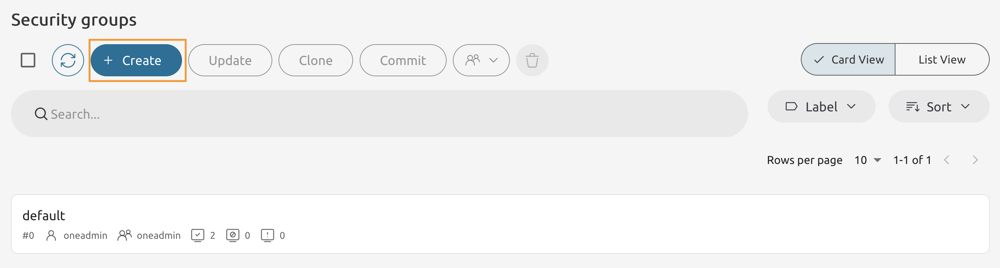

    
## 6.2.3

Name it as **App Group**. 

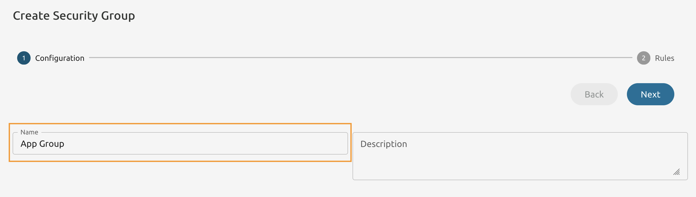

    
## 6.2.4

Add a new **Outbound** Rule with the settings as seen below.

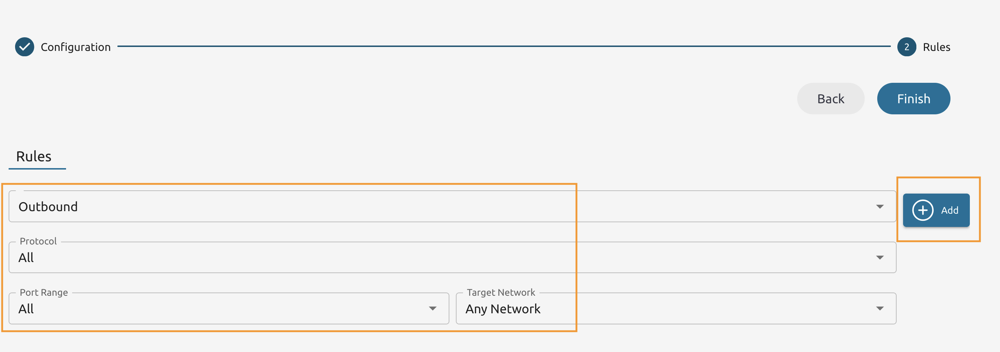

    
## 6.2.5

Add another Rule. This time it's the **Inbound** rule to allow MySQL TCP traffic from **isolated**.

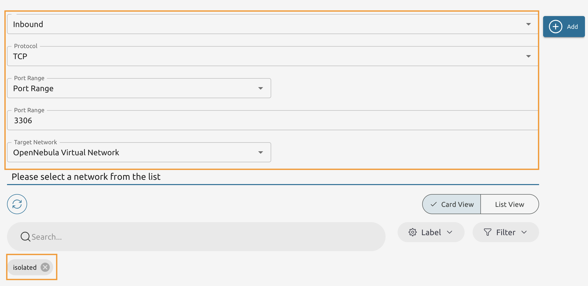

    
## 6.2.6

Add another **Inbound** rule. This time allow traffic targeting the port **22/tcp** from **Any Network**.

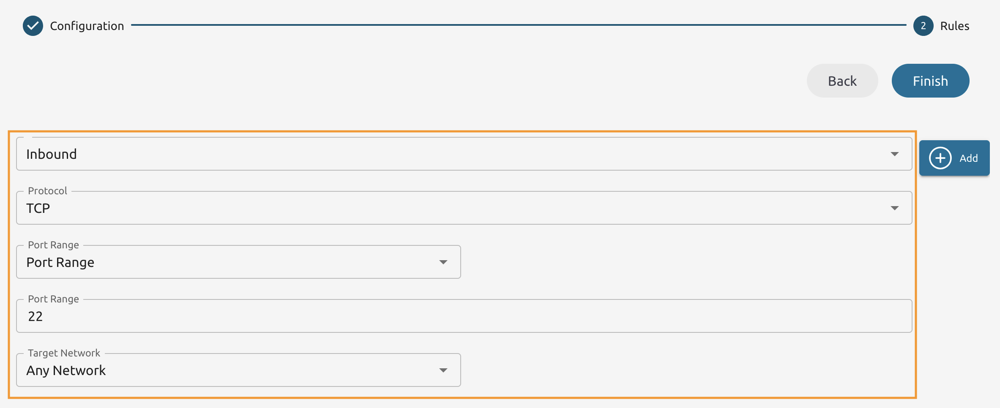

    
## 6.2.7

Add another **Inbound** rule. This time allow traffic to 5000/tcp from the **isolated** network.

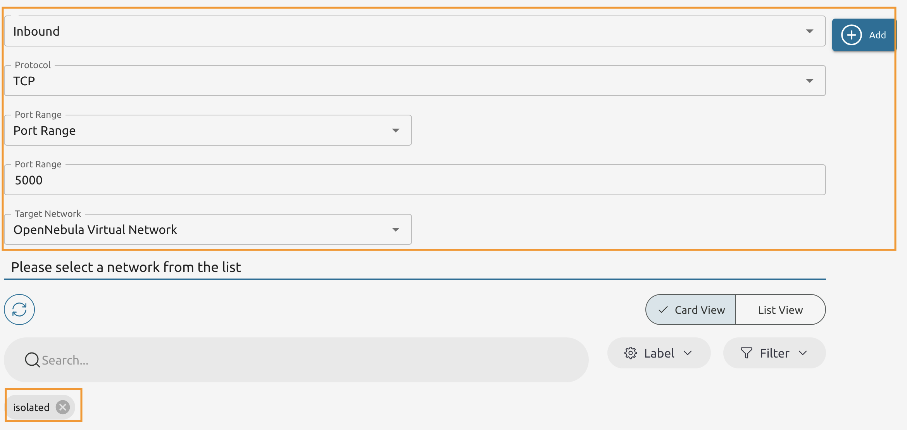

#### 5.2.8

Verify that you have the rules added and press **Finish** to add the **Security Group**.

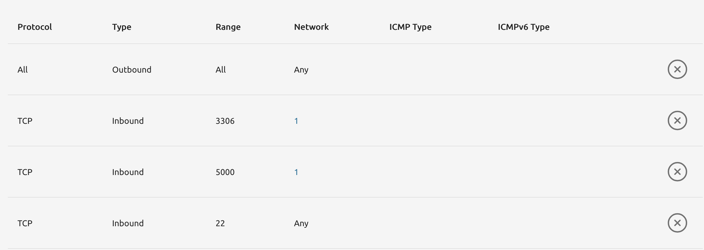

## 6.2.9

Enable **Other** users to **Use** the newly created Security Group.

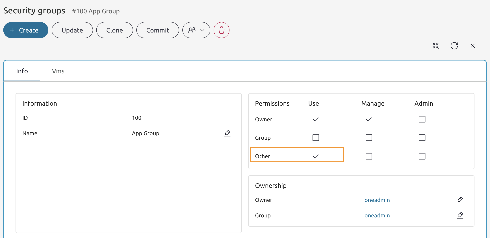

    
## 6.2.10

Select the **isolated** Virtual Network and press the **Update** button. 

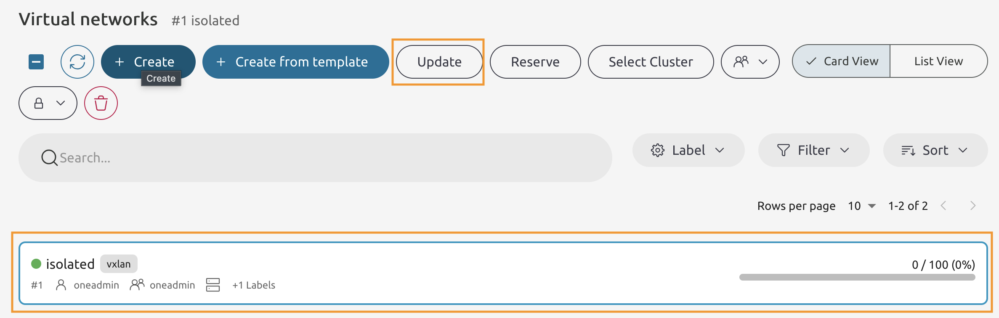

    
## 6.2.11

Add the **App Group** and then remove the **default group**, then press **Finish**.

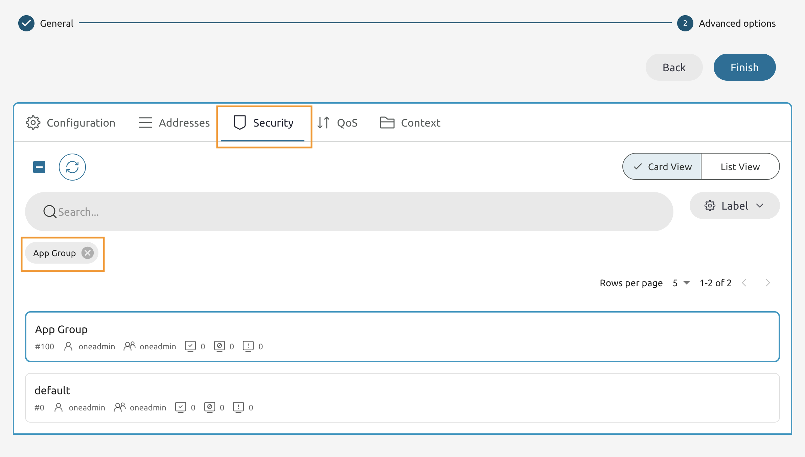
    
### Congratulations, you've completed the assignment!
{: .no_toc}