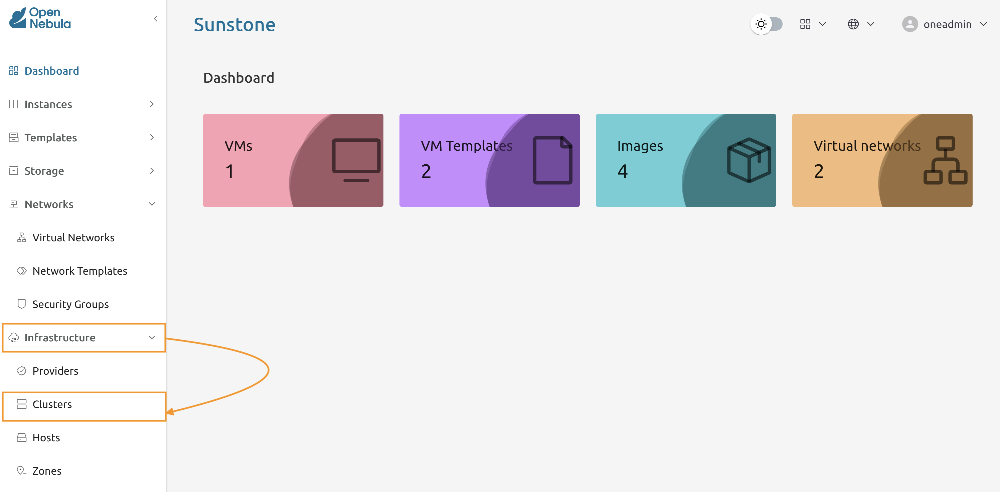
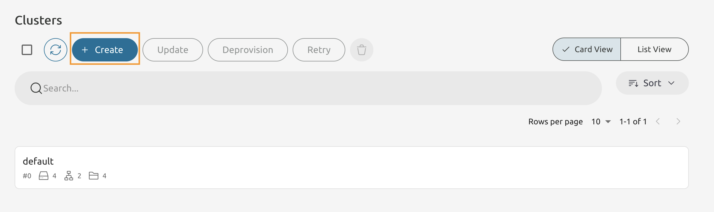
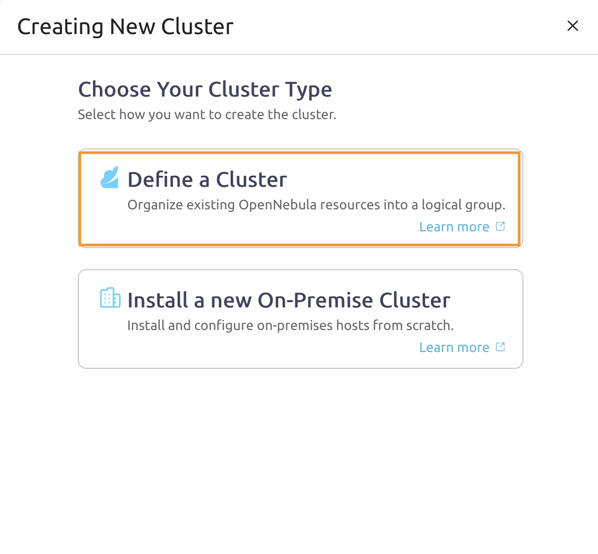
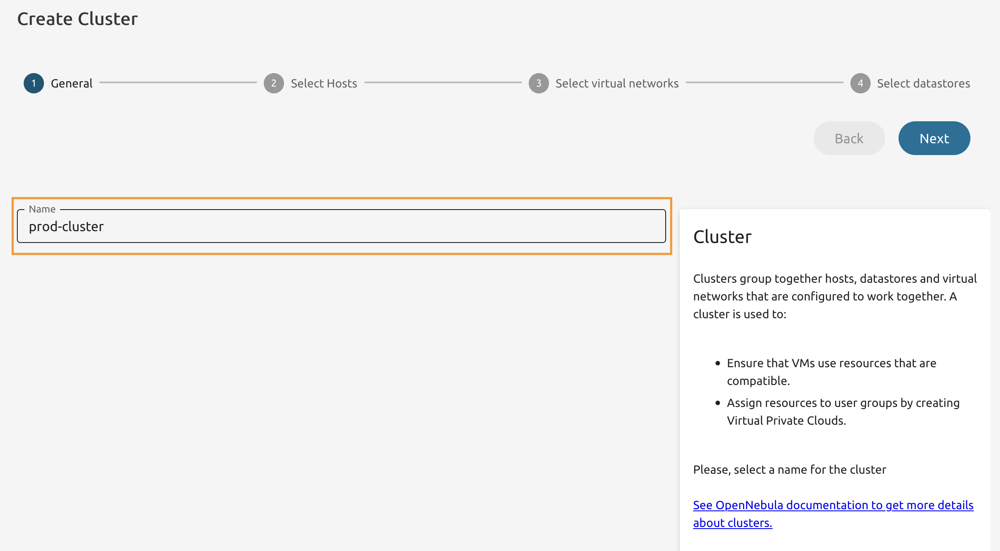
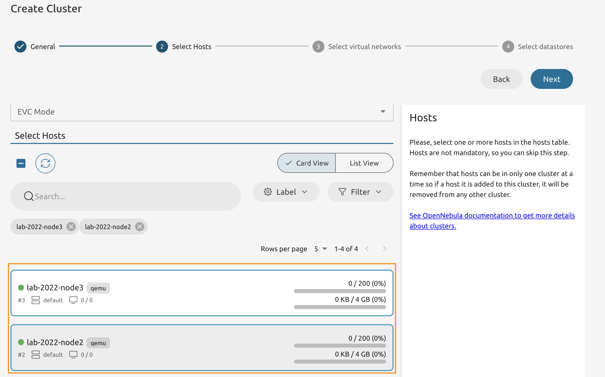
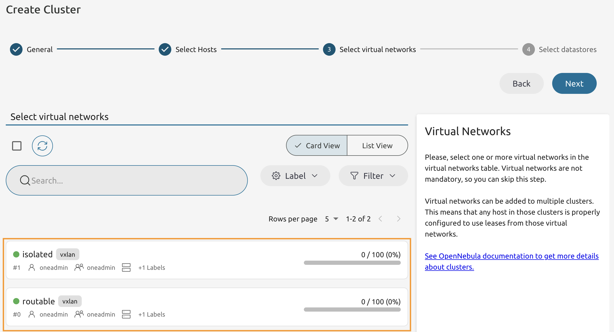
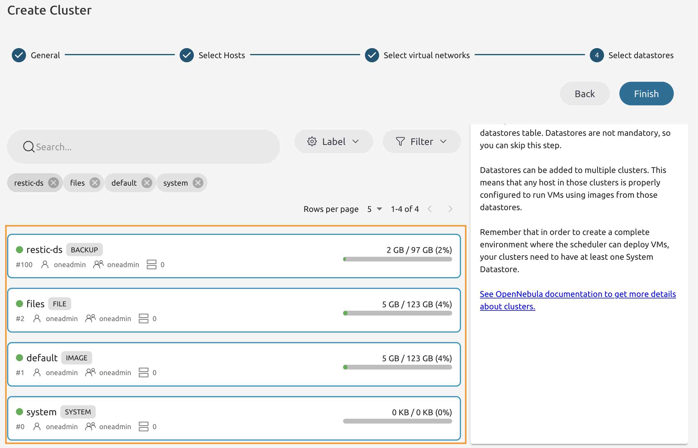
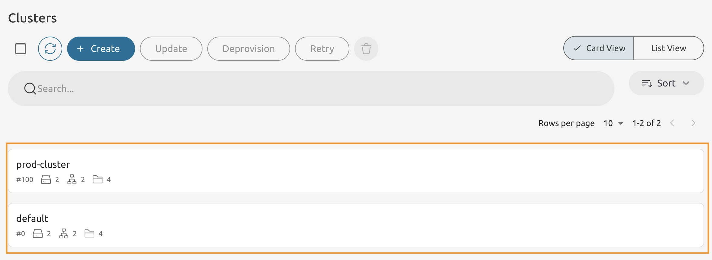

# Module 7 - Lab 1 : Cluster Management
{: .no_toc}

## Table of Contents
{: .no_toc}

  

    Expand to access the In-page navigation
  

  {: .text-delta }
1. TOC
{:toc}

    
    
## Objective(-s):
- Create a Cluster.

# Create a Cluster.
    
## 7.1.1

Navigate to the **Infrastructure -> Clusters** to access the cluster management console.

    
## 7.1.2

Press **Create** to add a new Cluster.

    
## 7.1.3

Select the **Define a Cluster** option from the list, because you are going to create a cluster from the already existing resources. 

    
## 7.1.4

Name it **prod-cluster**.

    
## 7.1.5

Add two Hosts to the Cluster that are not occupied by any VM.

    
## 7.1.6

Add both networks to the cluster.

    
## 7.1.7

Add all available **datastores** to the Cluster.

    
## 7.1.8

You should have another cluster with two hosts.
    

    
# Congratulations, you've completed the assignment!
{: .no_toc}