# Module 8 - Lab 3 : Deploy and Manage the VMs

## Table of Contents
{: .no_toc}

  

    Expand to access the In-page navigation
  

  {: .text-delta }
1. TOC
{:toc}

  

## Objective(-s):
- Deploy the Database VM.
- Deploy the Application VM.
- Verify the deployed Application.

# Deploy the Database VM.

## 8.3.1

One the **VMs** screen press the **Create** button.

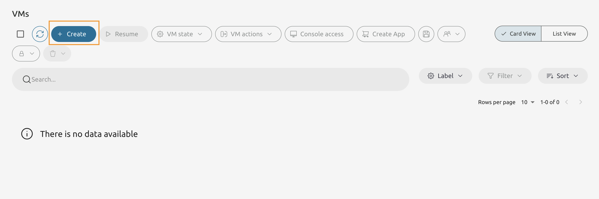

## 8.3.2

From the list of templates select the **alpine-db-server** VM Template.

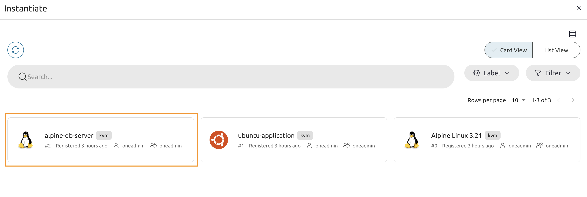

## 8.3.3

Keep everything **as is** and proceed to the next configurations screen.

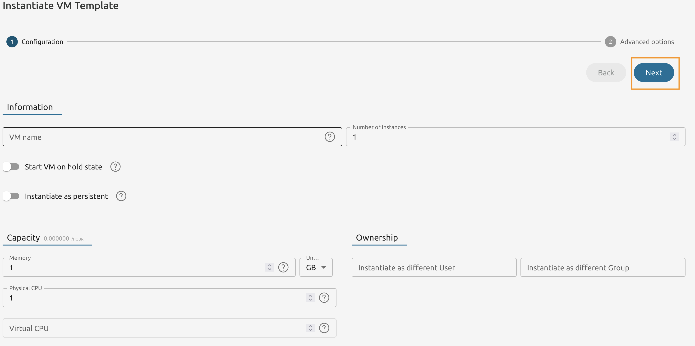

## 8.3.4

Switch to the **Placement** tab and select the **prod-cluster** cluster from the list.

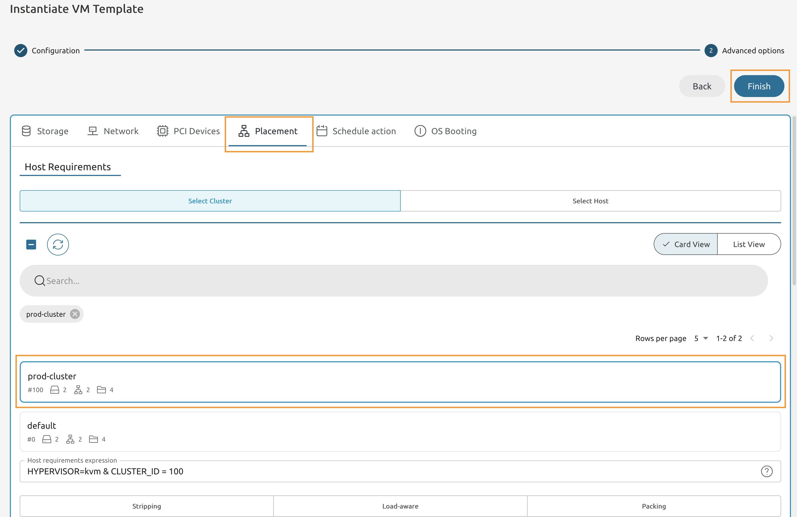

## 8.3.5

Make sure that the VM is running (status light lits Green).

Note the **IP Address** - you will need this in the future steps.

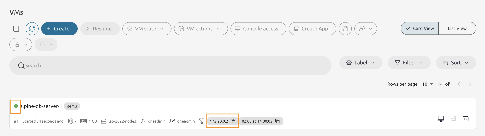

# Deploy the Application VM.

## 8.3.6

On the VMs page press the *8Create** button.

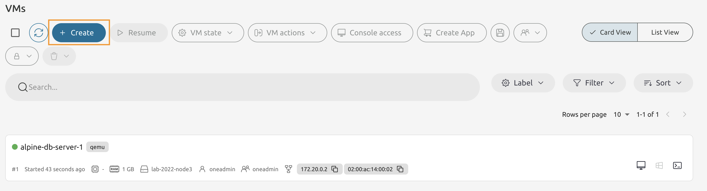

## 8.3.7

From the VM Template list select the **ubuntu-application** VM Template.

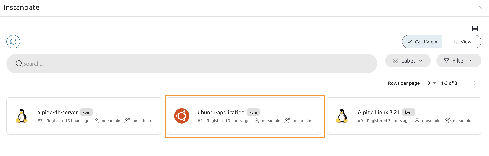
    
## 8.3.8

Keep the Configuration as is and proceed to the **User inputs**.

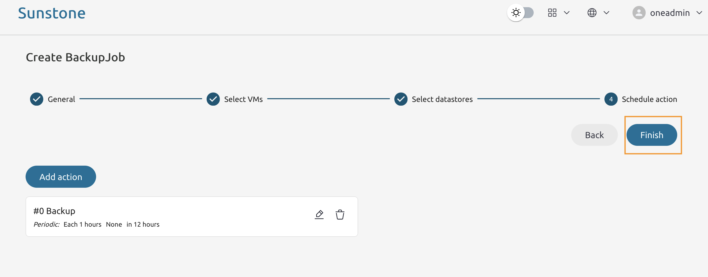
    
## 8.3.9

Set the **DB_HOST** to the IP Address of the alpine-db-server VM.

Set the **DB_PASSWORD** to **appassword** and leave rest as is.

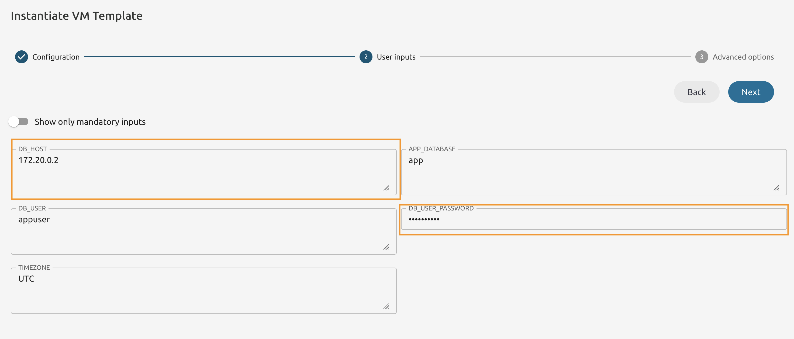

## 8.3.10

Go to the **Placement** tab and set the cluster requirement to **prod-cluster**.

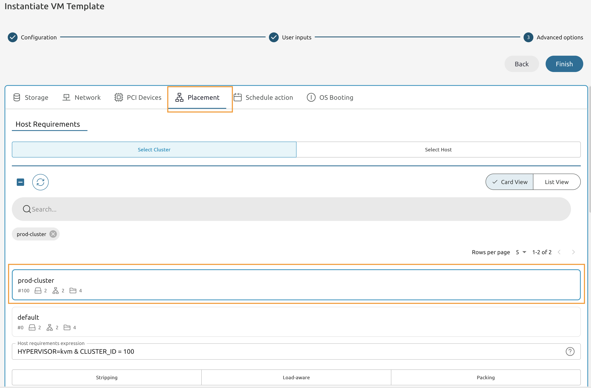
    
## 8.3.11

Wait until the newly deployed VM is **running**. 

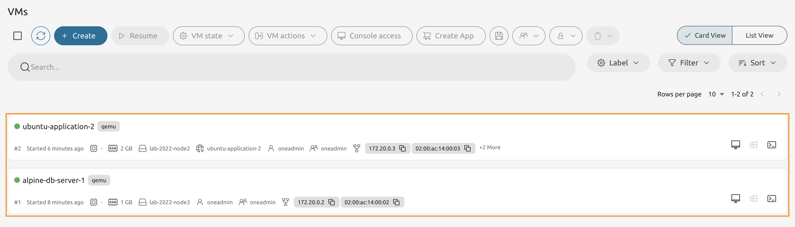

{: .note}
> It may take some time to start the Ubuntu-based VM + there's an internal sleep time to 60 seconds in the Start script. Return back in 5 minutes to proceed with the lab.
    
## 8.3.12

In the **Attributes** locate the **CFD_URL** attribute and copy the value.

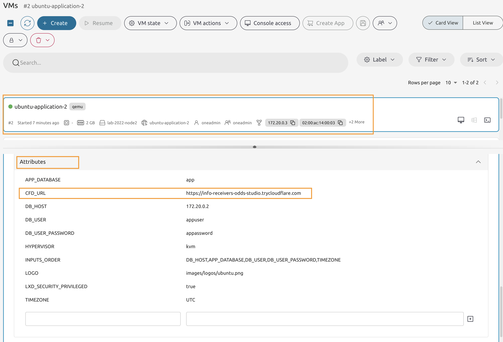

# Verify the deployed Application.
  
## 8.3.13

Open the URL in the new tab.

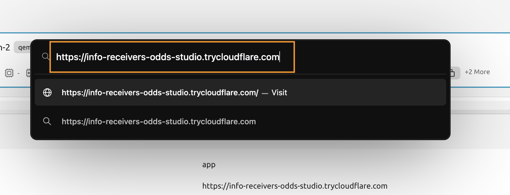
    
## 8.3.14

Make sure that the page is working and get yourself familiar with the instructions.

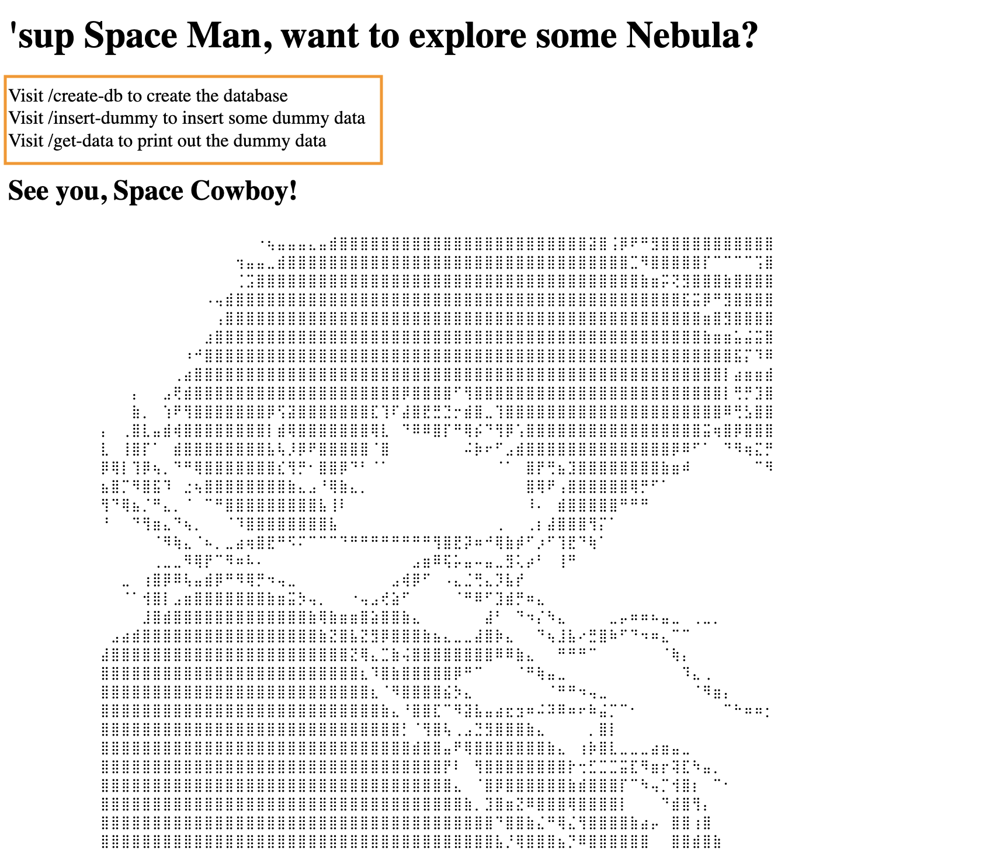
   
## 8.3.15

Visit the **/create-db** page to create the database. 

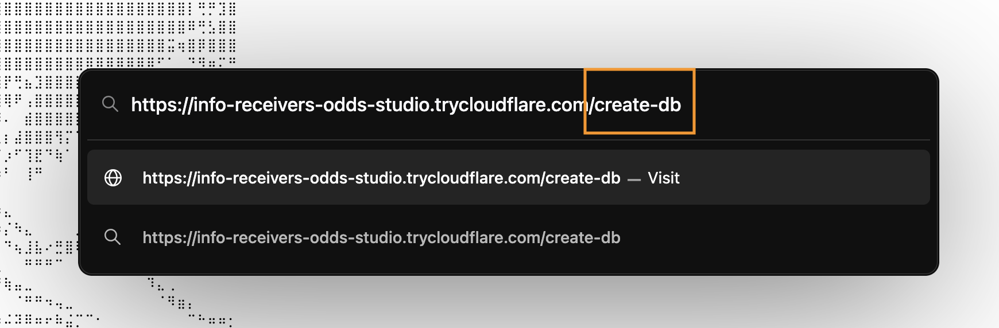
    
## 8.3.16

You **must get the success message, otherwise stop and debug the connectivity between your VMs**.

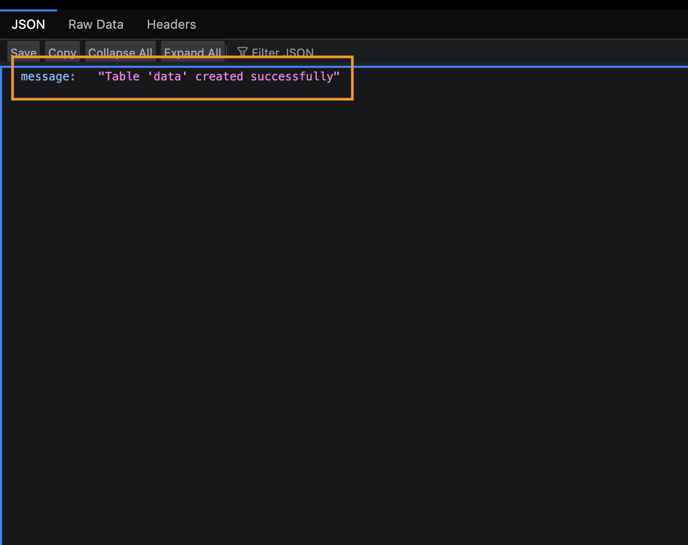
    
## 8.3.17

Now visit the **/insert-dummy** page.

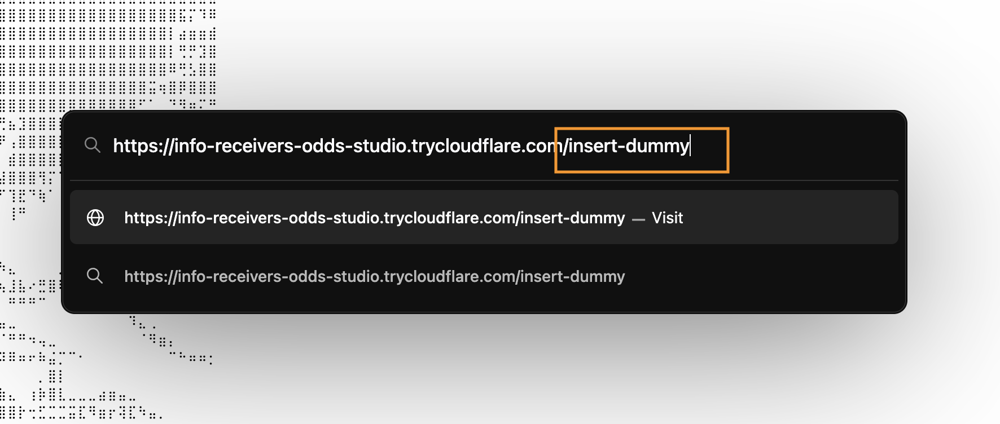
    
## 8.3.18

Refresh the page 3 to 4 times to generate more of the dummy data.

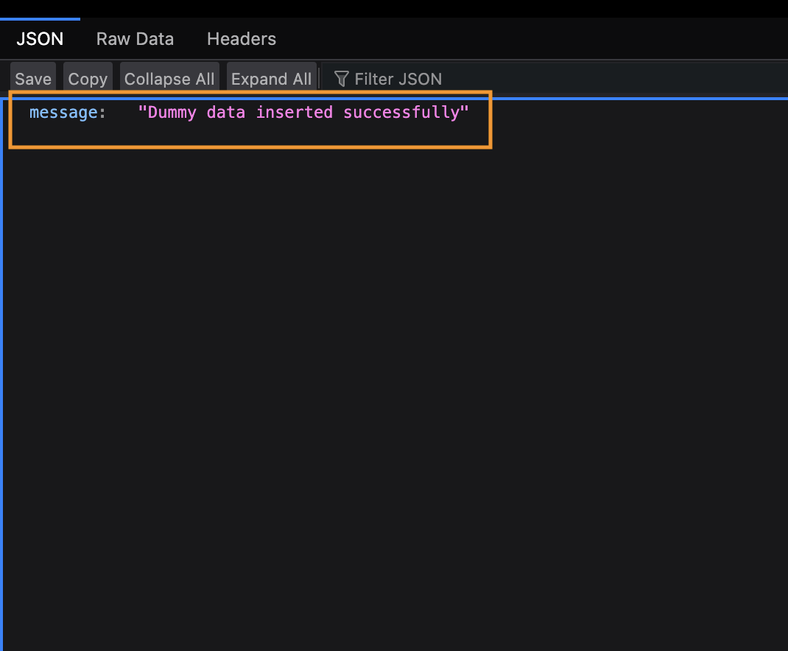
   
## 8.3.19

Now visit the **/get-data** page to print the contents of the database. 

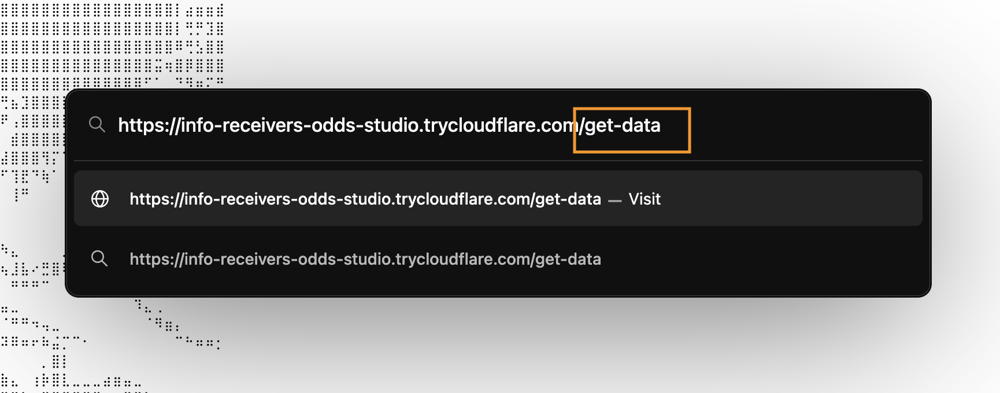
   
## 8.3.20

Your data must be printed.

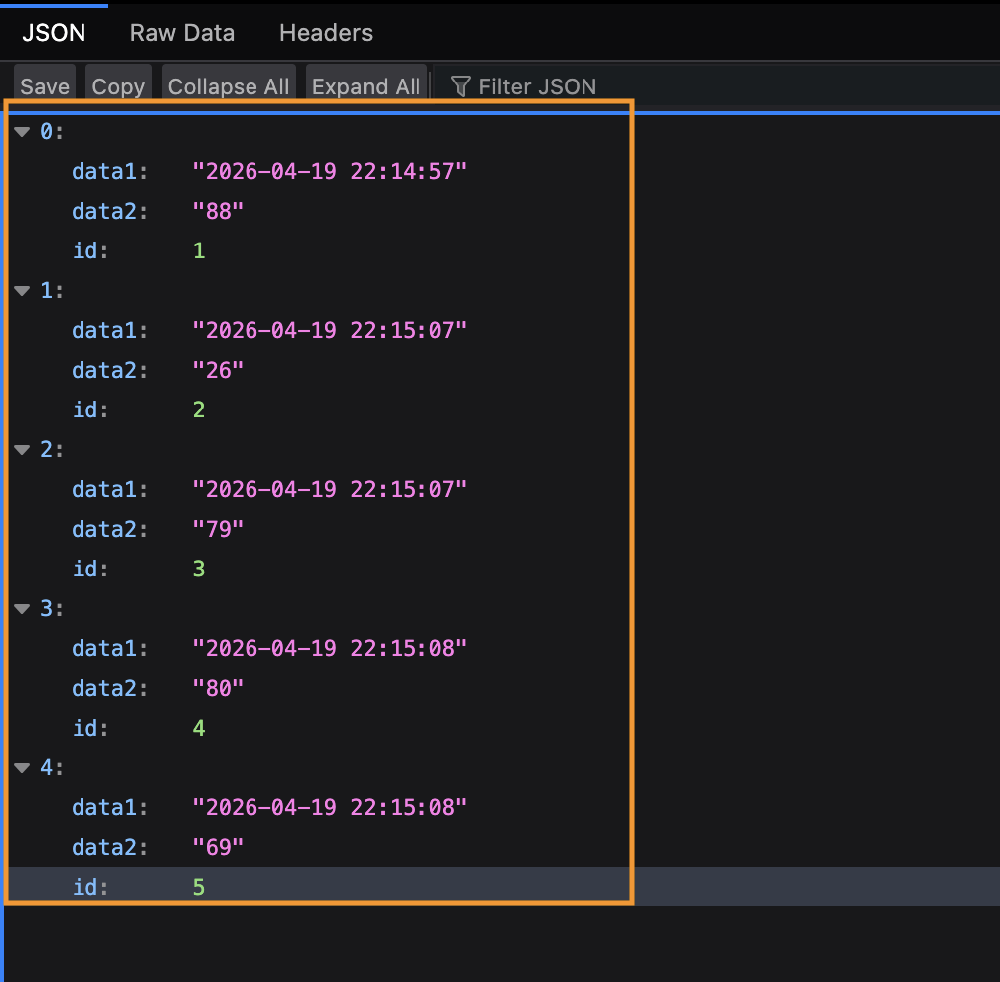					
  
# Congratulations, you've completed the assignment!
{: .no_toc}