# Module 8 - Lab 4 : VM Operations

## Table of Contents
{: .no_toc}

  

    Expand to access the In-page navigation
  

  {: .text-delta }
1. TOC
{:toc}

    
## Objective(-s):
- Perform the Backup, Recover - Recreate & Restore actions.
- Migare the VM.

# Perform the Backup, Recover - Recreate & Restore actions
    
## 8.4.1

Select the **alpine-db-server** VM and from the **VM actions** drop-down list pick the **Backup** option.

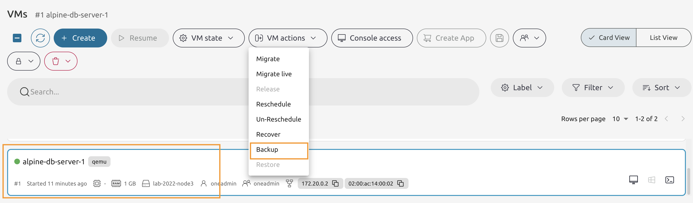
    
## 8.4.2

There are no backups made yet, so proceed to the next page.

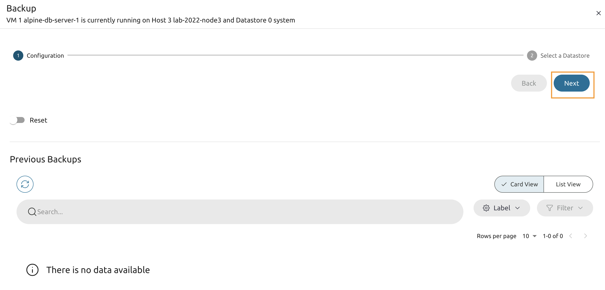
    
## 8.4.3

Select the backup datastore and proceed with **Finish**.

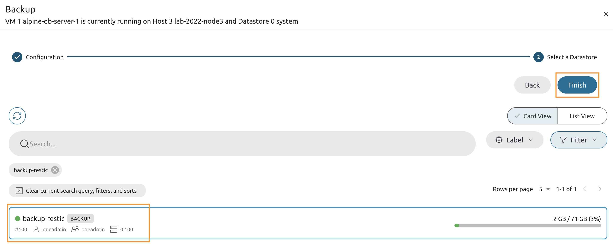
    
## 8.4.4

Wait until the VM is back to the **RUNNING** state.

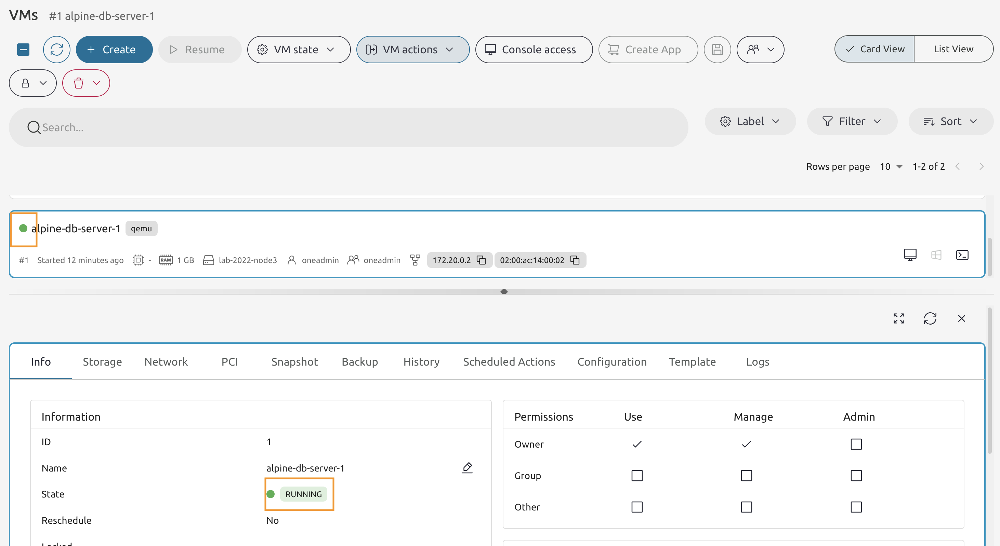
    
## 8.4.5

From the **VM actions** drop-down list select the **Recover** option.

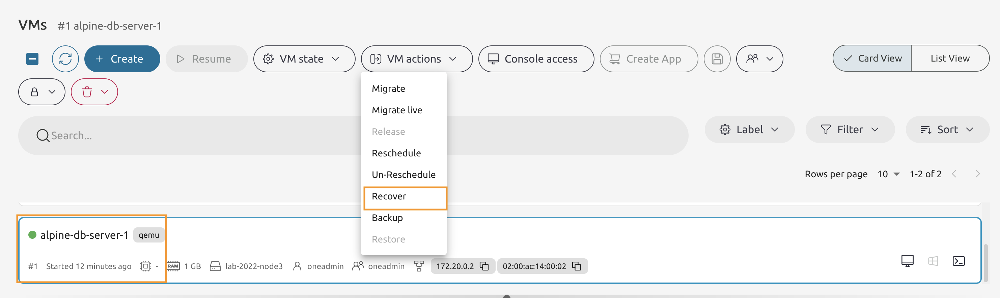
    
## 8.4.6

Select the **Recreate** option from the list and press the **Accept** button.

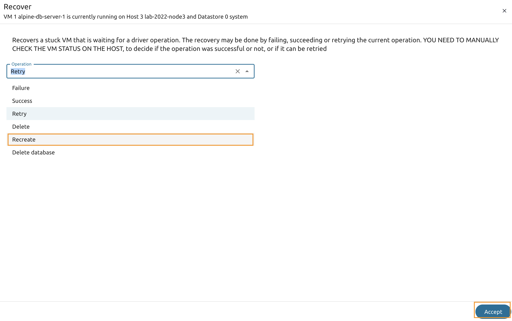
   
## 8.4.7

Wait untl the VM is in the **RUNNING** state.

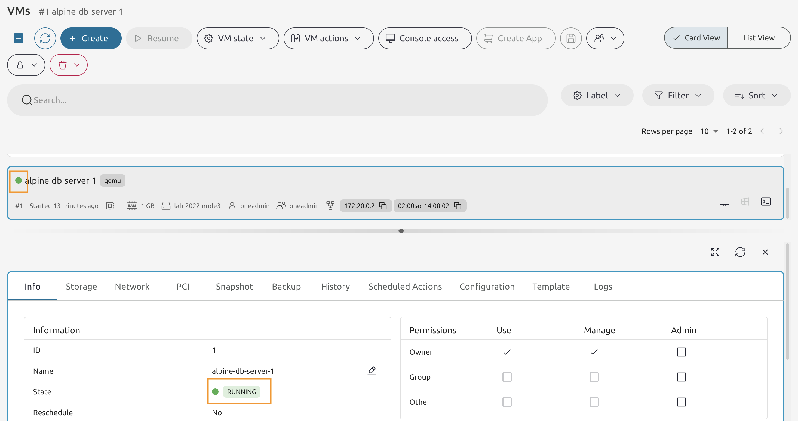

## 8.4.8

Go back to an app's **/get-data** page.

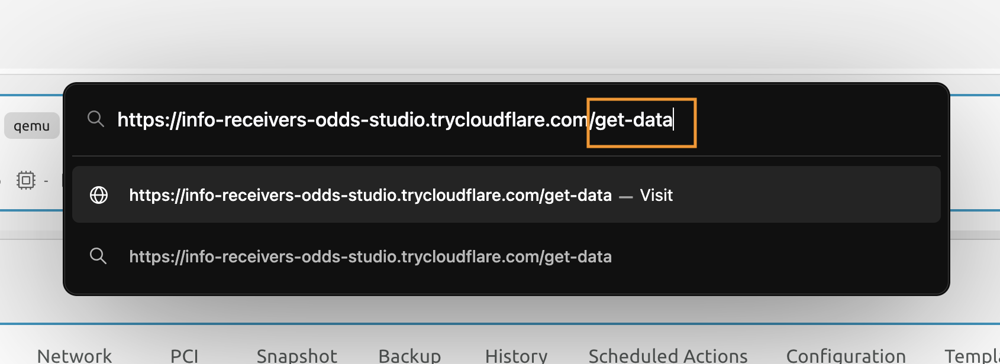
    
## 8.4.9

You should get the connection error. That's because the VM was recreated to its initial state and all changes were wiped out.

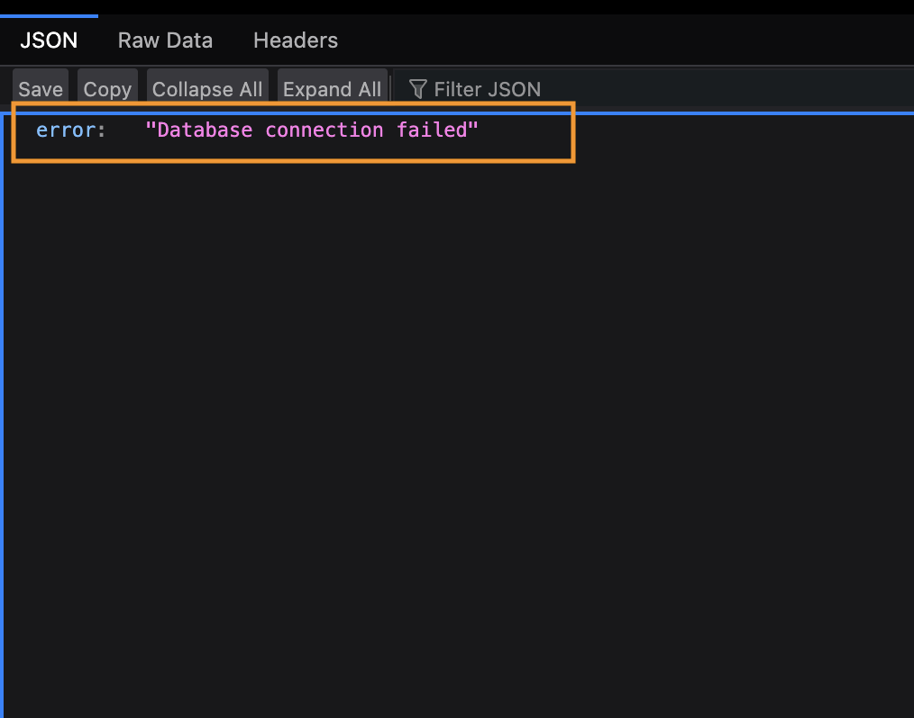

    
## 8.4.10

Go back to the **VMs** page and power off the **alpine-db-server** VM.

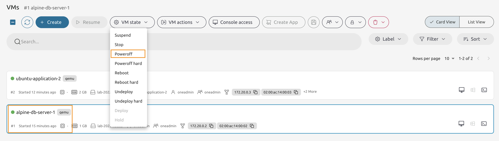

    
## 8.4.11

Once the VM is powered off - from the *8VM actions** drop-down list select the **Restore** option.

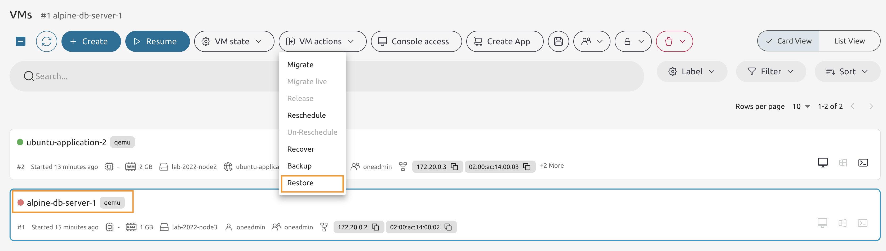

    
## 8.4.12

Select the backup to restore from the list and press the **Next** button.

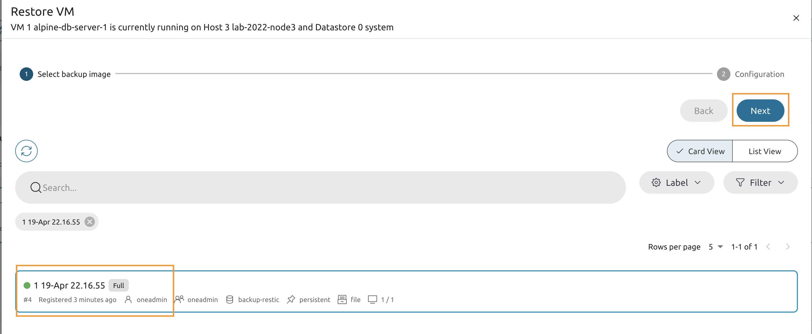

    
## 8.4.13

Do not change anything on this page and **Finish** the process.

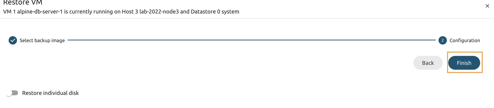

    
## 8.4.14

Wait until the VM is back to the **power off* state and press the **Resume** button.

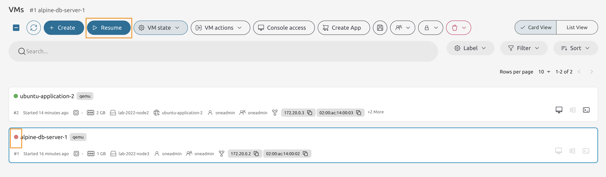

    
## 8.4.15

Wait until the VM is the **RUNNING** state and give the OS a few more minutes to boot.

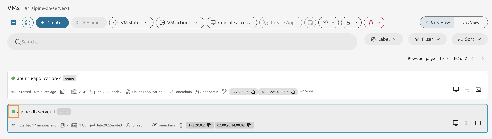

    
## 8.4.16

Visit the **/get-data** page once again.

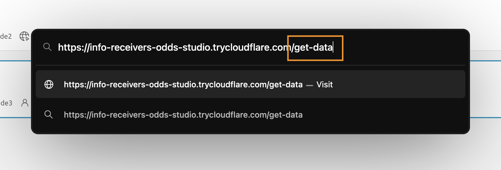

    
## 8.4.17

You supposed to have the printout with the data. If you have the connection error message - give it a few more minutes and then refresh the page.

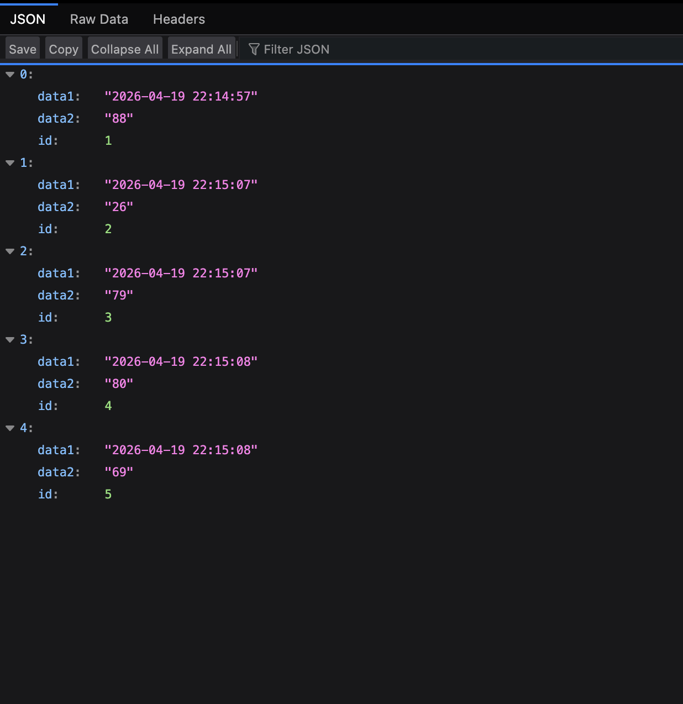

# Migare the VM.

## 8.4.18

On the VMs page select the **alpine-db-server** VM and from the *VM Actions** drop-down list choose the **Migrate live** option.

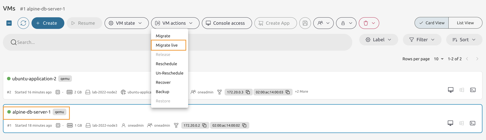

    
## 8.4.19

Select the **opposite** host from the list.

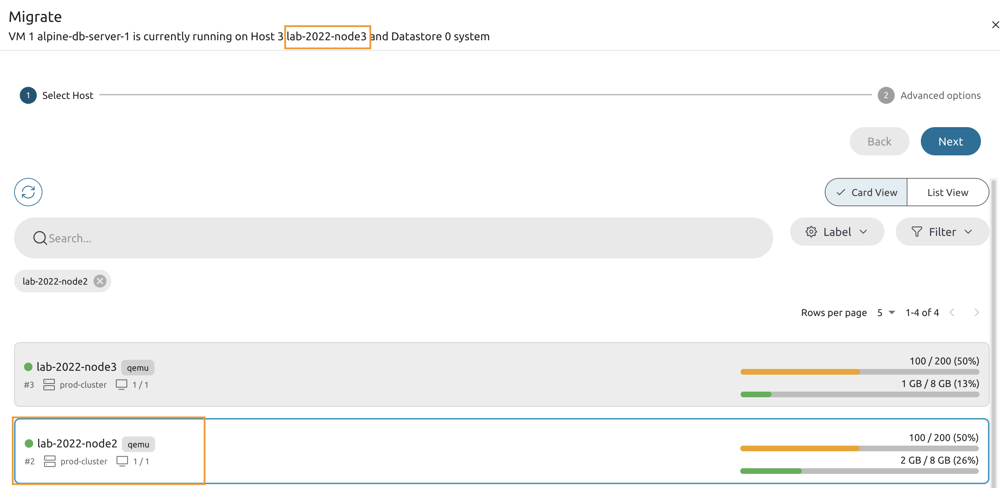

    
## 8.4.20

Select the **system** datastore and press the **Finish**.

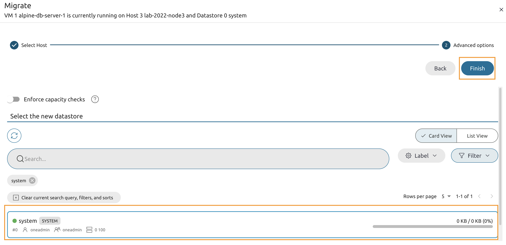

    
## 8.4.21

Wait until the VM is migrated and verify that both VMs are now running on the same host.

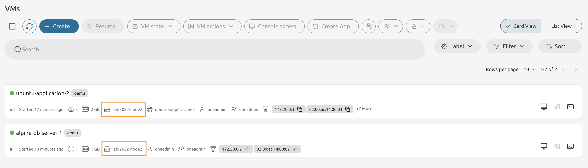

# Congratulations, you've completed the assignment!
{: .no_toc}