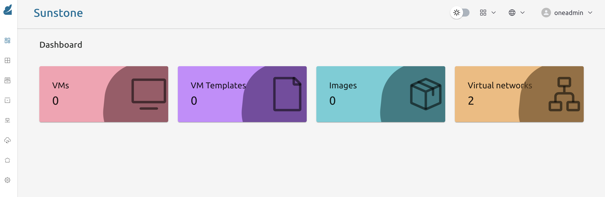
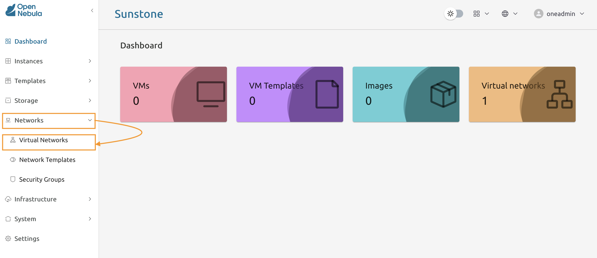
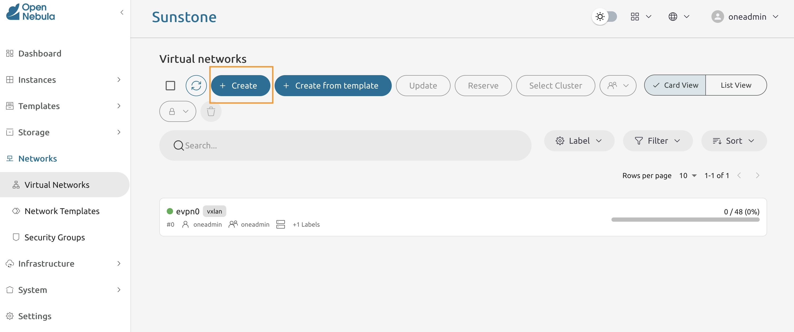
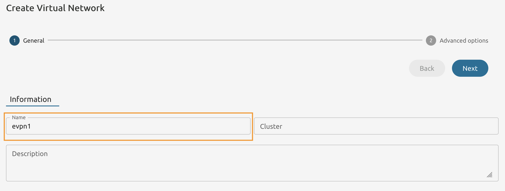
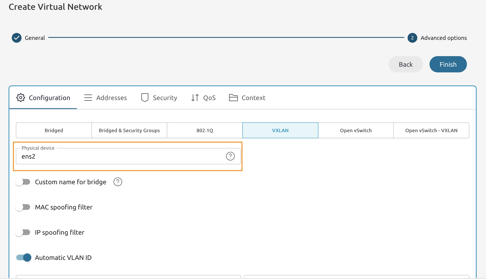
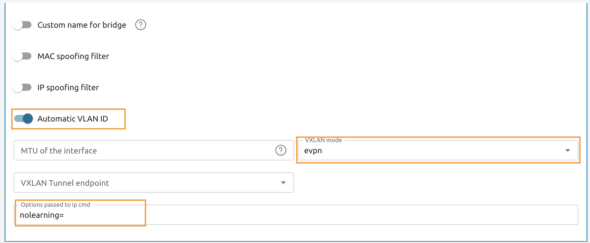
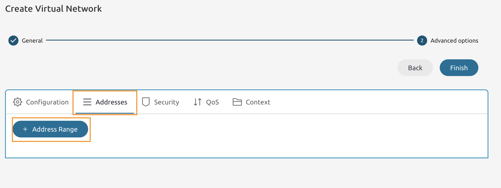
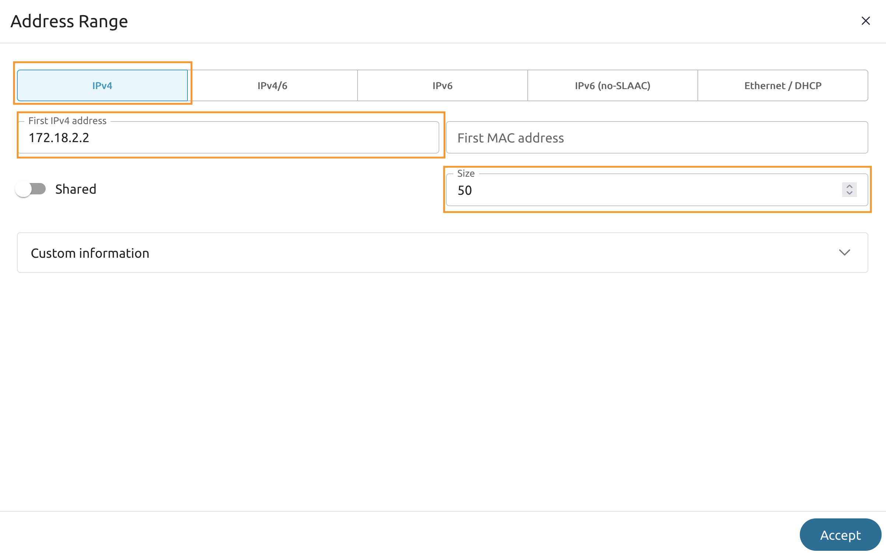
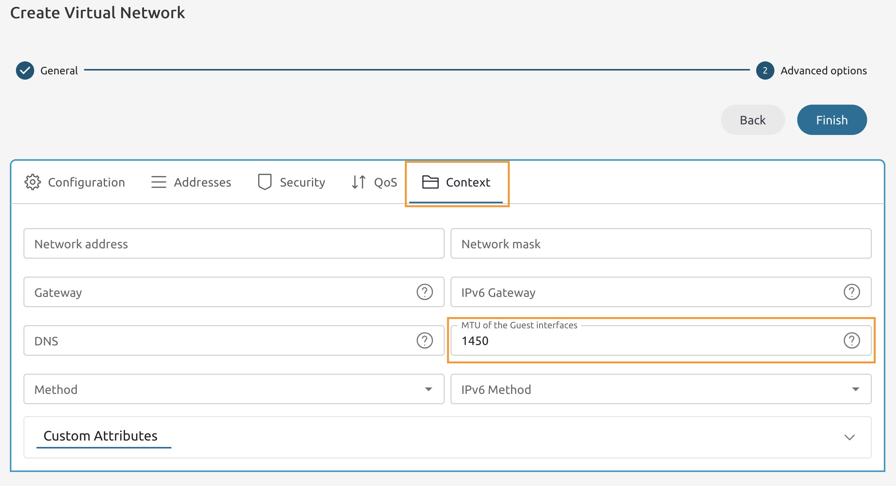
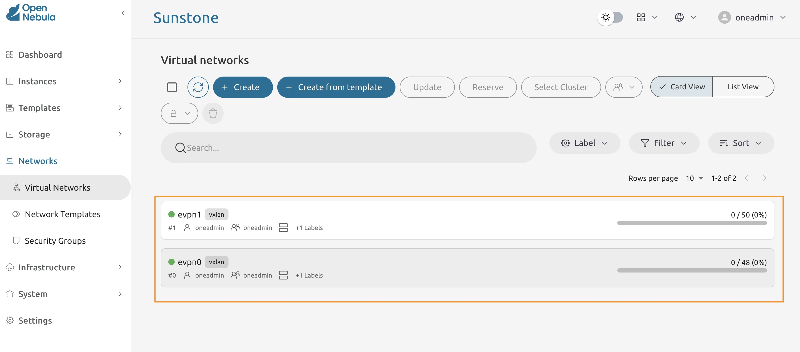

# Module 1 - Lab 1 : Deploy OpenNebula Using OneDeploy 
{: .no_toc}

## Table of Contents
{: .no_toc}

<details markdown="block">
  <summary>
    Expand to access the In-page navigation
  </summary>
  {: .text-delta }
1. TOC
{:toc}
</details>
    
## Objective(-s):
- Install the one-deploy collection from the GitHub repository.
- Create a custom inventory file.
- Deploy the OpenNebula environment using one-deploy.
- Add a secondary isolated virtual network.
    

# Install the one-deploy collection from the GitHub repository.


## 1.1.1

Connect to the Frontend Node via SSH, navigate to the **ansible** directory and activate the virtual environment.

```console
cd ~/ansible
source bin/activate
```

Clone the one-deploy repository and install the dependencies.

```console
git clone https://github.com/OpenNebula/one-deploy.git
cd one-deploy
pip install -r requirements.txt
Successfully installed ... setuptools-80.9.0 subprocess-tee-0.4.2 typing-extensions-4.14.1 wcmatch-10.1
```

Install the collection and verify that **opennebula.deploy** collection has been installed.

```console
ansible-galaxy collection install .
...
ansible-galaxy collection list
...
/home/ubuntu/ansible/one-deploy/ansible_collections
Collection                               Version
---------------------------------------- -------
opennebula.deploy                        0.0.0 
```

# Create a custom inventory file
    
## 1.1.2

Clone the training-files repository.

```console
export REPO='https://github.com/OpenNebula/one-training-files.git'
git clone --no-checkout $REPO  ~/Files
cd ~/Files
git sparse-checkout init --cone
git sparse-checkout set OneDeploy
git checkout
ls -lh OneDeploy/
total 8.0K
-rw-rw-r-- 1 ubuntu ubuntu 1.3K Aug 20 20:58 lab.yaml
-rw-rw-r-- 1 ubuntu ubuntu  535 Aug 20 20:58 fix-frr.yaml
```

Copy files from the **Files** to **one-deploy** and return to the **one-deploy** directory.

```console
cp OneDeploy/lab.yaml ~/ansible/one-deploy/inventory/lab.yaml
cp OneDeploy/fix-frr.yaml ~/ansible/one-deploy/playbooks/
cd ~/ansible/one-deploy/
```

    
## 1.1.3

Open the lab.yaml invenotry file in the editor of your choice.

```console
vi inventory/lab.yaml
```

Locate and substitute the following part with your IPs and values.

```console
router:
    hosts:
        f1: { ansible_host: <FE IP> }

frontend:
    hosts:
        f1: { ansible_host: <FE IP> }

node:
    hosts:
        n1: { ansible_host: <HOST 1> }
        n2: { ansible_host: <HOST 2> }
```

Save the file once done!

    
## 1.1.4

Open the **main.yaml** in the editor of your choice. 

```console
vi playbooks/main.yml
```

Append with the following line.

```console
- ansible.builtin.import_playbook: fix-frr.yaml
```

Copy the SSH public key to all three public IPs.

```console
ssh-copy-id ubuntu@<FE>

ssh-copy-id ubuntu@<HOST 1>

ssh-copy-id ubuntu@<HOST 2>
```

# Deploy the OpenNebula environment using one-deploy

## 1.1.5

Run the playbook and wait until it finishes.

```console
ansible-playbook -i inventory/lab.yaml opennebula.deploy.main
...
PLAY RECAP ************************************************************************************************************
f1                         : ok=95   changed=5    unreachable=0    failed=0    skipped=93   rescued=0    ignored=0   
n1                         : ok=53   changed=0    unreachable=0    failed=0    skipped=61   rescued=0    ignored=0   
n2                         : ok=52   changed=0    unreachable=0    failed=0    skipped=52   rescued=0    ignored=0
...
```
    
## 1.1.6

Open the **Frontend Node's IP with port 2616** in the browser and try to login using the credentials from the **lab.yaml** playbook.




# Add a secondary isolated Virtual Network


## 1.1.7

Navigate to **Networks -> Virtual Networks**




## 1.1.8

Press the **Create** button to start the Virtual Network creation wizard. 




## 1.1.9

Name it **evpn1**  and proceed ot the next step.




## 1.1.10

Connect to either of KVM hosts nodes and execute the **ip a** command. Locate a **physical NIC that has an IP address configured**.

```console
ip a

2: ens2: <BROADCAST,MULTICAST,UP,LOWER_UP> mtu 1500 qdisc fq_codel state UP group default qlen 1000
link/ether de:00:00:fd:e0:6d brd ff:ff:ff:ff:ff:ff
altname enp0s2
inet 163.172.146.37/32 metric 100 scope global dynamic ens2
```

Write down the interface name as you are going to use it in the further steps.

## 1.1.11

Return back to Sunstone and set the network driver to **VXLAN**. 

Then insert the extracted NIC name into the **Physical device** field.




## 1.1.12

Toggle the **Automatic VLAN ID**. 

Set the **VXLAN mode** to **evpn**.

Add **nolearning-** to the **Options passed to ip cmd**.




## 1.1.13

Switch to **Addresses** tab and press the **Address Range** button.




## 1.1.14

Make sure to set type to **IPv4**.

Set the **First IPv4 address** to **172.18.2.2**. 

And **Size** to **50**.



    
## 1.1.15

Switch to the **Context** tab and set the **MTU of the Guest Interfaces** to **1450**.

Press **Finish** to save changes.



    
## 1.1.16

You must end up having two virtual networks in the list.



# Congratulations, you've completed the assignment!
{: .no_toc}