# Module 1 - Lab 1 : Deploy OpenNebula Using OneDeploy 
{: .no_toc}

## Table of Contents
{: .no_toc}

<details markdown="block">
  <summary>
    Expand to access the In-page navigation
  </summary>
  {: .text-delta }
1. TOC
{:toc}
</details>
    
## Objective(-s):
- Install the one-deploy collection from the GitHub repository.
- Create a custom inventory file.
- Deploy the OpenNebula environment using one-deploy.
- Add a secondary isolated virtual network.
    

# Install the one-deploy collection from the GitHub repository.


## 1.1.1

Open the Terminal windows from the **Applications** menu.

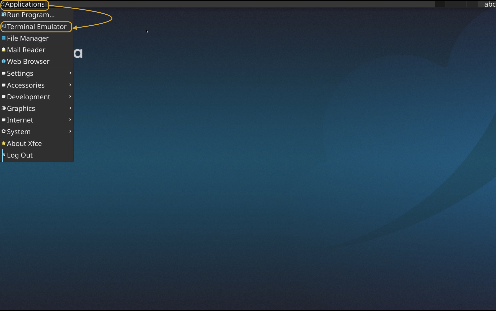

## 1.1.2

Connect to either of the KVM hosts using the SSH.

```console
ssh ubuntu@<KVM HOST IP>
```

You might get the following message - make sure to answer **yes** to the prompt
```
The authenticity of host '51.15.202.41(51.15.202.41)' can't be established.
ED25519 key fingerprint is: SHA256:2+aQa7AVHkwWsDFdPfdPl6+j/gbbgOwhXKpkWfl8lqY
This key is not known by any other names.
Are you sure you want to continue connecting (yes/no/[fingerprint])? yes
```

You must be logged in as the **ubuntu** user. 

```console
ubuntu@one-kvm-node-0
```

Extract the name of the Ethernet interface and store it somwhere. We will need this in the future steps! 

```console
ip link
1: lo: <LOOPBACK,UP,LOWER_UP> mtu 65536 qdisc noqueue state UNKNOWN mode DEFAULT group default qlen 1000
    link/loopback 00:00:00:00:00:00 brd 00:00:00:00:00:00
2: ens2: <BROADCAST,MULTICAST,UP,LOWER_UP> mtu 1500 qdisc fq_codel state UP mode DEFAULT group default qlen 1000
    link/ether de:00:00:31:51:82 brd ff:ff:ff:ff:ff:ff
    altname enp0s2
```

{: .warning}
>In this case it's **ens2**, but bear in mind that your ouput might be different!

Terminate the SSH connection.

```console
exit
```

## 1.1.3

```console
cd ~/ansible
source bin/activate
```

Clone the one-deploy repository and install the dependencies.

```console
git clone https://github.com/OpenNebula/one-deploy.git
cd one-deploy
pip install -r requirements.txt
```

Wait until theinstallation is over.
```console
Successfully installed ... setuptools-80.9.0 subprocess-tee-0.4.2 typing-extensions-4.14.1 wcmatch-10.1
```

Install the collection. 

```console
ansible-galaxy collection install .
```

Verify that **opennebula.deploy** collection has been installed.

```console
ansible-galaxy collection list
...
/config/ansible/one-deploy/ansible_collections
Collection                               Version
---------------------------------------- -------
opennebula.deploy                        0.0.0 
```

# Create and configure the custom inventory file
    
## 1.1.4

Copy the inventory file sample

```console
cp ~/lab.yaml  ~/ansible/one-deploy/inventory/lab.yaml
```

## 1.1.5

{: .note}
> For your convenience the VDI comes with VS Codium. You may, however, continue using CLI interface and editors such as vi or nano. 

Open the VS Codium application.

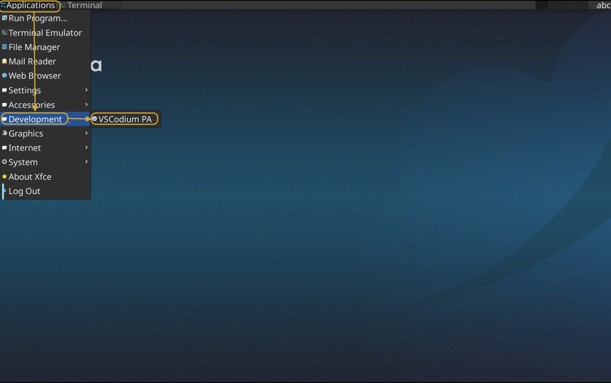

You might need to go through the first start setup. You may simply press the **cancel** button or supply a password **you will remember untill the end of the lab**.

## 1.1.6

Press **Open File...**

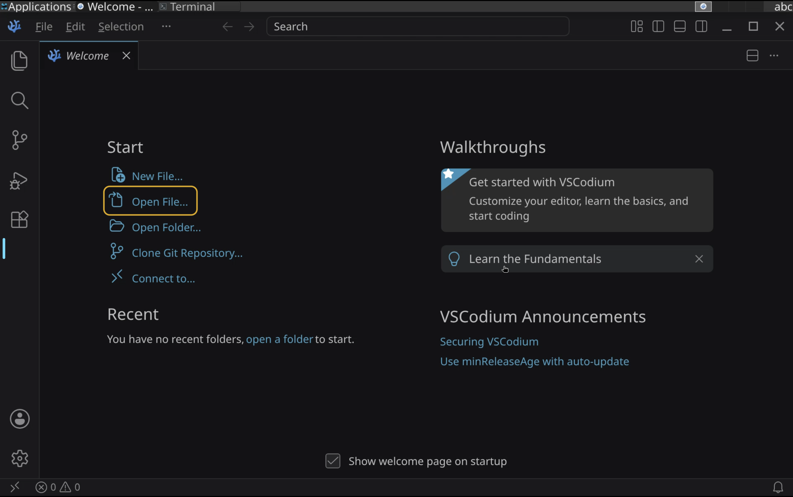

## 1.1.7

Navigate to the **/config/ansible/one-deploy/inventory/** directory and select the **lab.yaml** file.

Then press **Open**.

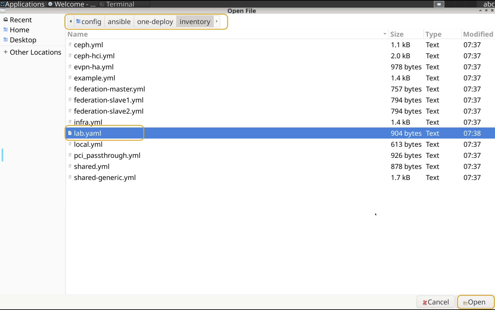

{: .note}
> You might be prompted with a bunch of requests - simply proceed with **Open** every time a pop-up appears. 


## 1.1.8

Locate the **one_version** variable and set it to 7.4.

```console
one_version: '<VERSION>'
```

Locate the **one_token** and change it to the token provided by your instructor. 

```console
one_token: '<TOKEN>'
```

Locate and map the **PHYDEV** to the interface name you've extracted before.

```console
PHYDEV: <PHYSICAL DEVICE>
```

Locate and substitute the following part with your lab IPs.

```console
router:
    hosts:
        f1: { ansible_host: <FE IP> }

frontend:
    hosts:
        f1: { ansible_host: <FE IP> }

node:
    hosts:
        n1: { ansible_host: <HOST 1> }
        n2: { ansible_host: <HOST 2> }
```

Save the file once done!

# Deploy the OpenNebula environment using one-deploy

## 1.1.9

Return to the terminal window and run the playbook.

```console
ansible-playbook -i inventory/lab.yaml opennebula.deploy.main
```

Wait until it finishes.

```console
...
PLAY RECAP ************************************************************************************************************
f1                         : ok=95   changed=5    unreachable=0    failed=0    skipped=93   rescued=0    ignored=0   
n1                         : ok=53   changed=0    unreachable=0    failed=0    skipped=61   rescued=0    ignored=0   
n2                         : ok=52   changed=0    unreachable=0    failed=0    skipped=52   rescued=0    ignored=0
...
```
    
## 1.1.10

{: .note }
> For your convenience the VDI is supplied with a browser - Chromium. However you may add Firefox, Vivialdi or other browser should you wish. In this guide we will assume the usage of Chromium.

Open the Web Browser.

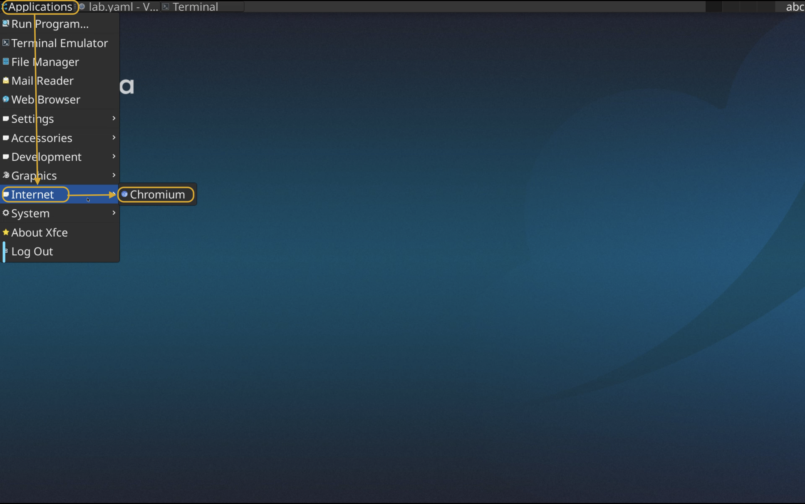


## 1.1.11
Open the **Frontend Node's IP with port 2616** in the browser and try to login using the credentials from the **lab.yaml** playbook.

{: .note }
> You may use either Public IP address of a Frontend Node or use 172.17.2.1. 

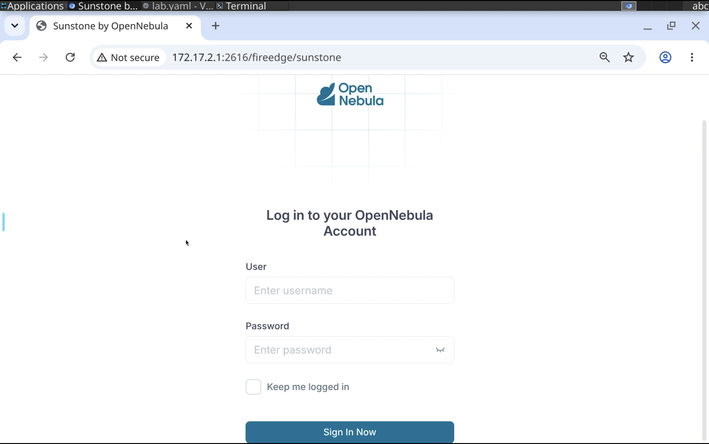

## 1.1.12

Make sure you are logged in before proceeding.

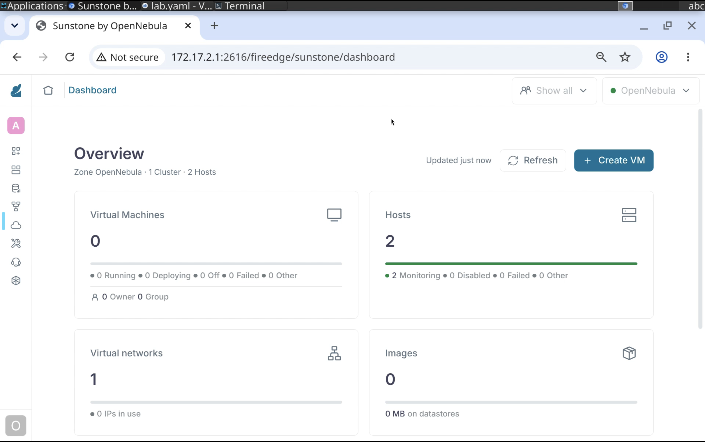


# Add a secondary isolated Virtual Network

## 1.1.13

Navigate to **Networks -> Virtual Networks**

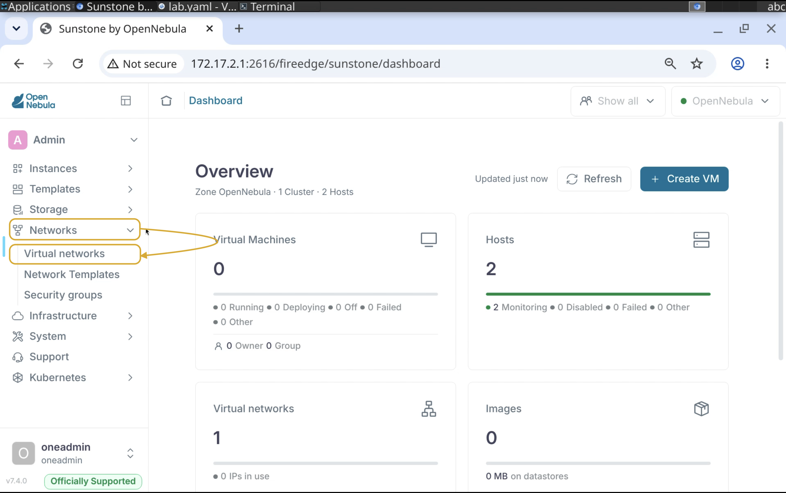

## 1.1.14

Press the **Create** button to start the Virtual Network creation wizard. 

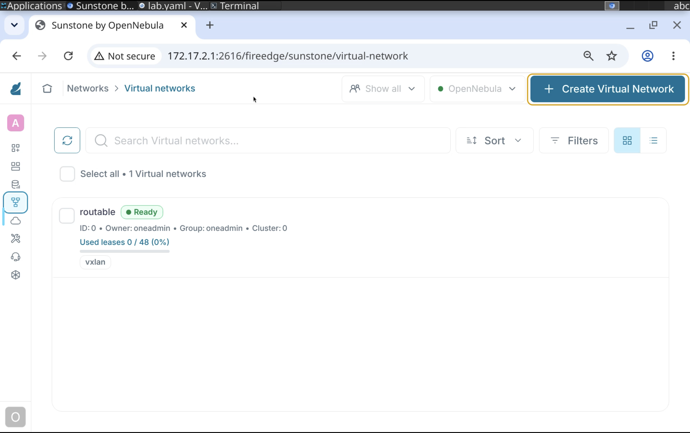

## 1.1.15

Make sure that **From scratch** is selected and press the Continue button.

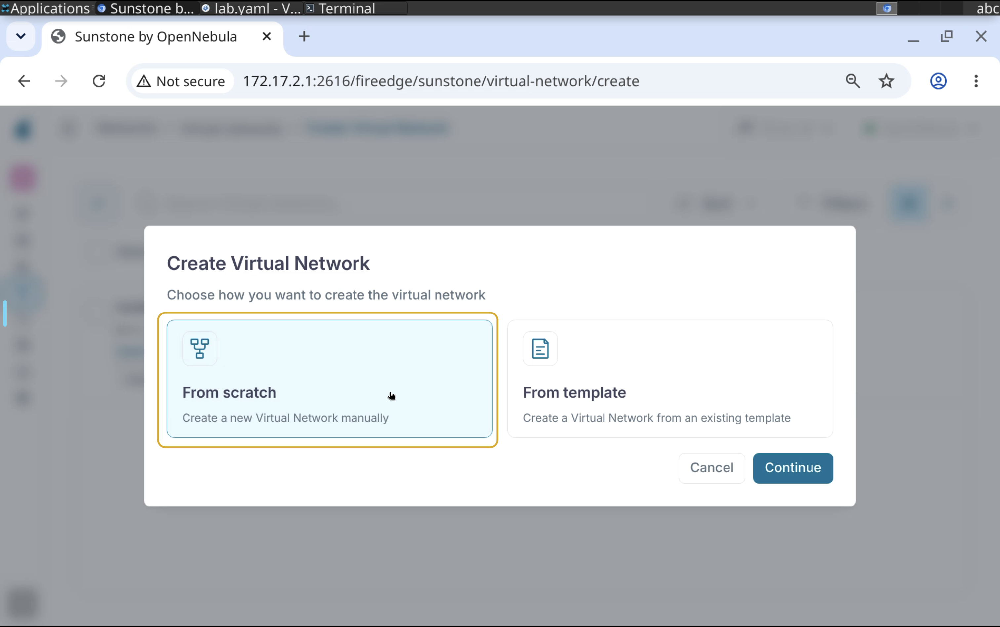


## 1.1.16

Name it **private**  and proceed ot the next step.

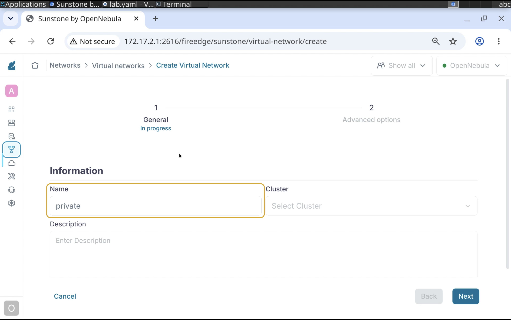

## 1.1.17

Set the network driver to **VXLAN**. 

Then insert the previously extracted NIC name into the **Physical device** field.

Toggle the **Automatic VLAN ID**. 

Set the **VXLAN mode** to **evpn**.

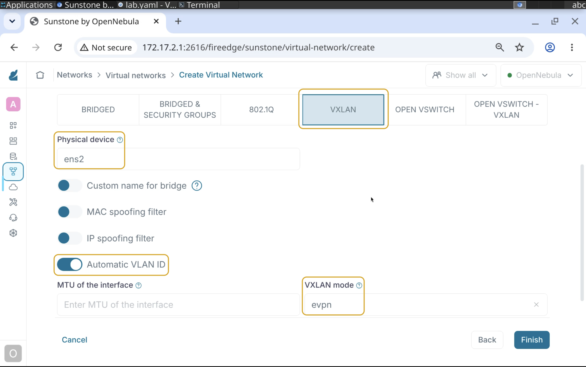

## 1.1.18


Add **nolearning-** to the **Options passed to ip cmd**.

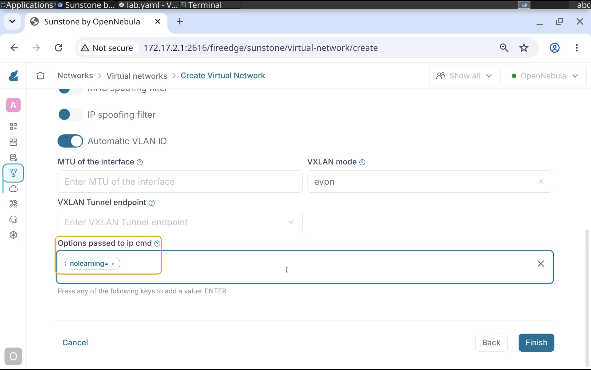


## 1.1.19

Switch to **Addresses** tab and press the **Address Range** button.

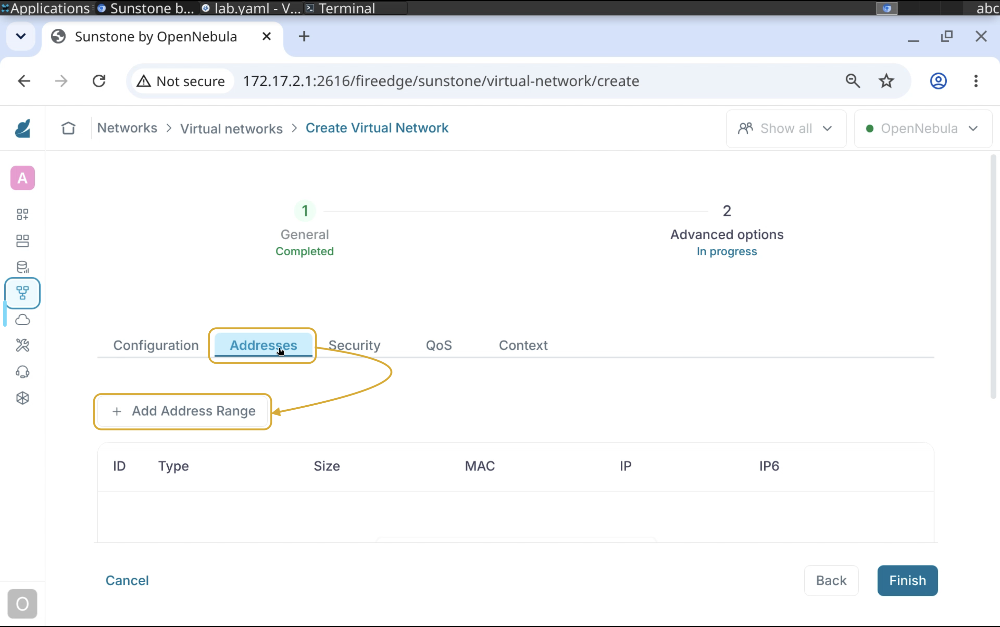


## 1.1.20

Make sure to set type to **IPv4**.

Set the **First IPv4 address** to **10.20.30.2**. 

And **Size** to **50**.

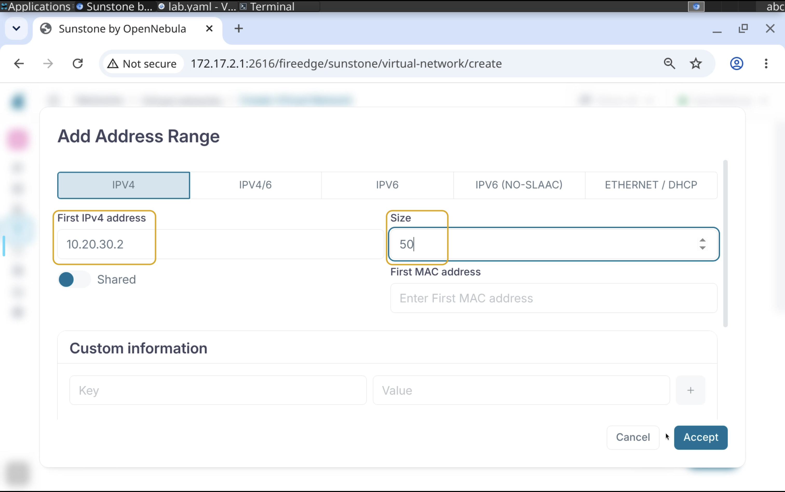

    
## 1.1.21

Switch to the **Context** tab and set the **MTU of the Guest Interfaces** to **1450**.

Press **Finish** to save changes.

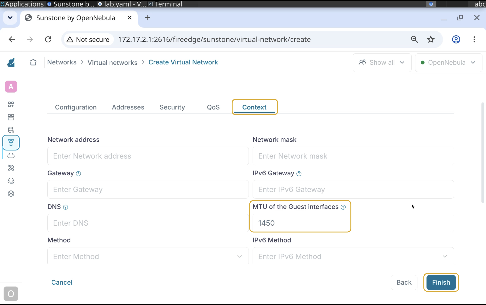

    
## 1.1.22

You must end up having two virtual networks in the list.

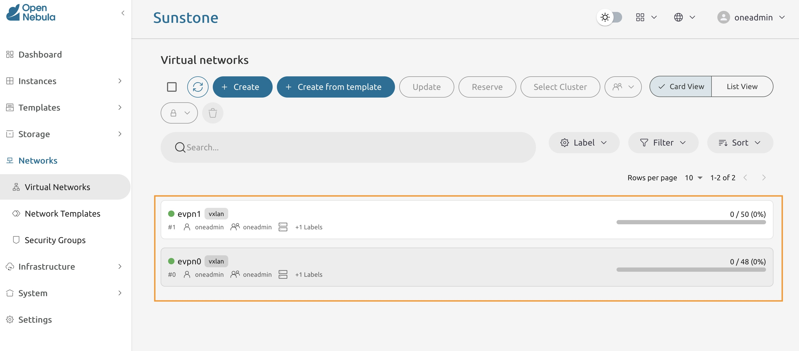

# Adjust the FRR settings

## 1.1.23

Connect to the frontend node using SSH and switch to root.

```console
ssh ubuntu@<FE IP>

sudo su
```

## 1.1.24

Using Vi or Nano edit the **bgpd.conf** file. 

```console
vi /etc/frr/bgpd.conf
```

Add two lines with IPs of your KVM nodes right after the simillar one with the Fronend Node's IP address.
Save the file.

```console
bgp listen range <KVM 1>/32 peer-group fabric
bgp listen range <KVM 2>/32 peer-group fabric
```

## 1.1.25

Restart the FRR daemon.

```console
systemctl restart frr
```

# Congratulations, you've completed the assignment!
{: .no_toc}