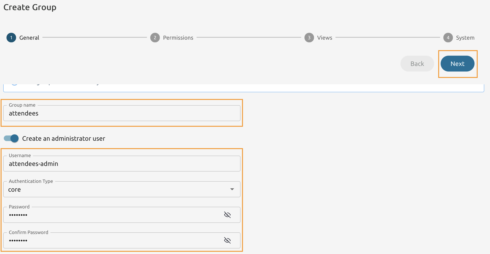
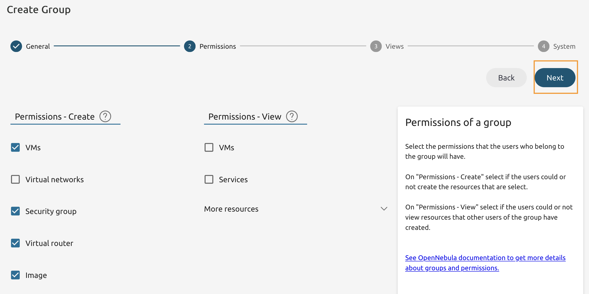
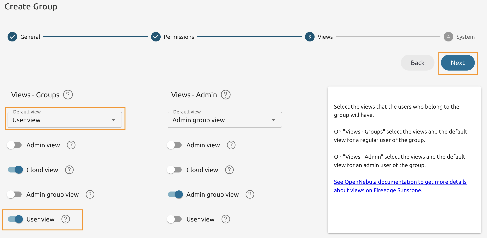
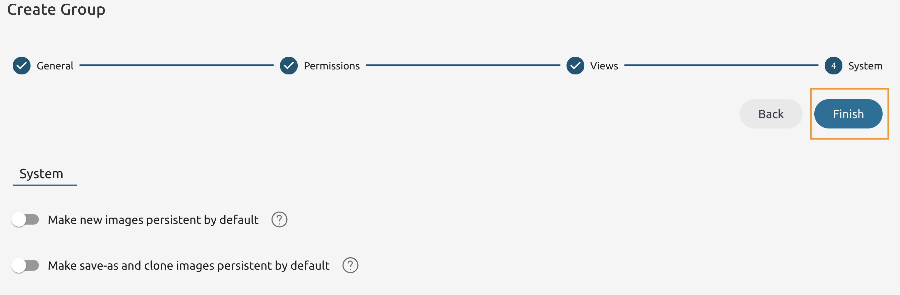
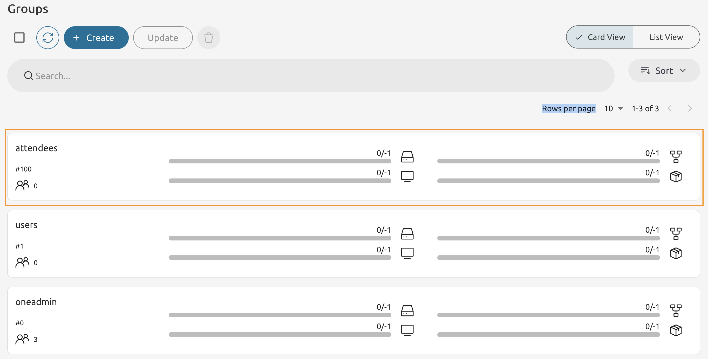

# Module 2 - Lab 1 : ACLs
{: .no_toc}

## Table of Contents
{: .no_toc}

<details markdown="block">
  <summary>
    Expand to access the In-page navigation
  </summary>
  {: .text-delta }
1. TOC
{:toc}
</details>
    
## Objective(-s):
- Create a User Group and a User.
- Create ACLs for the Group.
- Verify that the ACL is working.

# Create a User Group and a User

## 2.1.1

From the Frontend Node's Command Line run the onegroup command to create a new group.

```console
onegroup create --name "Template-Admins"
ID: 100
```

Update your new group to have "User" view availiable for the basic users.

```console
onegroup update 100

FIREEDGE=[
    GROUP_ADMIN_DEFAULT_VIEW="groupadmin",
    GROUP_ADMIN_VIEWS="groupadmin",
    VIEWS="user" ]
```

Create a new user and with the **Template-Admins** as the primary group.

```console
oneuser create tmpl_admin 'Pa$$w0rd' --group 100
```
# Create ACLs for the Group


## 2.1.2

Use the **oneacl** command to enable "Template-Admins" user group members to administer Images and Templates across the Environment. 

```console
oneacl create '@100 TEMPLATE+IMAGE/* CREATE+USE+MANAGE+ADMIN *'
ID: 10
```

Export the 'Alpine Linux 3.21' from the Offical OpenNebula Marketplace.

```console
onemarketapp export 'Alpine Linux 3.21' 'Alpine Linux 3.21' -d 1
IMAGE
    ID: 0
VMTEMPLATE
    ID: 0
```

# Verify that the ACL is working

    
## 2.1.3

Login as **tmpl_admin** and navgate to **Templates -> VM Templates**.



    
## 2.1.4

Locate the **Alpine Linux 3.21** VM Template and select it.



    
## 2.1.5

Under the **Permissions** enable **Use** permissions to **Other** users.



    
## 2.1.6

Navigate to **Storage -> Images** and locate the **Alpine Linux 3.21** Image.



    
## 2.1.7

Under the **Permissions** enable **Use** permissions to **Other** users.



    
## 2.1.8 

Return to the Frontend Node's Command Line and create a new file named **new_tmpl.cnf** with the following contents.

```console
CONTEXT=[
    NETWORK="YES",
    SSH_PUBLIC_KEY="$USER[SSH_PUBLIC_KEY]" ]
CPU="0.125"
DISK=[
    IMAGE_ID="0" ]
GRAPHICS=[
    LISTEN="0.0.0.0",
    TYPE="vnc" ]
HYPERVISOR="kvm"
LOGO="images/logos/linux.png"
LXD_SECURITY_PRIVILEGED="true"
MEMORY="256"
NIC_DEFAULT=[
    MODEL="virtio" ]
OS=[
    ARCH="x86_64" ]
SCHED_REQUIREMENTS="HYPERVISOR=kvm"
NAME="Custom AL3.21"
```

    
## 2.1.9

Then create a new template using this file.

```console
onetemplate create new_tmpl.cnf --user tmpl_admin
Password:
ID: 1
```
    
# Congratulations, you've completed the assignment!
{: .no_toc}