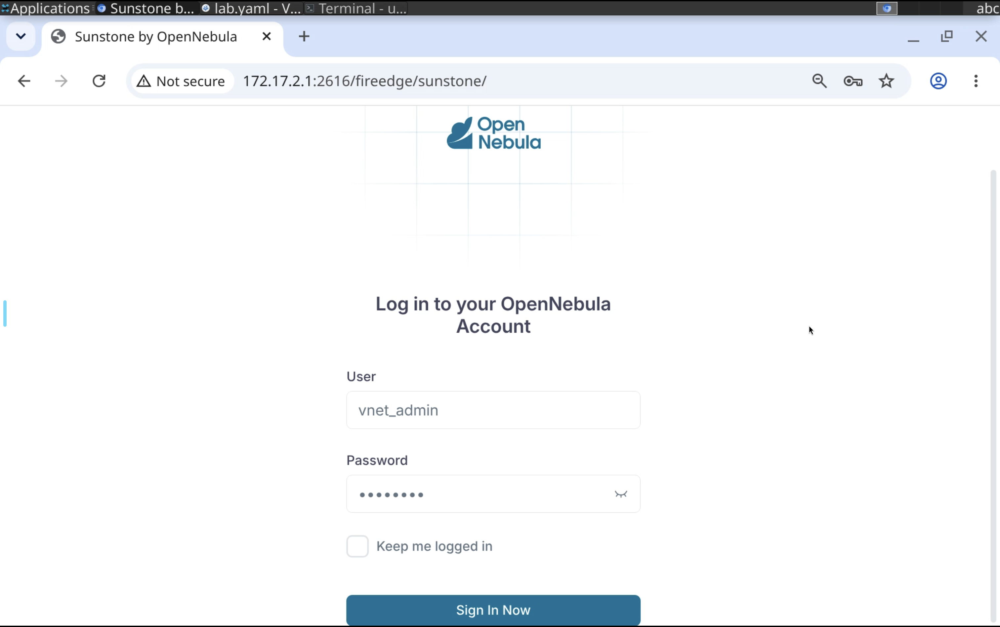
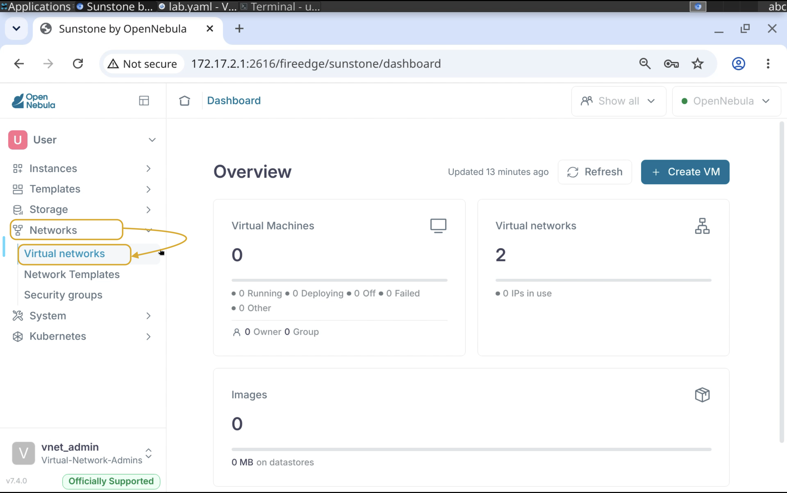
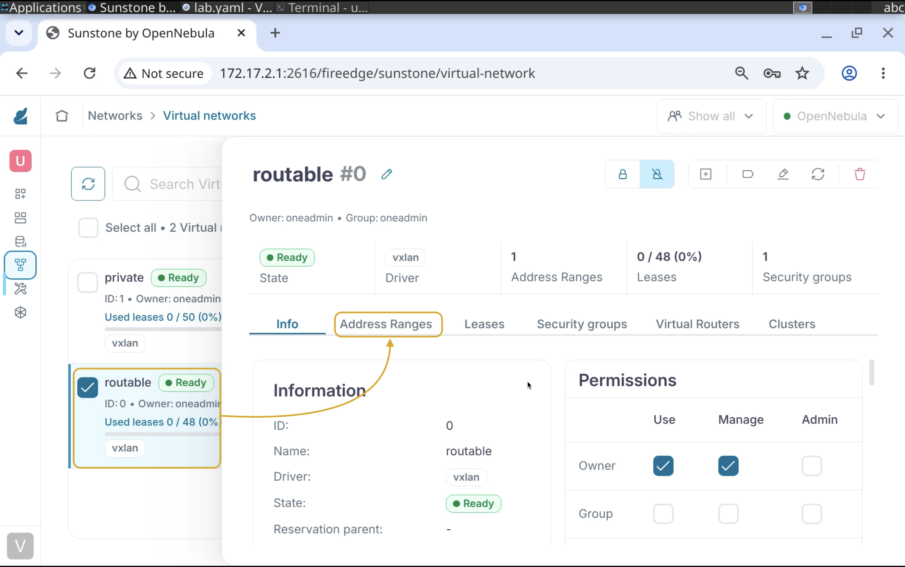
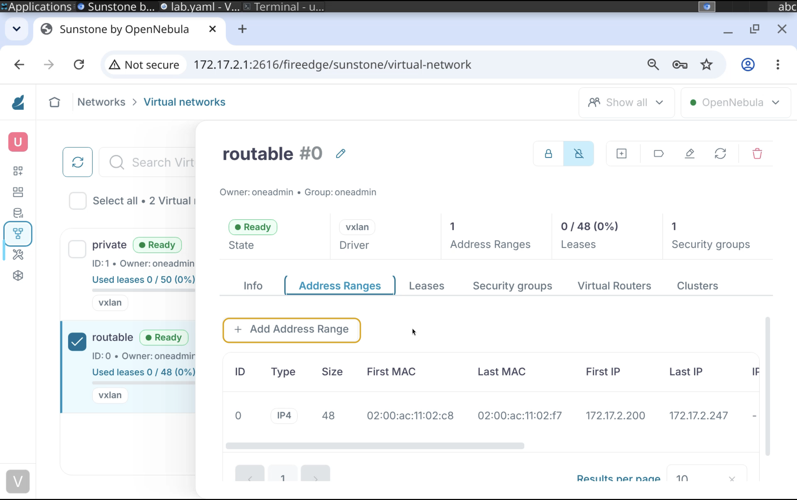
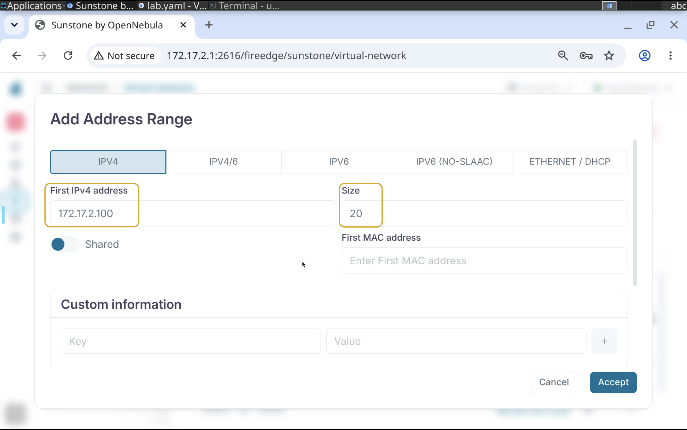
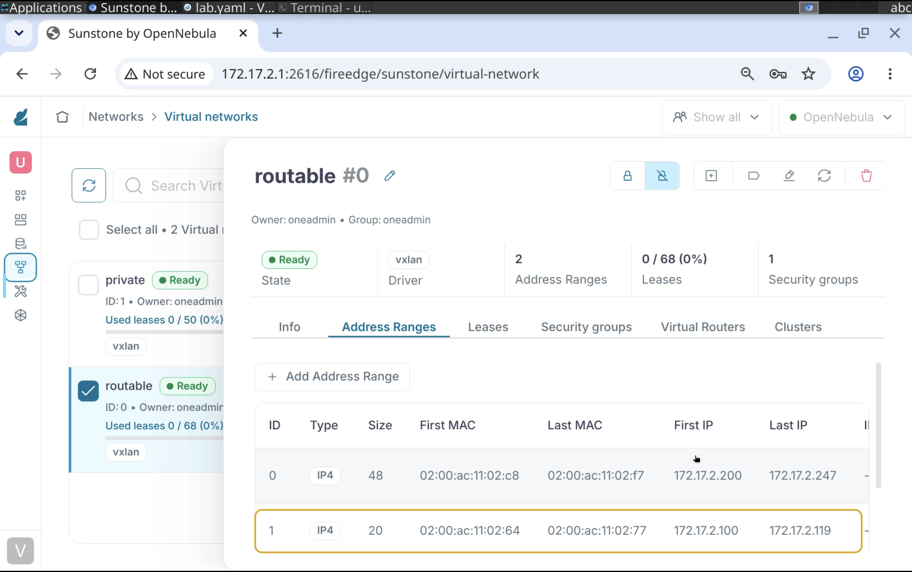

# Module 2 - Lab 1 : ACLs
{: .no_toc}

## Table of Contents
{: .no_toc}

<details markdown="block">
  <summary>
    Expand to access the In-page navigation
  </summary>
  {: .text-delta }
1. TOC
{:toc}
</details>
    
## Objective(-s):
- Create a User Group and a User.
- Create ACLs for the Group.
- Verify that the ACL is working.

{: .note }
> Note that your IDs might differ, therefore make sure to substitute all IDs with the ones you will be receiving in the output.

# Create a User Group and a User


## 2.1.1

Connect to the Frontend Node using SSH and switch to **oneadmin** user.

```console
ssh ubuntu@<FE>

sudo -iu oneadmin
```

## 2.1.2

Execute the onegroup command to create a new group.

```console
onegroup create --name "Virtual-Network-Admins"
```

In the output you must have the unique ID of a Group.

```console
ID: 100
```

## 2.1.3

Update your new group to have "User" view availiable for the basic users.

```console
onegroup update 100
```

Make sure to set the VIEWS parameter to **user**.

```console
FIREEDGE=[
    GROUP_ADMIN_DEFAULT_VIEW="groupadmin",
    GROUP_ADMIN_VIEWS="groupadmin",
    VIEWS="user" ]
```

## 2.1.4

Create a new user and with the **Virtual-Network-Admins** as the primary group.

Please don't forget to set the password. 

```console
oneuser create vnet_admin '<PASSWORD>' --group 100
```

In the output you must have the unique ID of a User.

```console
ID: 2
```

# Create ACLs for the Group

## 2.1.5

Use the **oneacl** command to create an ACL that will allow **Virtual-Network-Admins** user group members to administer Networks, Virtual Network Templates and Security Groups across the Environment. 

```console
oneacl create '@100 NET+VNTEMPLATE+SECGROUP/* CREATE+USE+MANAGE+ADMIN *'
```

Make sure that there's no errors in the output before proceeding.

```console
ID: 10
```

# Verify that the ACL is working

## 2.1.6

Login as **vnet_admin**.



## 2.1.7

Navgate to **Networks - Virtual Networks**.



    
## 2.1.8

Select the **routable** subnet and switch to the **Address Ranges** tab.



    
## 2.1.9

Press **Add Address Range**.



## 2.1.10

Set the **First Address** to **172.17.2.100** and the **Size** to **20**.



## 2.1.11

You should end up having two networks.



    
# Congratulations, you've completed the assignment!
{: .no_toc}