# Module 2 - Lab 2 : VDC Management  
{: .no_toc}

## Table of Contents
{: .no_toc}

<details markdown="block">
  <summary>
    Expand to access the In-page navigation
  </summary>
  {: .text-delta }
1. TOC
{:toc}
</details>
    
## Objective(-s):
- Create a VDC.
- Remove the "users" group from the "default" VDC.

# Create a VDC.

    
## 2.2.1

Make sure you are logged in as **oneadmin** and navigate to **System -> VDCs** to access the VDCs management panel. 

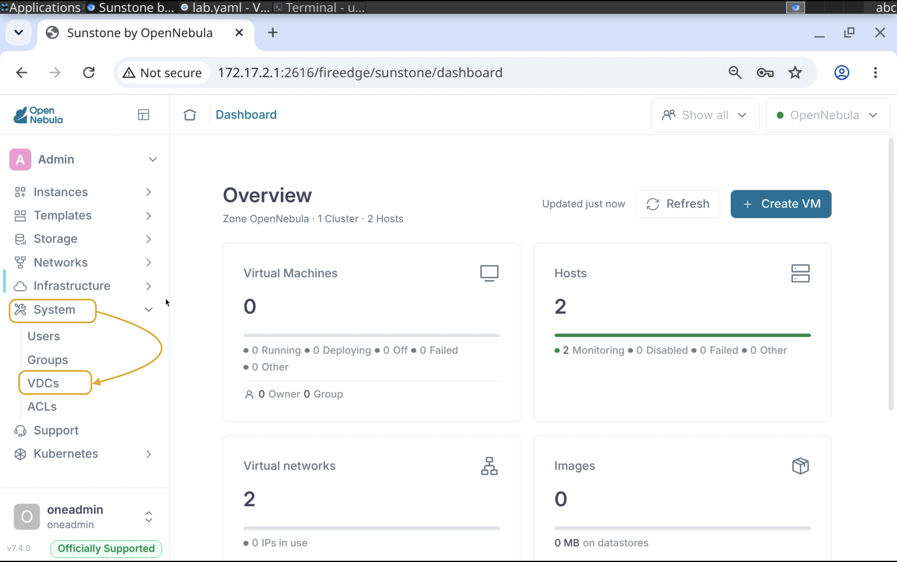


## 2.2.2

Press **Create** to add a new VDC.

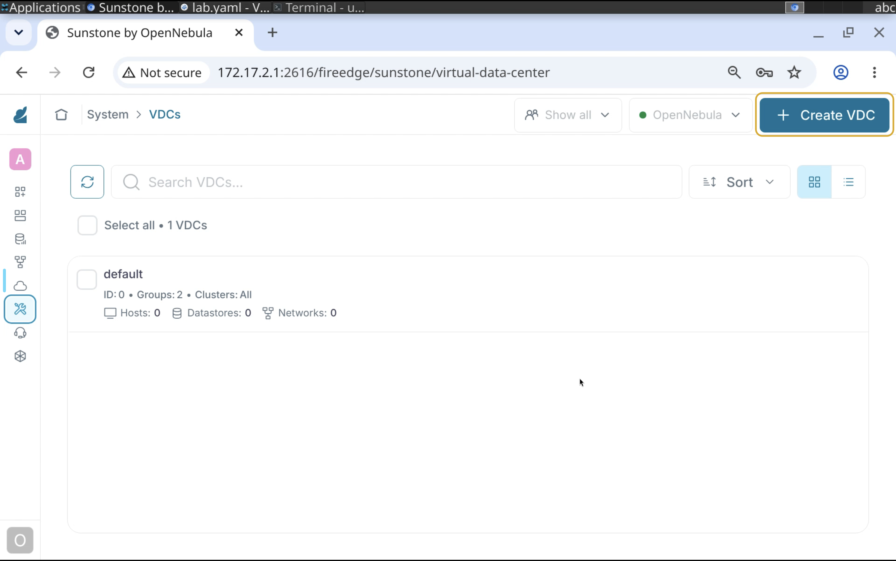
    
## 2.2.3

Name it the way you wish. In this guide we are going to use the **prodVDC** as a reference. 

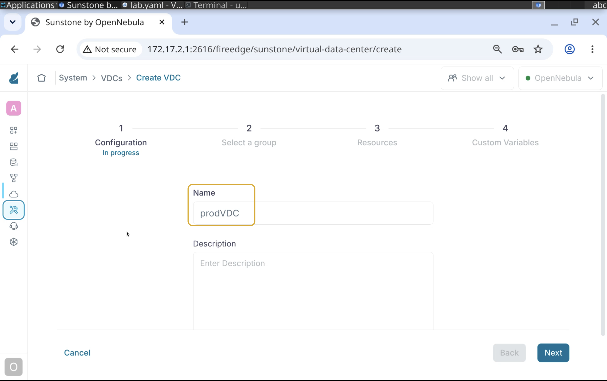
    
## 2.2.4

Select **users** from the group selector.

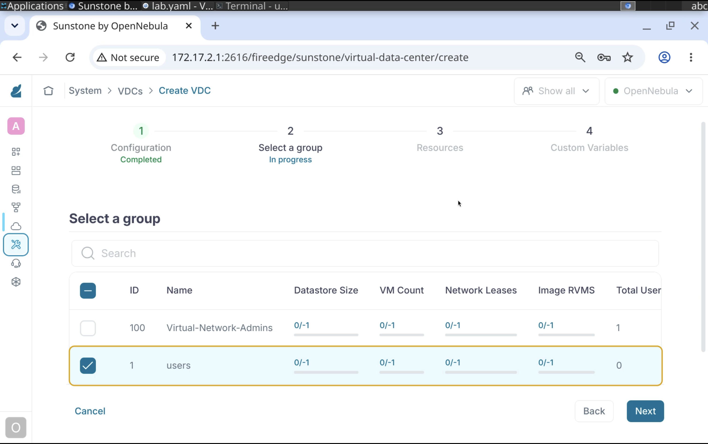
    
## 2.2.5

Select **all** datastores.

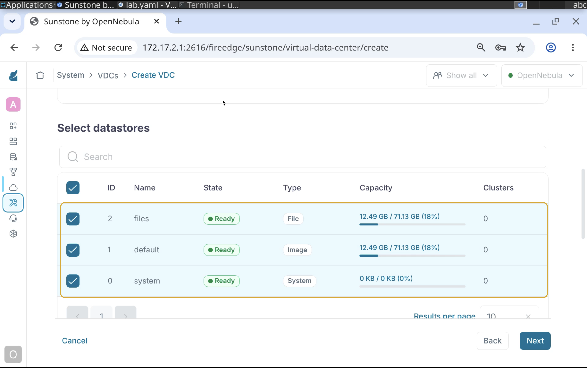

## 2.2.6

Select one of **Hosts**.

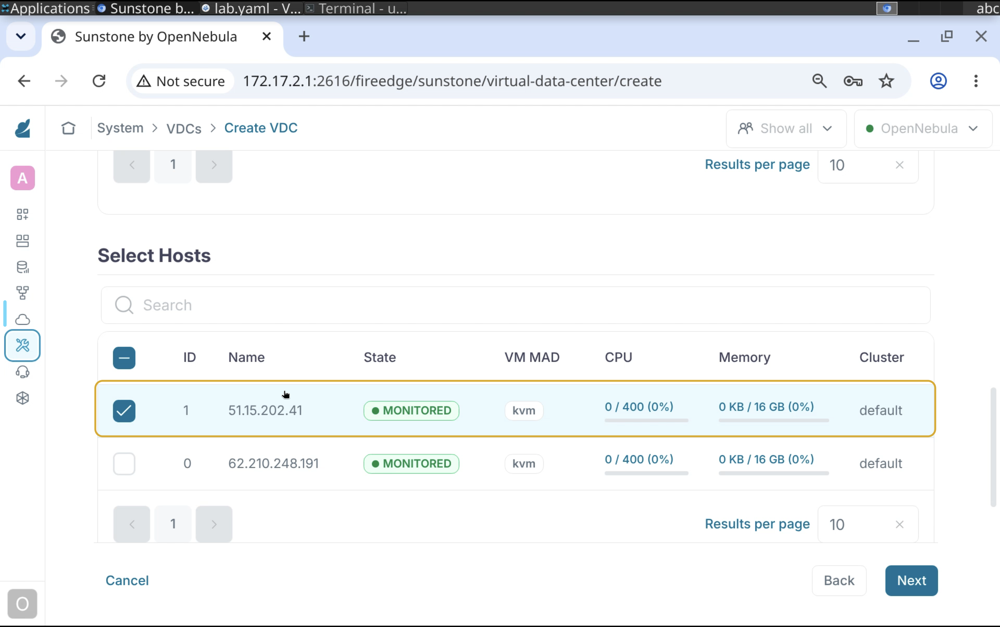

## 2.2.7

Select all **Networks**.

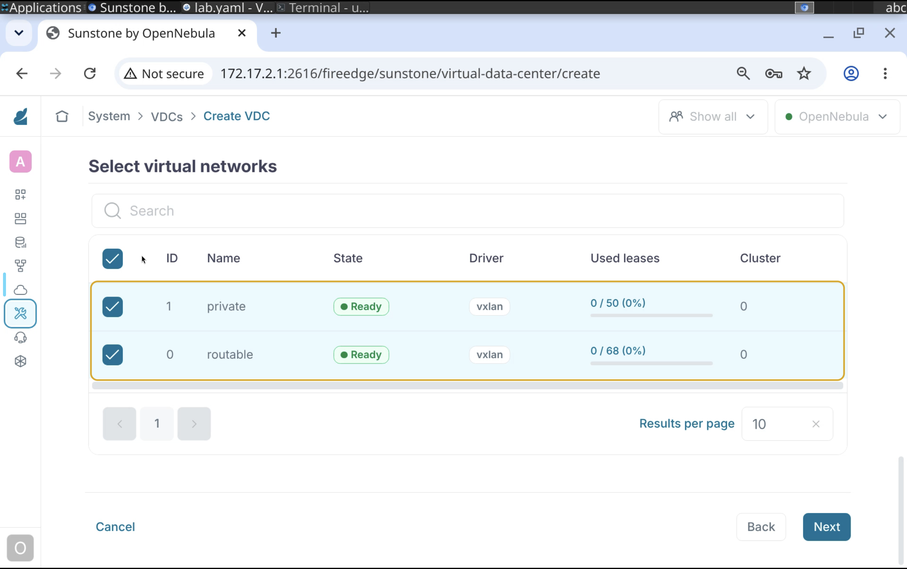

## 2.2.8

Keep **Custom Variables** as is and press the **Finish** button.

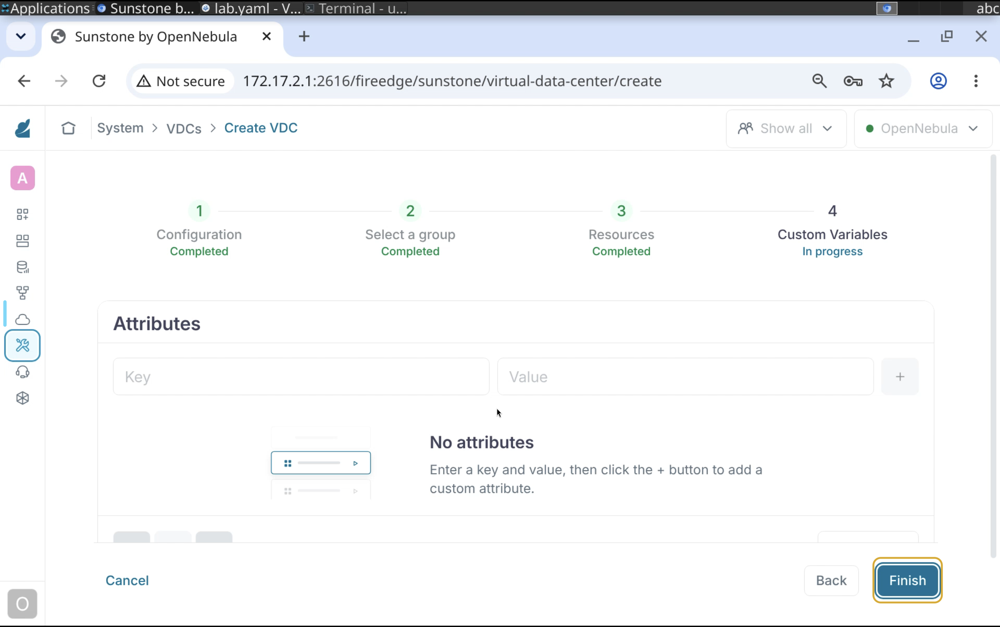

## 2.2.9

You should end up with two VDCs.

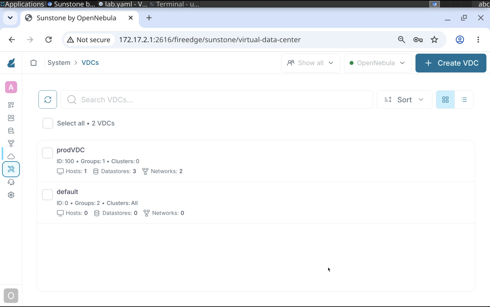

# Remove the "users" group from the default VDC.

## 2.2.10

Select the **default** VDC and press **Update**.

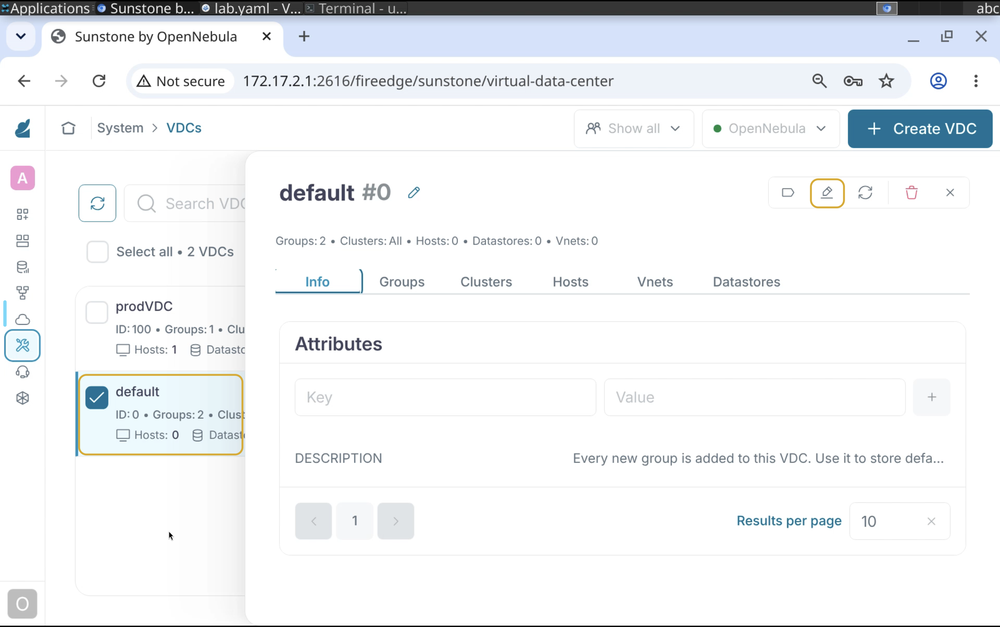

## 2.2.11

Go to the **Select a group** tab and make sure to remove the **users** from the list.

Leave rest as is and save the changes.

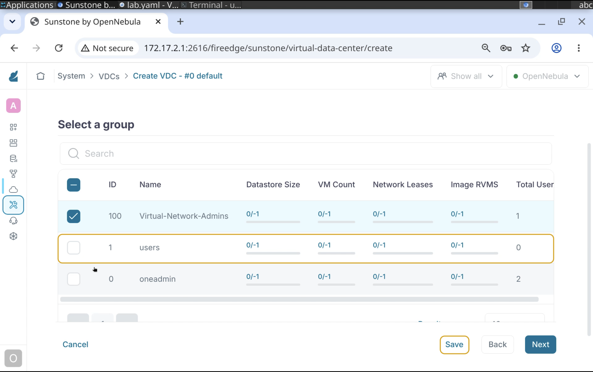

# Verify that VDC restrictions are enforced

## 2.2.12

Switch back to the command line and connect to the Frontend Node. 

```console
ssh ubuntu@<FE IP>
```

Switch to oneadmin.

```console
sudo -iu oneadmin
```

## 2.2.13

Create a User and set the **users** group as a primary.

```console
oneuser create 'vdc-user' '<PASSWORD>' --group users
```

Make sure you have an output with the user ID.

```console
ID: 3
```

## 2.2.14

Download the **Alpine Linux 3.21** as **vdc-user**.

Make sure to enter the password of **vdc-user** once prompted.

```console
onemarketapp export 'Alpine Linux 3.21' 'Alpine Linux 3.21' -d 1 --user vdc-user
```

Your output should contain IDs of an Image and a VMTemplate

```console
IMAGE
    ID: 0
VMTEMPLATE
    ID: 0
```

## 2.2.15

Deploy 5 VMs from the Alpine Linux 3.21 VM Template

```console
onetemplate instantiate 0 -m 5 --user vdc-user
```

You must have 5 unqiue IDs in the output.

```console
VM ID: 0
VM ID: 1
VM ID: 2
VM ID: 3
VM ID: 4
```

## 2.2.16

Execute onevm top and wait until 4 out of 5 VMs will end up in the **runn** state. 

```console
 ID USER     GROUP    NAME                         STAT  CPU     MEM HOST                      TIME
   4 vdc-user users    Alpine Linux 3.21-4          pend    1    256M                       0d 00h00
   3 vdc-user users    Alpine Linux 3.21-3          runn    1    256M 51.15.202.41          0d 00h00
   2 vdc-user users    Alpine Linux 3.21-2          runn    1    256M 51.15.202.41          0d 00h00
   1 vdc-user users    Alpine Linux 3.21-1          runn    1    256M 51.15.202.41          0d 00h00
   0 vdc-user users    Alpine Linux 3.21-0          runn    1    256M 51.15.202.41          0d 00h00
```

Note that **all VMs are running on the same host!**. 

## 2.2.17

Now let's use **show** command to check the **SCHED_MESSAGE** of the pending VM.

```console
onevm show 4 | grep 'SCHED_MESSAGE'
```

The message states that no hosts can offer the required resources. 

```console
SCHED_MESSAGE="Wed Sep  9 11:25:08 2026: [HOST] Not enough CPU on hosts: 1"
```

## 2.2.18

Terminate all hosts.

```console
onevm terminate --hard 0..4
```

# Congratulations, you've completed the assignment!
{: .no_toc}