# Module 3 - Lab 1 : Scheduling
{: .no_toc}

## Table of Contents
{: .no_toc}

<details markdown="block">
  <summary>
    Expand to access the In-page navigation
  </summary>
  {: .text-delta }
1. TOC
{:toc}
</details>
  
    
## Objective(-s):
- Configure the OneDRS policy.
- Configure Undercommitment & Overcommitment.
- Deploy VMs and verify the OneDRS policy.

# Configure the OneDRS policy.
  
## 3.1.1

As **oneadmin** login to the Sunstone and navigate to **Infrastructure -> Clusters**.

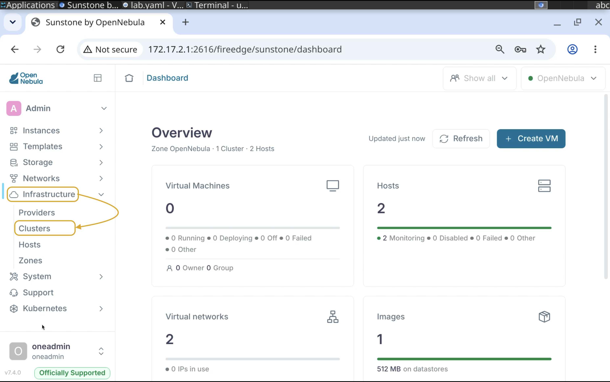
    
## 3.1.2

Select the **default** cluster and expand the infotab switch to **OneDRS** tab.

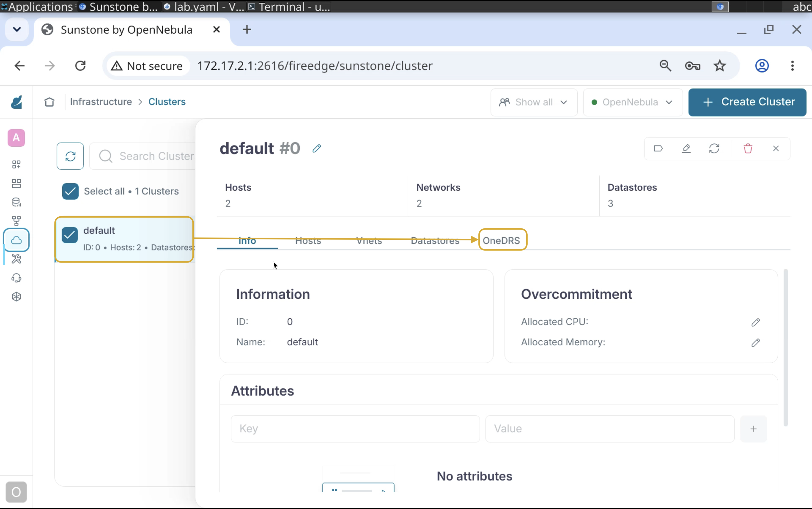
    
## 3.1.3

Press **Enable OneDRS** to start the DRS policy wizard.

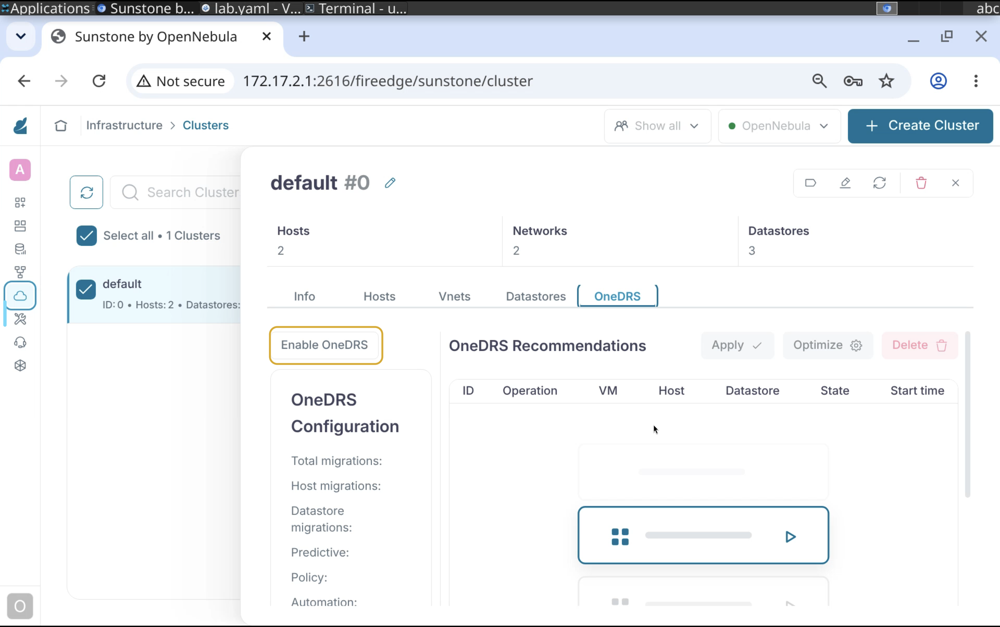
    
## 3.1.4

Set the **Policy** to **Balance**.

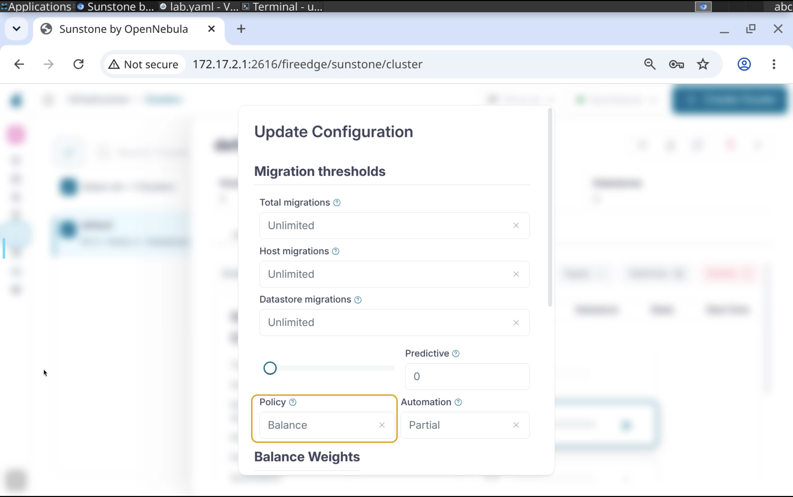

## 3.1.5

Press **Continue**.

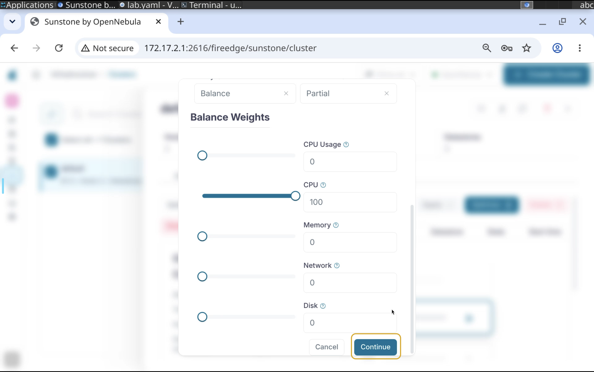

# Configure Undercommitment & Overcommitment.
    
## 3.1.6

Navigate to **Infrastructure -> Hosts**.

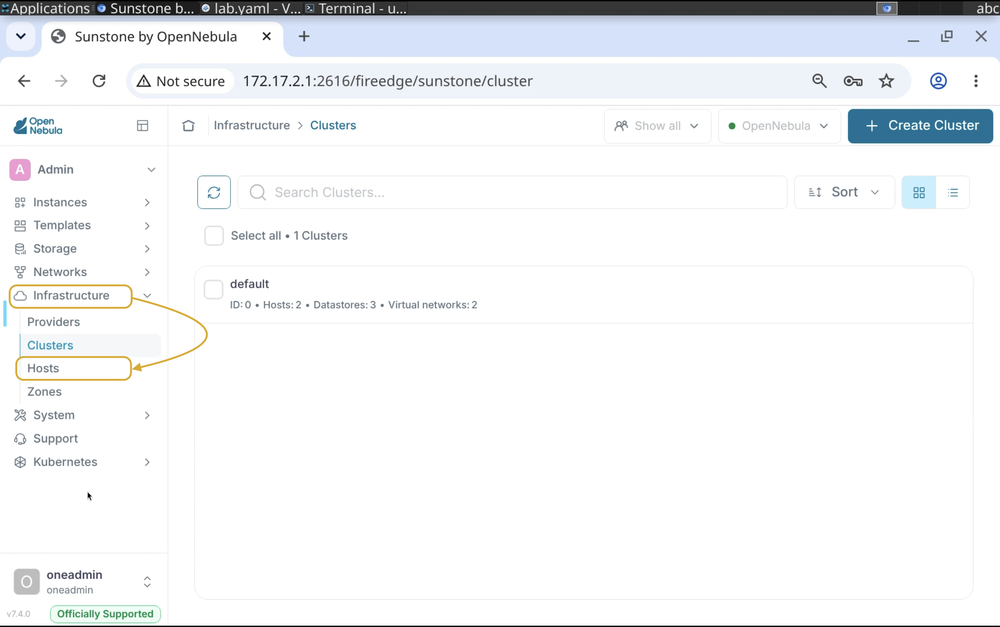

    
## 3.1.7

Select one host and expand the infotab.

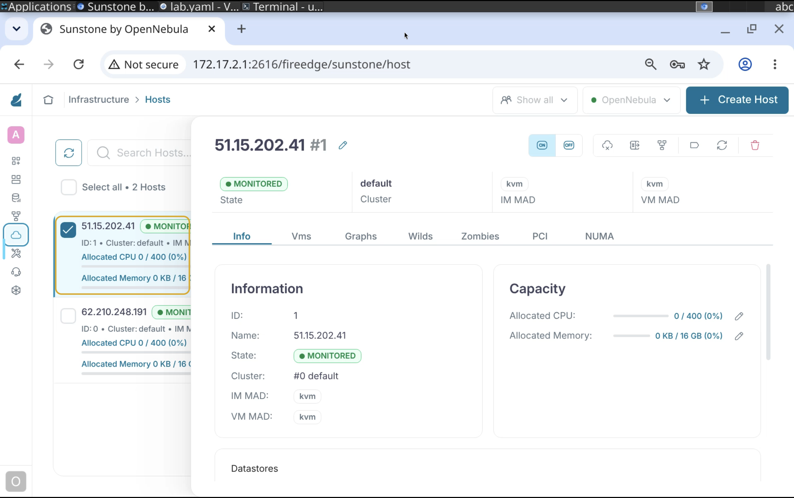

    
## 3.1.8

Under **Capacity** locate the **Allocated CPU** and press the edit button.

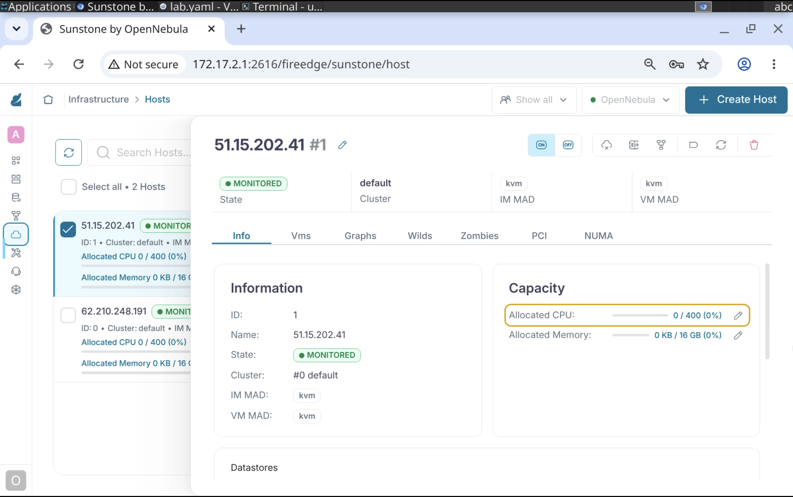

    
## 3.1.9

Set the value to **300**.

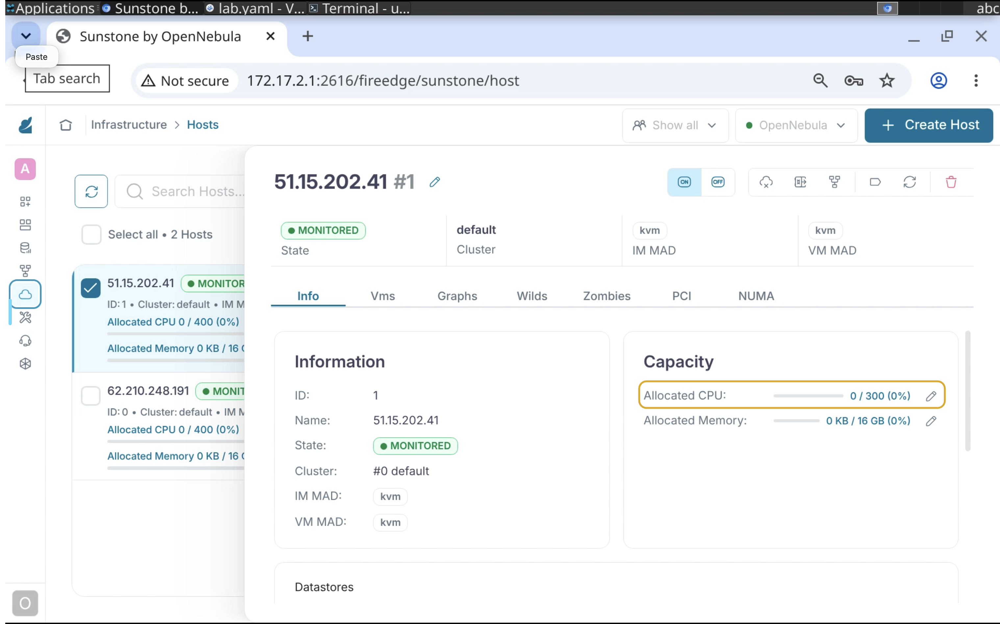

    
## 3.1.11

Perform the same action with another host but set the value to **800**.

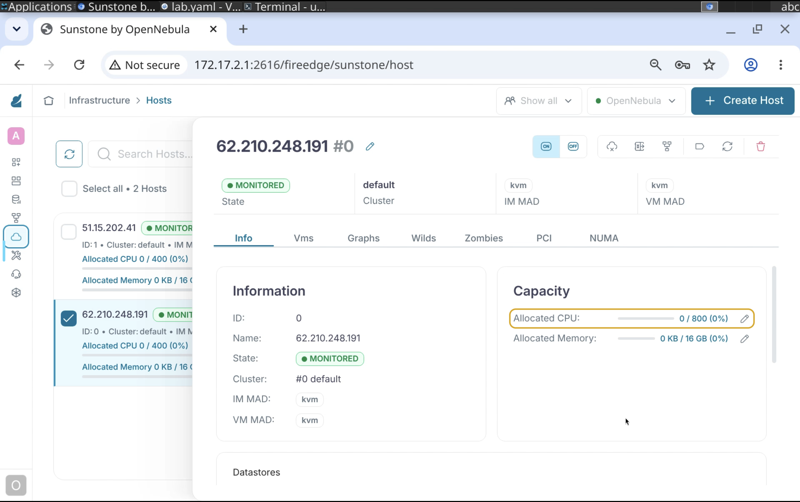

    
## 3.1.12

You should end up with one host that's **undercommited** and one **overcommited**.

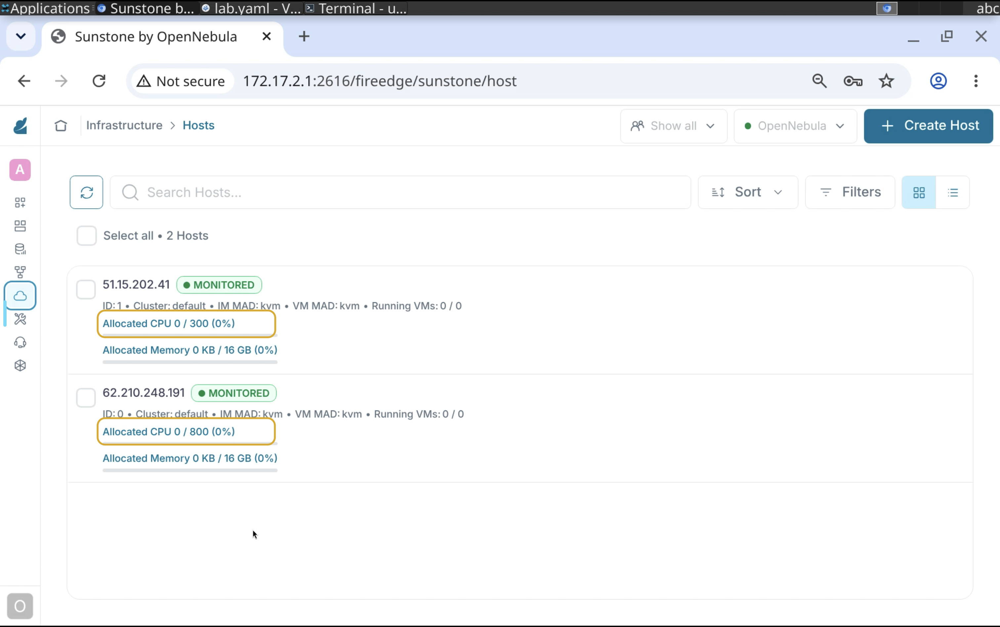


# Deploy VMs and verify the OneDRS policy.
    
## 3.1.13

On the Frontend node as **oneadmin** create a new file with the following content.

```console
CONTEXT=[
    NETWORK="YES",
    SSH_PUBLIC_KEY="$USER[SSH_PUBLIC_KEY]" ]
CPU="0.125"
DISK=[
    IMAGE_ID="0" ]
GRAPHICS=[
    LISTEN="0.0.0.0",
    TYPE="vnc" ]
HYPERVISOR="kvm"
LOGO="images/logos/linux.png"
LXD_SECURITY_PRIVILEGED="true"
MEMORY="256"
NIC_DEFAULT=[
    MODEL="virtio" ]
OS=[
    ARCH="x86_64" ]
SCHED_REQUIREMENTS="HYPERVISOR=kvm"
NAME="Custom AL3.21"
```

## 3.1.14

Use the onetemplate command line to create a new VM Template.

```console
onetemplate create /path/to/file
```

You supposed to get the VM Template ID as an output.

```console
ID: 1
```

## 3.1.15

Disable the undercommited host.

```console
onehost disable 1
```

Instantiate 15 VMs from the **Custom AL 3.21** VM Template.

```console
onetemplate instantiate 1 -m 15
VM ID: 10
VM ID: 8
VM ID: 9
VM ID: 10
VM ID: 11
VM ID: 12
...
...
VM ID: 24
```
    
## 3.1.14

Wait until all VMs are in the running state and go enable the previously disabled host.

```console
onehost enable 1
```

## 3.1.15

Return to **OneDRS** settings on the **default** cluster and press **Optimize**.

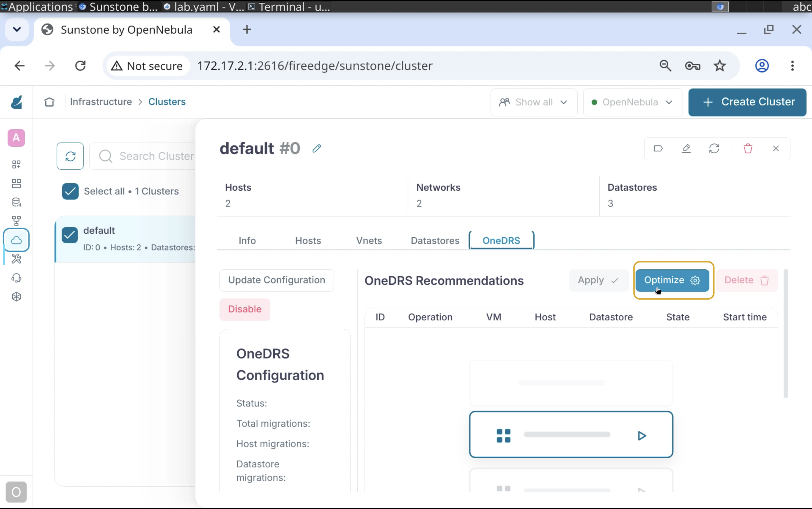

    
## 3.1.16

Once the plan is in place - press **Apply** to execute it!

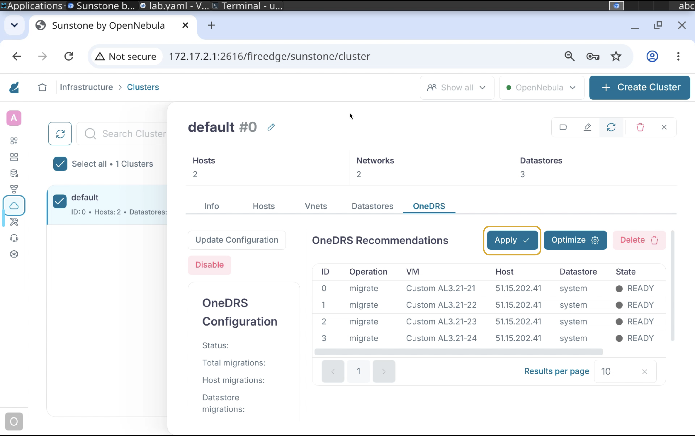

    
## 3.1.17

Wait until all VMs that are subject of this plan are in the **DONE** state.


    
## 3.1.18

Go to **Infrastructure -> Hosts** and check the CPU metrics.


# Remove all running VMs.

```console
onevm terminate --hard <FIRST VM ID>..<LAST VM ID>
```

# Congratulations, you've completed the assignment!
{: .no_toc}