# Module 4 - Lab 1 : OneApps 
{: .no_toc}

## Table of Contents
{: .no_toc}

<details markdown="block">
  <summary>
    Expand to access the In-page navigation
  </summary>
  {: .text-delta }
1. TOC
{:toc}
</details>  
    
## Objective(-s):
- Clone the repositories.
- Configure and Build the VM appliance.
- Upload an Image and Instantiate the VM.

{: .warning }
> The majority of commands in this section must be executed as root!

# Clone the repositories.

## 4.1.1

Make sure you are connected to the Frontend Node and logged in as root!

```console
whoami
```

```console
root
```

Clone the OneApps repository.

```console
cd ~
git clone https://github.com/OpenNebula/one-apps/
```

The repository must be cloned.

```console
Cloning into 'one-apps'...
remote: Enumerating objects: 9027, done.
remote: Counting objects: 100% (947/947), done.
remote: Compressing objects: 100% (311/311), done.
remote: Total 9027 (delta 806), reused 645 (delta 635), pack-reused 8080 (from 3)
Receiving objects: 100% (9027/9027), 22.54 MiB | 41.07 MiB/s, done.
Resolving deltas: 100% (4819/4819), done.
```
    
## 4.1.2

Clone the repository with files.

```console
export REPO='https://github.com/OpenNebula/one-training-files.git'
rm -rf ~/Files
git clone --no-checkout $REPO  ~/Files
cd ~/Files
git sparse-checkout init --cone
git sparse-checkout set OneApps
git checkout
cd OneApps
ls -lh
```

You must end up with three directories.

```console
total 12K
drwxr-xr-x 3 root root 4.0K Aug  4 10:13 appliances
drwxr-xr-x 3 root root 4.0K Aug  4 10:13 packer
drwxr-xr-x 2 root root 4.0K Aug  4 10:13 templates
```

# Configure and Build the VM appliance.

## 4.1.3

Navigate to the **one-apps** git repository and duplicate the Wordpress service.

```console
cd ~/one-apps/packer
cp -R service_Wordpress service_FlaskApp
```

Change directory to FlaskApp and use sed to substitute paths and names.

```console
cd service_FlaskApp/
mv Wordpress.pkr.hcl FlaskApp.pkr.hcl
sed -i 's/Wordpress/FlaskApp/g' *.pkr.hcl
sed -i 's/Wordpress/FlaskApp/g' gen_context
sed -i 's/alma8.qcow2/ubuntu2204.qcow2/g' *.pkr.hcl
```
    
## 4.1.6

Add two scripts from Files.

```console
cp ~/Files/OneApps/packer/ubuntu/*.sh ~/one-apps/packer/ubuntu/
```

Create the **FlaskApp** dir under the **appliances** and copy the shell script from Files.

```console
mkdir -p ~/one-apps/appliances/FlaskApp
cp ~/Files/OneApps/appliances/FlaskApp/*.sh ~/one-apps/appliances/FlaskApp/
```

    
## 4.1.7

Edit the **Makefile.config**.

```console
vi ~/one-apps/Makefile.config
```

Append it with the new service.

```console
SERVICES_AMD64 := service_Wordpress service_VRouter service_OneKE service_OneKEa capone \
                service_Harbor service_SlurmController service_SlurmWorker service_MinIO \
                service_Vllm service_Capi service_FabricManager service_OneKS service_example \
                service_Nim service_FlaskApp
```

Run the builder from the one-apps directory and wait until the appliance .qcow2 image can be found inside the **export** directory.

```console
cd ~/one-apps
make ubuntu2204 service_FlaskApp
```

Wait until both images are built. 

```console
==> Builds finished. The artifacts of successful builds are:
--> null.null: Did not export anything. This is the null builder
--> qemu.FlaskApp: VM files in directory: build/service_FlaskApp
--> qemu.FlaskApp: VM files in directory: build/service_FlaskApp
[INFO] Packer service_FlaskApp done
```


# Upload an Image and Instantiate the VM.

    
## 4.1.8

Copy the service Image to the **/var/tmp/one** directory and change the ownership.

```console
cp export/service_FlaskApp.qcow2 /var/tmp/one/
chown oneadmin:oneadmin /var/tmp/one/service_FlaskApp.qcow2
```

Import the appliance.

```console
oneimage create -d 1 --name 'Service FlaskApp' --path /var/tmp/one/service_FlaskApp.qcow2
```

You should receive the Image's ID as an output. **Write it down as you will need it in the future!**

```console
ID: 2
```


## 4.1.9

Using Vi or Nano as root edit the Virtual Machine template.

```console
vi ~/Files/OneApps/templates/vm.tmpl
```

Map it to the Image ID from the previous step.

```console
DISK=[
    IMAGE="Service FlaskApp",
    IMAGE_ID="<YOUR IMAGE ID>",
    IMAGE_UNAME="oneadmin",
    SIZE="10240",
    TARGET="vda" ]
```

Copy the template and adjust permissions.

```console
cp ~/Files/OneApps/templates/vm.tmpl /var/lib/one/
chown oneadmin:oneadmin /var/lib/one/vm.tmpl
```

As oneadmin create a new VM Template from the copied file.

```console
sudo -i -u oneadmin
onetemplate create vm.tmpl
```

You should get the VM Template ID.

```console
ID: 3
```
    
## 4.1.10

Switch to Sunstone and navigate to **Instances -> VMs**.

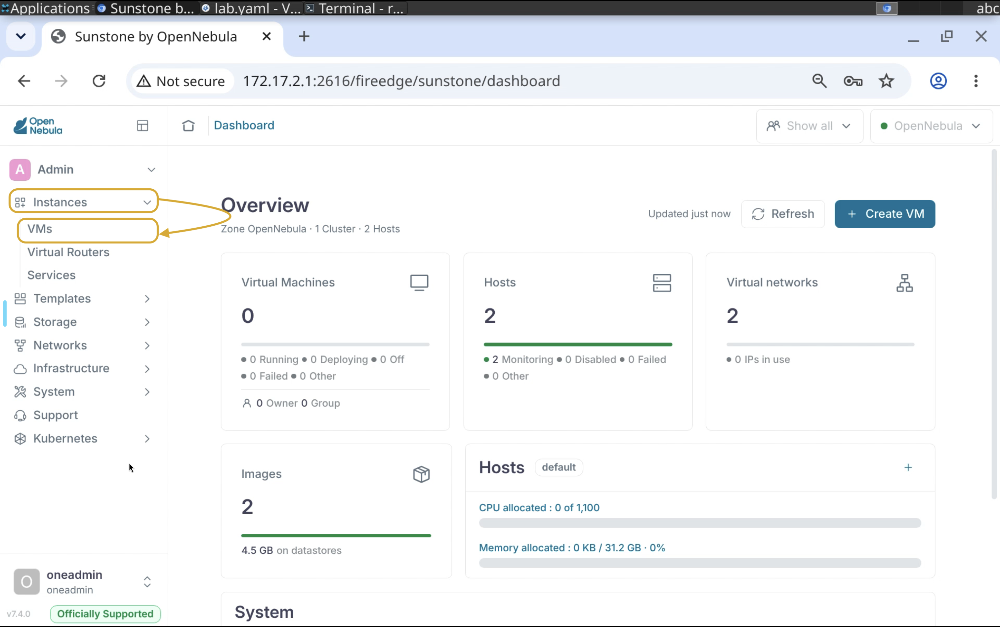

## 4.1.11

Press **Create VM** to create a Virtual Machine. 

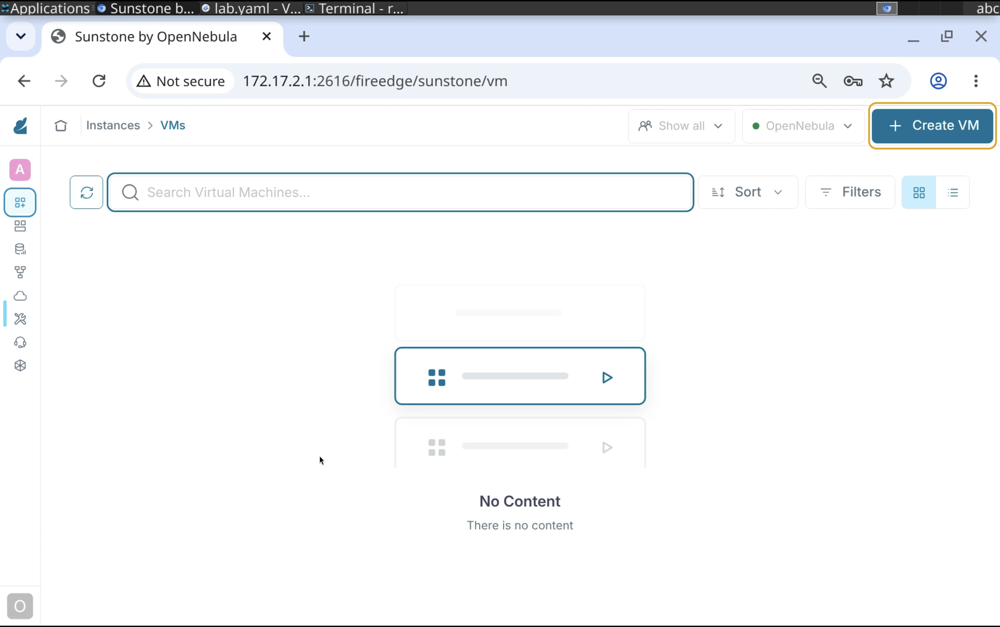

## 4.1.12

Select the **Service FlaskApp** VM Template.

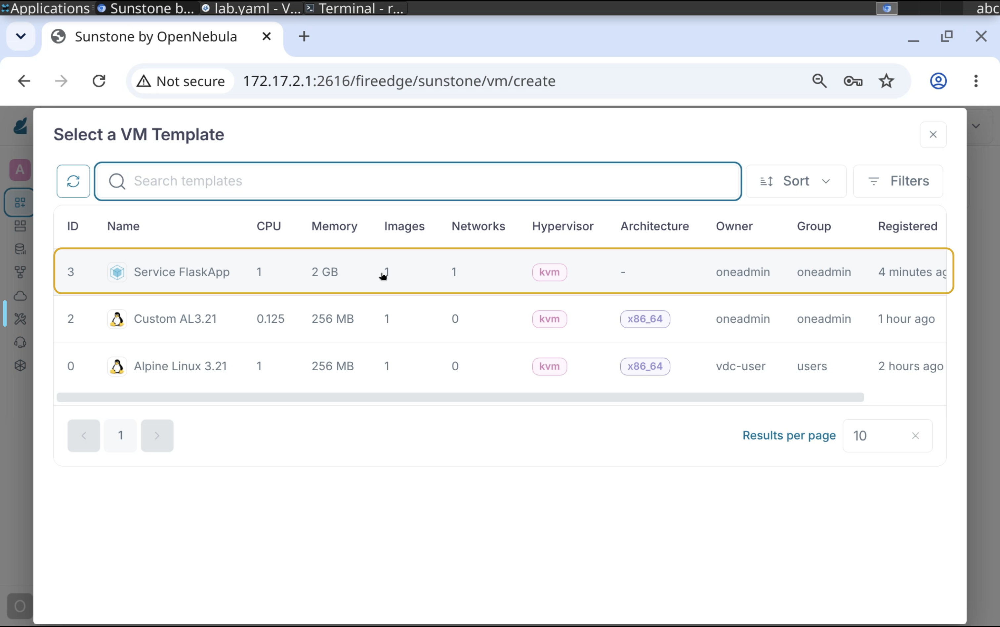

## 4.1.13

Keep the **Configuration** tab as is and proceed **Next** to User inputs. 

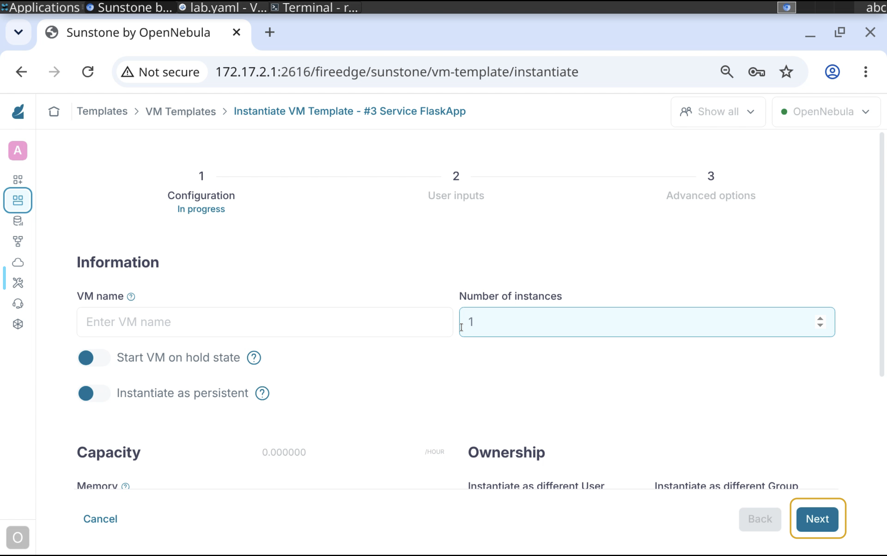

## 4.1.14

Enter the value for **MYSQL_ROOT_PASSWORD**.

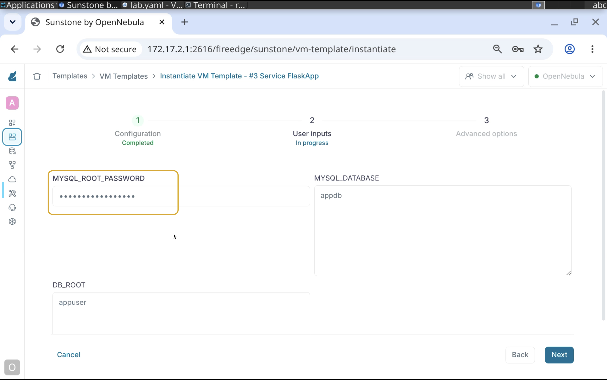

## 4.1.15

Keep the **Advanced options** as is and **Finish** the deployment.

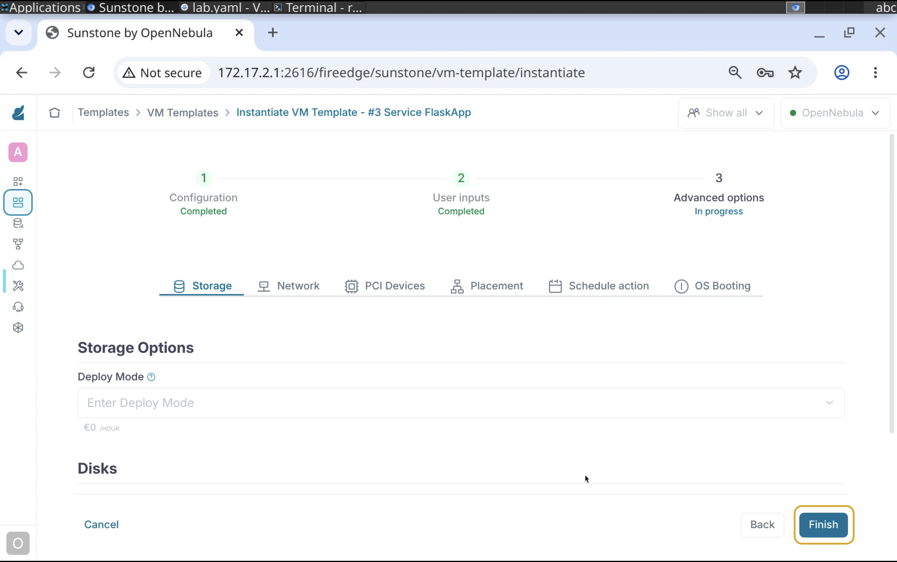

# Test the application.

## 4.1.16

Once the VM is running - copy the IP address.

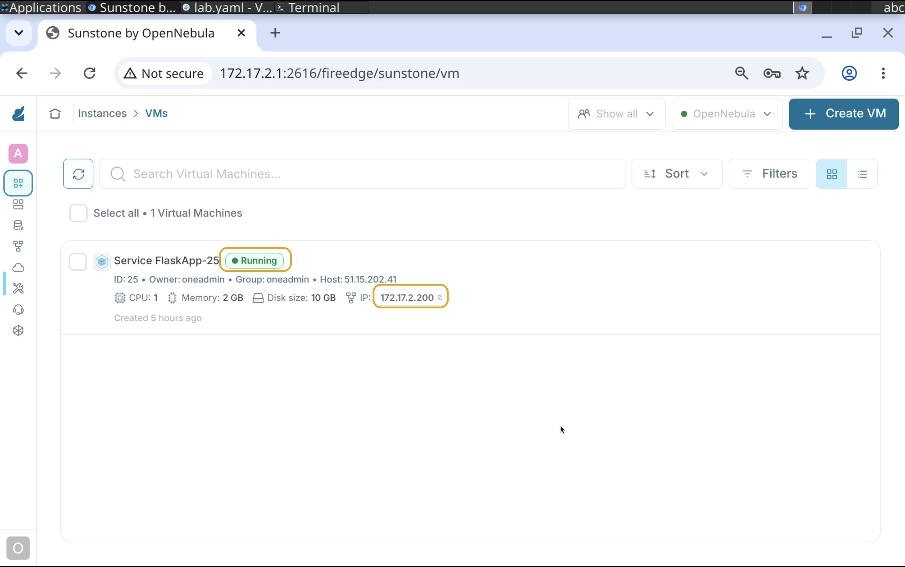

## 4.1.17

Open new tab and navigate to the copied IP address with **appended port 5000**.

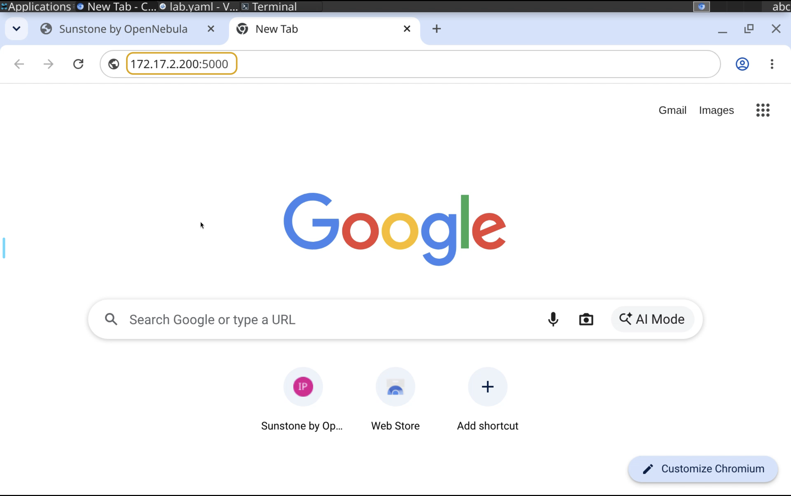

## 4.1.18

This page confirms that the application is running! 

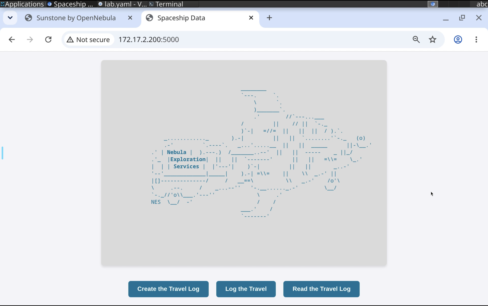

## 4.1.19

Let's confirm that the database service is running as well by pressing the **Create the Trevel log** button.

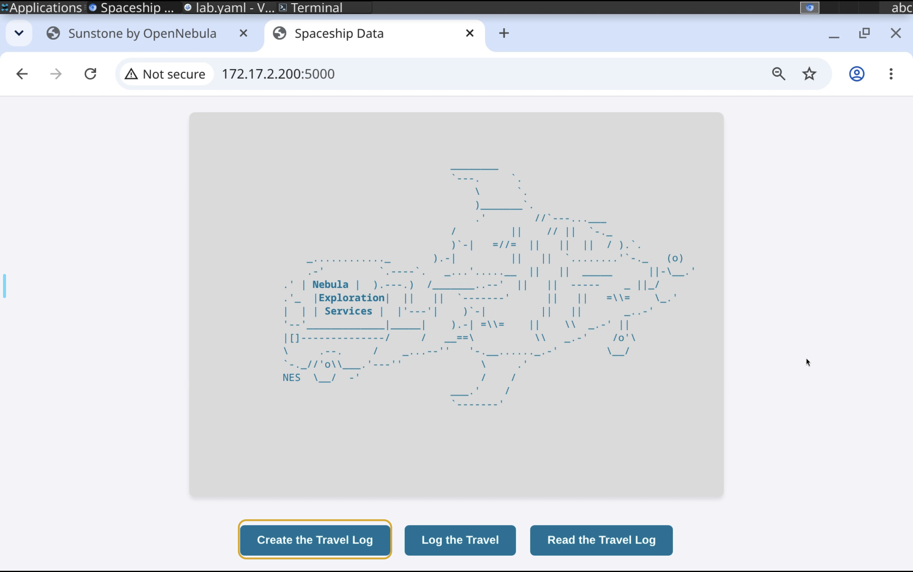

## 4.1.20

This page confirms that the app can write to the database.

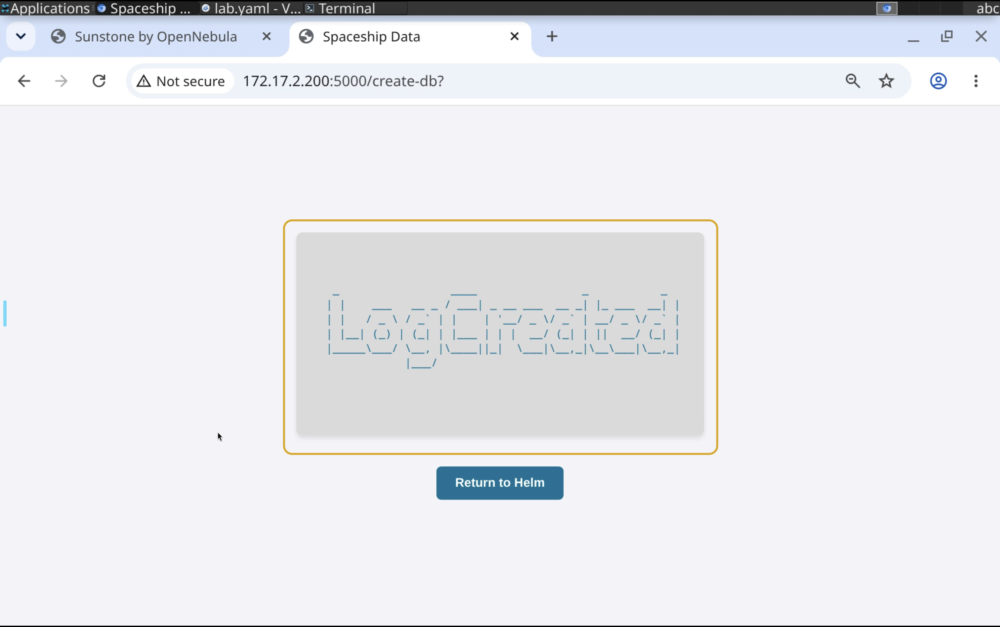

# Terminate the VM in a preferred way!
    
# Congratulations, you've completed the assignment!
{: .no_toc}