# Module 5 - Lab 1 : Services 
{: .no_toc}

## Table of Contents
{: .no_toc}

<details markdown="block">
  <summary>
    Expand to access the In-page navigation
  </summary>
  {: .text-delta }
1. TOC
{:toc}
</details>  
    
## Objective(-s):
- Import the Service Template.
- Create an Empty Image.
- Update the VM Template.
- Instantiate the Service Template.
- Destroy the running Service. 
    

# Import the Service Template.
    
## 5.1.1

Navigate to **Storage -> Apps**.

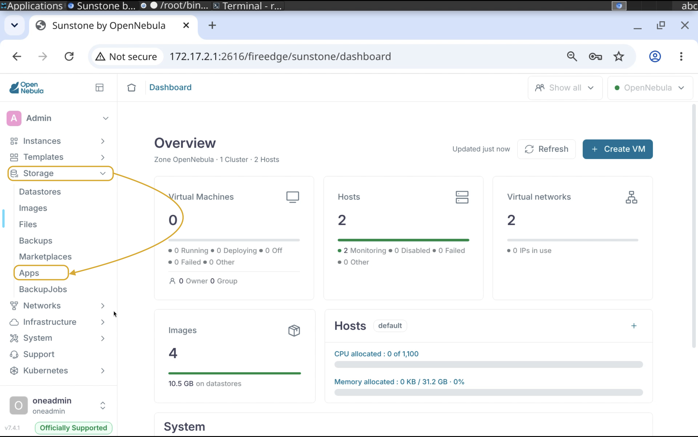

    
## 5.1.2

Enter **MinIO** in the search and in the **Filter** drop-down set **Type** to **Service Template**.

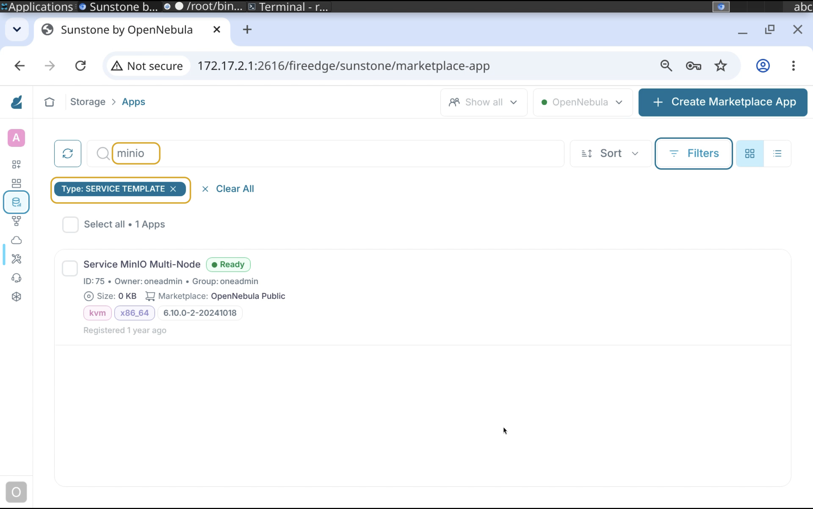

    
## 5.1.3

Locate the **Service MinIO Multi-Node** and press **Import**.

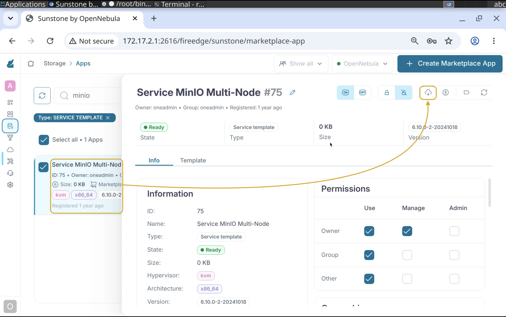

    
## 5.1.4

You can change the **Name** and **VM Template** name if you wish, however it's better to keep it as is.

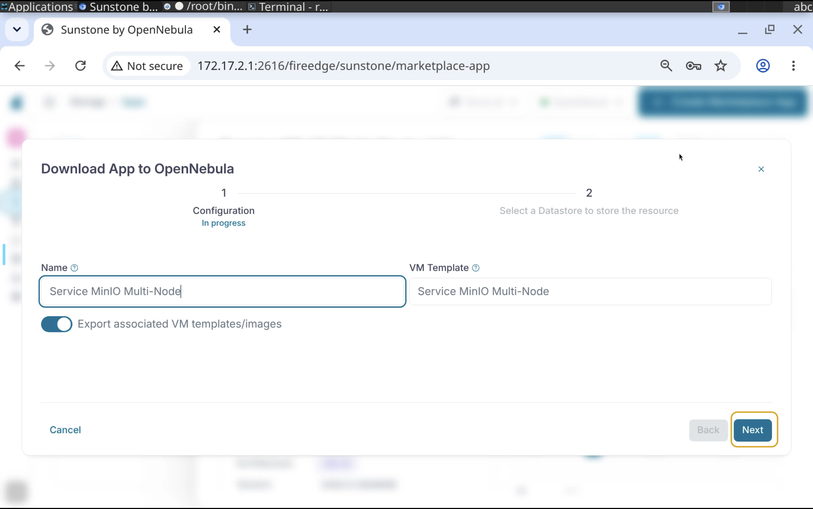

    
## 5.1.5

Select the **default** datastore and press **Finish**.

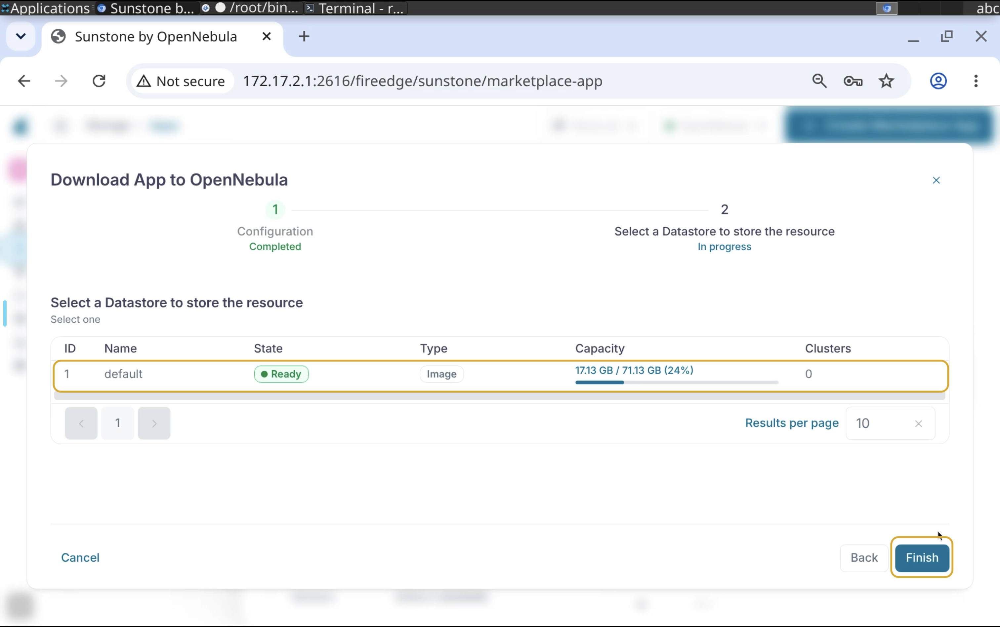

## 5.1.6

The VM Templates along with the necessary Images will be downloaded shortly.

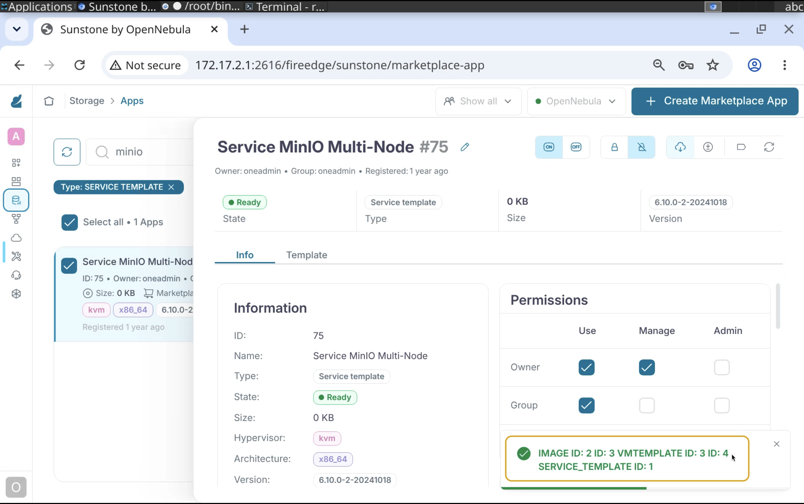

# Create an Empty Image.

{: .note }
> MinIO VM requires 4 extra disks to be attached. For this purpose you will need to create an empty Datablock image.

## 5.1.7

Navigate to **Storage -> Images**.

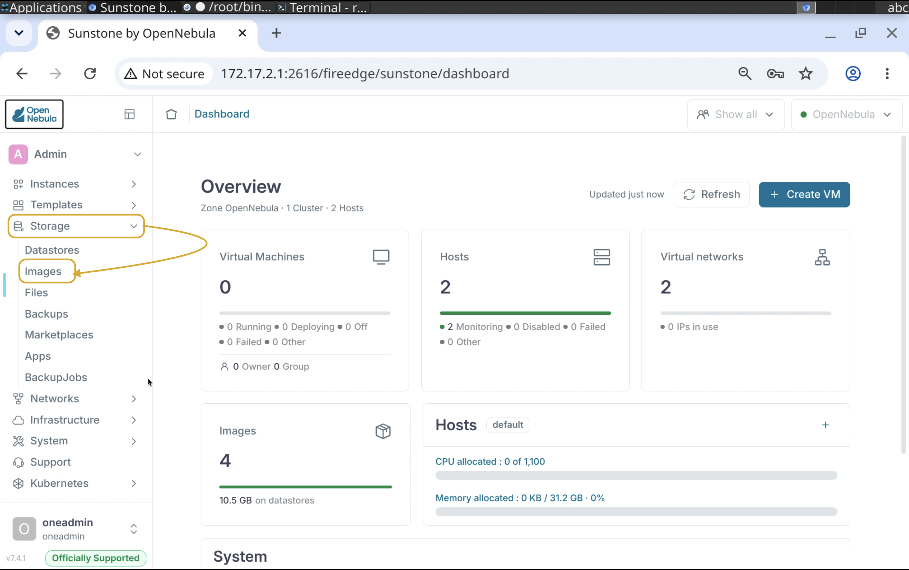

## 5.1.8

Press **Create Image**.

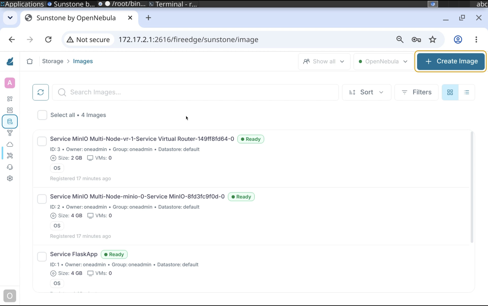

## 5.1.9

Name it **MinIO-Data**.

Set **Type** to **Generic storge datablock**. 

Set **Size** to **5GB**. 

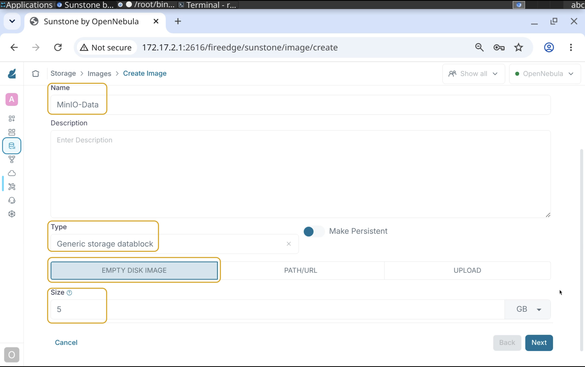

## 5.1.10

Store it on the **default** datastore. 

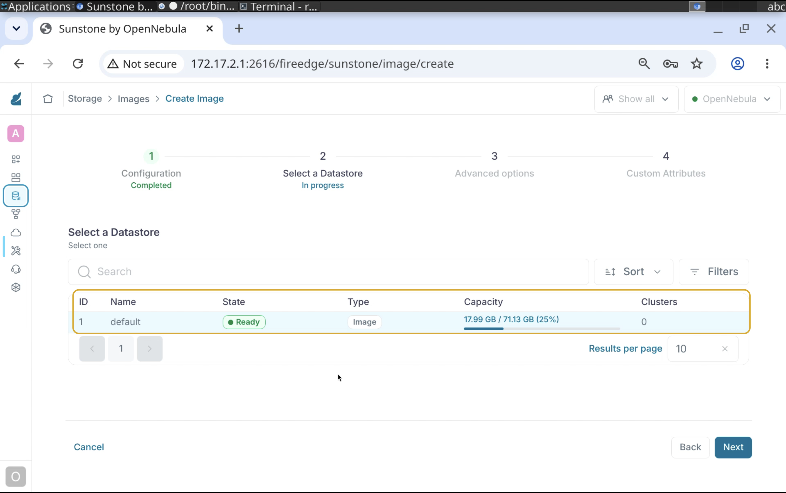

## 5.1.11

Set **BUS** to **Virtio**.

Set **Format** to **QCOW2**.

Set **Target device** to **vd**.

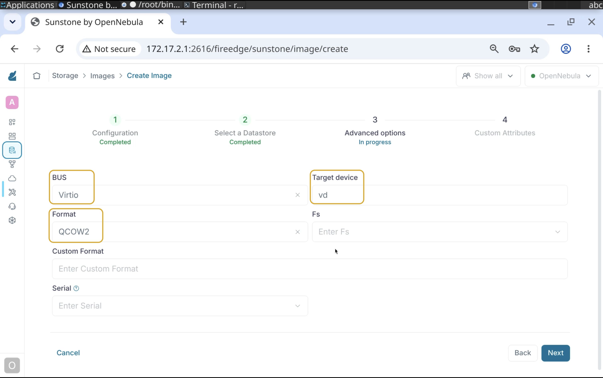

## 5.1.12

Keep the **Custom Attributes** page as is and **Finish**.

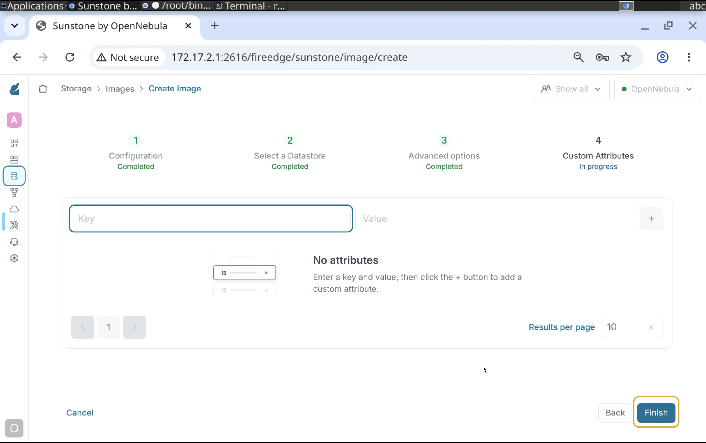

## 5.1.13

Note the **Image ID**, you will need this shortly!

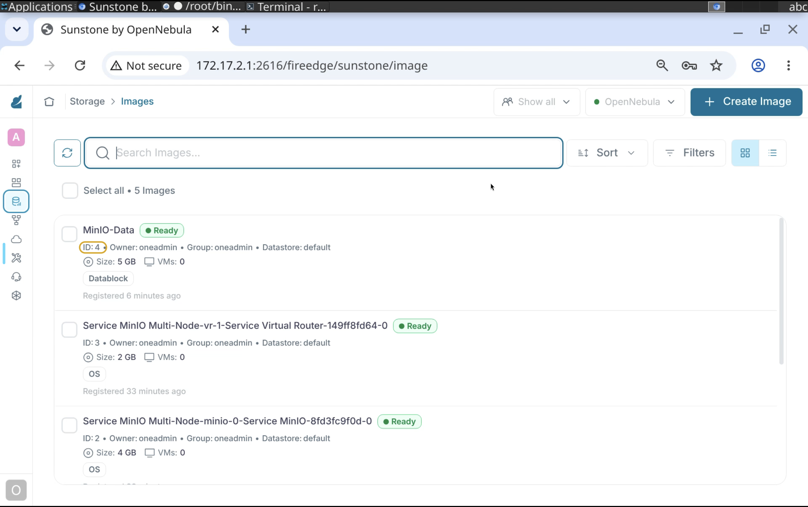

# Update the VM Template

## 5.1.14

Switch to Command Line and make sure you are connected to the Frontend Node and logged in as **oneadmin**.

```console
whoami
```

```console
oneadmin
```

## 5.1.15

{: .note }
> You may perform this action in Sunstone by executing the same process of attaching an Image 4 times. This guide will focuses on updating the VM Template using OpenNebula CLI

Execute the **update** subcommand to start updating the VM template. 

{: .warning }
> Make sure you are not updating the vr template!

```console
onetemplate update Service\ MinIO\ Multi-Node-minio-0
```

Right after the first **DISK** parameter append 4 more **DISK** parameters and make sure you are using the Image ID from the previous output!

```console
DISK=[
  DEV_PREFIX="vd",
  IMAGE_ID="4"]
DISK=[
  DEV_PREFIX="vd",
  IMAGE_ID="4"]
DISK=[
  DEV_PREFIX="vd",
  IMAGE_ID="4"]
DISK=[
  DEV_PREFIX="vd",
  IMAGE_ID="4"]
```
 
## 5.1.16

Switch to Sunstone and navigate to **Templates -> Service Templates**.


## 5.1.17

Select the MinIO Multi-Node service template and press the Instantiate button.


## 5.1.18

Name it the way you wish and proceed to the Networks page.


## 5.1.18

Name it the way you wish and proceed to the Networks page.


## 5.1.19

Map the **Public** service VN to the **routable** VN.

Map the **Private** service VN to the **private** VN.


## 5.1.20


# Congratulations, you've completed the assignment!
{: .no_toc}