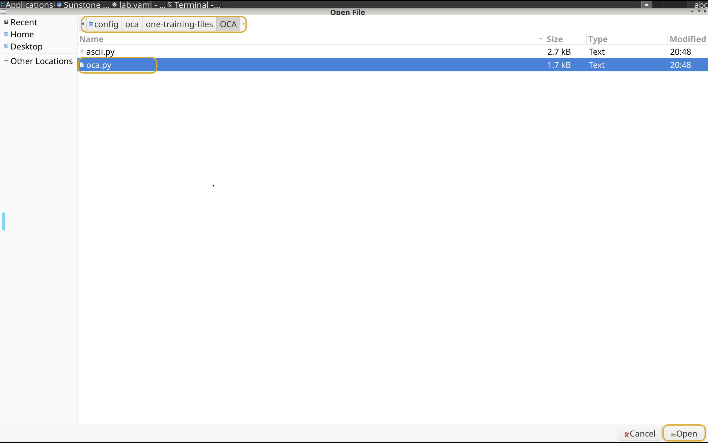

# Module 8 - Lab 1 : OpenNebula Cloud API 
{: .no_toc}

## Table of Contents
{: .no_toc}

<details markdown="block">
  <summary>
    Expand to access the In-page navigation
  </summary>
  {: .text-delta }
1. TOC
{:toc}
</details>

## Objective(-s):
- Install the python bindings.
- Download the script and adjust it.
- Run the script and verify the execution.


# Install the python bindings.


## 8.1.1

Create the virtual environment and install the **pyone** bindings.
```console
cd ~
mkdir oca
python3 -m venv oca
cd oca
source bin/activate
pip install pyone
``` 

Make sure that installation has been finished without any errors.

```console
Successfully installed certifi-2026.7.22 charset_normalizer-3.5.1 dict2xml-1.7.8 grpcio-1.84.0 idna-3.19 lxml-6.1.3 pyone-7.3.80 requests-2.34.2 six-1.17.0 tblib-3.2.2 typing-extensions-4.16.0 urllib3-2.8.0 xmltodict-1.0.4
```

# Download and adjust the script.

## 8.1.2

```console
export REPO='https://github.com/OpenNebula/one-training-files.git'
git clone --no-checkout $REPO
cd one-training-files
git sparse-checkout init --cone
git sparse-checkout set OCA
git checkout
cd OCA
ls -lh
```

Verify that the files are in place.

```console
total 8.0K
-rw-rw-r-- 1 oneadmin oneadmin 2.7K Aug  4 13:09 ascii.py
-rw-rw-r-- 1 oneadmin oneadmin 1.7K Aug  4 13:09 oca.py
```


## 8.1.3

Open the **oca.py** file in the VS Codium.




## 8.1.4

{: .note }
> This is a challenge - you must correctly substitute the variables!

Locate a few **\<\<CHANGE ME\>\>** objects in the script and substitute these with the values:
- **routable**
- **AlmaLinux 10**.
- **2633**

Save the changes!

# Run the script and verify the execution.

## 8.1.4

Execute the script and provide the credentials in-line.

```console
python3 oca.py 'oneadmin' '<PASSWORD>' '<FE IP>'
```

Your output must be look like the one below!

```console
⠀⠀⠀⠀⠀⠀⠀⠀⠀⠀⠀⠀⠀⠀⠀⠀⠀⠀⠀⠀⠀⠀⠀⠀⢠⣀⣀⠀⠀⠀⠀⠀⠀⠀⠀⠀⠀⠀⠀⠀⠀⠀
                    ⠀⠀⠀⠀⠀⠀⠀⠀⠀⠀⠀⠀⠀⠀⠀⠀⠀⠀⠀⠀⠀⠀⠀⠀⠈⠉⣉⣙⣷⡦⠀⠀⠀⠀⠀⠀⠀⠀⠀⠀⠀⠀
                    ⠀⠀⠀⠀⠀⠀⠀⠀⠀⠀⠀⠀⠀⠀⠀⠀⠀⠀⠀⠀⠀⠀⢤⣴⠖⠛⠉⠀⠀⠀⠀⠀⠀⠀⠀⠀⠀⠀⠀⠀⠀⠀
                    ⠀⠀⠀⠀⠀⠀⠀⠀⠀⠀⠀⠀⠀⠀⠀⠀⠀⠀⠀⠀⠀⣀⣀⣉⠛⠓⠶⢤⣄⠀⠀⠀⠀⠀⠀⠀⠀⠀⠀⠀⠀⠀
                    ⠀⠀⠀⠀⠀⠀⠀⠀⠀⠀⠀⠀⠀⠀⠀⠀⠀⠀⠀⠀⣤⣽⡿⠟⠁⠀⠀⠀⠉⠀⠀⠀⠀⠀⠀⠀⠀⠀⠀⠀⠀⠀
                    ⠀⠀⠀⠀⠀⠀⠀⠀⠀⠀⠀⠀⠀⠀⠀⠀⠀⠀⠀⠀⠈⠉⠙⠛⠷⠀⠀⠀⠀⠀⠀⠀⠀⠀⠀⠀⠀⠀⠀⠀⠀⠀
                    ⠀⠀⠀⠀⠀⠀⠀⠀⠀⠀⠀⠀⠀⠀⠀⣀⣀⣤⣤⣤⣤⣀⣀⡀⠀⠀⠀⠀⠀⠀⠀⠀⠀⠀⠀⠀⠀⠀⠀⠀⠀⠀
                    ⠀⠀⠀⠀⠀⠀⠀⠀⣀⣀⣤⡶⠶⠛⠉⠉⠉⠉⠁⠀⠀⠀⠀⠉⠙⠿⠓⠒⠶⢺⡇⠀⠀⠀⠀⠀⠀⠀⠀⠀⠀⠀
                    ⢶⡶⠶⠶⠶⠖⠖⠛⠉⠉⠀⠀⠀⠀⠀⠀⠀⠀⠀⠀⠀⠀⠀⠀⠀⠀⠀⠀⣴⡟⠁⠀⠀⠀⠀⠀⠀⠀⠀⠀⠀⠀
                    ⠘⣧⡀⠀⠀⣀⠀⠀⠀⠀⠀⠀⠀⠀⠀⠀⠀⠀⠀⠀⠀⠀⠀⠀⠀⠀⢀⣼⠏⠀⠀⠀⠀⠀⠀⠀⠀⠀⠀⠀⠀⠀
                    ⠀⠈⠻⢤⣼⡏⠀⠀⠀⠀⠀⠀⠀⠀⠀⠀⠀⠀⠀⠀⠀⠀⠀⠀⠀⠀⠈⣏⠀⠀⠀⠀⠀⠀⠀⠀⠀⠀⠀⠀⠀⠀
                    ⠀⠀⠀⠀⢻⡀⠀⠀⠀⠀⠀⠀⠀⠀⠀⠀⠀⠀⠀⠀⠀⠀⠀⢀⣀⡀⢀⣿⡿⠶⠶⣤⡀⠀⠀⠀⠀⠀⠀⠀⠀⠀
                    ⠀⠀⠀⠀⢸⡇⠀⣀⣀⠀⢀⣀⣤⡀⠀⠀⠀⠀⠸⠶⠶⠚⠛⠋⢹⣿⣿⣟⣉⠉⠒⠀⠻⣦⣠⣤⣤⣤⣄⣀⠀⠀
                    ⠀⢀⣤⢾⣿⣷⣶⡍⠙⠙⠛⠋⠉⠀⠀⢴⡶⠀⠀⠀⠀⢀⣠⡶⠟⠛⠛⣷⠀⠉⠁⠀⠀⠈⣧⡀⠀⠩⣀⠈⢹⣆
                    ⠀⣠⠔⢉⡴⢿⣿⡟⠛⠛⠛⠶⣤⣀⠀⠀⠀⠀⠀⠀⣴⡿⠋⠀⠀⠀⢀⡉⠀⠀⠀⠀⢀⣼⠛⠛⢛⣿⡿⠀⣾⡟
                    ⠀⠁⣰⠋⢀⡿⠁⠀⠀⠀⠀⠀⠀⠉⠻⣦⡀⠀⠀⣼⠟⠀⠀⠀⢀⣠⣾⢁⣀⣤⣴⡶⠟⣁⣴⠞⠋⠉⢀⣼⣿⠁
                    ⠀⠀⠉⠀⠈⠷⣄⡀⠀⠀⠀⠀⠀⠀⠀⠈⢿⡗⠚⡏⠀⢀⣤⡶⠛⠋⠉⠉⠉⠉⠀⣠⣾⠟⢁⣀⣤⣶⣿⠟⠁⠀
                    ⠀⠀⠀⠀⠀⠀⠀⠈⠉⠑⠲⠤⣄⣦⣤⡴⠞⠁⠀⠉⠙⠉⠁⠀⠀⠀⠀⠀⠀⠀⠀⠹⠿⠾⠾⠟⠛⠁⠀⠀⠀⠀
                    Taking a short nap...meow...
```

## 8.1.5

Verify tha the VM is in the process of deploying or is already running.

# Congratulations, you've completed the assignment!
{: .no_toc}